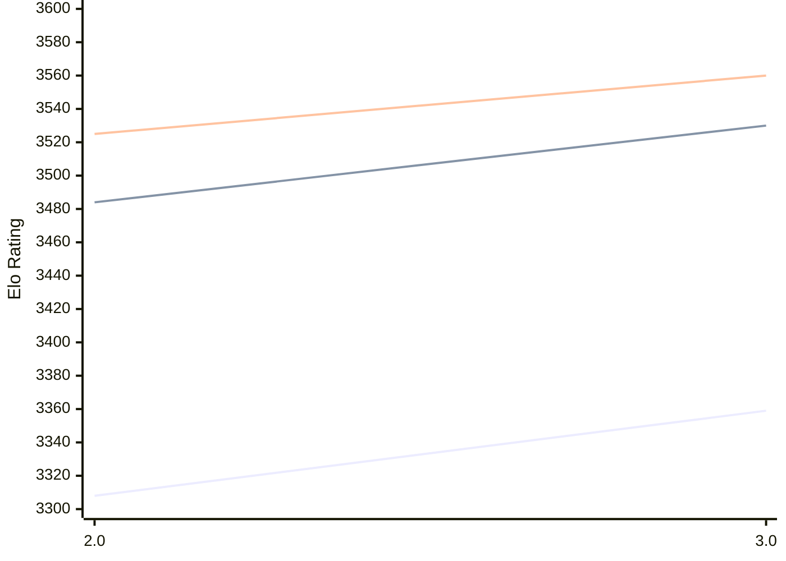

# Engine: Quanticade

Author: Martin Botka

Home: https://github.com/Quanticade/Quanticade

## Elo Ratings E1 (Ultra 7 265T (1.50 GHz) - E-Core)

| Version | Published | STC 8.0+0.08s  | LTC 60.0+0.60s | VLTC 2m24s+1.12s | Comment |
| --- | --- | --- | --- | --- | --- |
| 3.0 | 2025-12-15 | 3256 | 3594 | 3634 |  |
 | | | cElo (∆ prev) | cElo (∆ prev) | cElo (∆ prev) | 

## Elo Ratings P1 (Ultra 7 265T (1.50 GHz) - P-Core)

| Version | Published | STC 8.0+0.08s  | LTC 60.0+0.60s | VLTC 2m24s+1.12s | Comment |
| --- | --- | --- | --- | --- | --- |
| 3.0 | 2025-12-15 | 3445 | 3636 | 3673 |  |
 | | | cElo (∆ prev) | cElo (∆ prev) | cElo (∆ prev) | 

## Elo Ratings T1 (i5-7500T 2.70GHz)

| Version | Published | STC 8.0+0.08s  | LTC 60.0+0.60s | VLTC 2m24s+1.12s | Comment |
| --- | --- | --- | --- | --- | --- |
| 3.0 | 2025-12-15 | 3359(+51) | 3530(+46) | 3560(+35) |  |
| 2.0 | 2025-05-21 | 3308 | 3484 | 3525 |  |
 | | | cElo (∆ prev) | cElo (∆ prev) | cElo (∆ prev) | 

<a href="https://github.com/computer-chess-index/cci/issues/new?template=submit-version.yml&title=[VERSION]+Quanticade+<version>&body=###%20Engine%20name%0AQuanticade%0A%0A###%20Version%0A3.0" target="_blank">Submit new version</a>

 Test Conditions:

GUI/CLI: <a href=https://github.com/cutechess/cutechess target="_blank">Cute-Chess</a> 
Elo Calculation: <a href=https://www.remi-coulom.fr/Bayesian-Elo/ target="_blank">Bayesian-Elo</a> 
CPU for P1: Intel(R) Core(TM) Ultra 7 265T (1.50 GHz) - P-Core 
CPU for E1: Intel(R) Core(TM) Ultra 7 265T (1.50 GHz) - E-Core 
CPU for T1: Intel(R) Core(TM) i5-7500T 2.70GHz 
Opening book: 8_moves_v3 
\* STC: 8.0+0.08s, LTC: 60.0+0.60s, VLTC: 2m24s+1.12s

 Lists:
Ratings: <a href=https://github.com/computer-chess-index/cci/blob/main/lists/CCIRatings.csv target="_blank">Complete list</a>

Generated: 2026-10-19 04:42:00

## Ratings Verlauf T1

```mermaid
%%{init: {"theme":"base","themeVariables":{"seriesColors:['#a3a3a3','#222221','#faa371']}}}%%
xychart-beta
  x-axis ["2.0", "3.0"]
  y-axis "Elo Rating" 3300 --> 3600
  line "T1: STC (8.0+0.08s)" [3308, 3359]
  line "T1: LTC (60.0+0.60s)" [3484, 3530]
  line "T1: VLTC (2m24s+1.12s)" [3525, 3560]
```

## Detailed Evaluation Results

| Version | Time Control | Variant | Elo  | Range +/- | Matches | Score | Average Opponent Elo | Draws |
| --- | --- |--- | --- | --- | --- | --- | --- | --- |
| 3.0 | VLTC (2m24s+1.12s) | E1 | 3634 | 37 | 166 | 52% | 3622 | 85% |
|  |  | T1 | 3560 | 21 | 500 | 51% | 3553 | 89% |
|  |  | P1 | 3673 | 48 | 100 | 52% | 3661 | 87% |
|  | LTC (60.0+0.60s) | T1 | 3530 | 22 | 498 | 50% | 3528 | 86% |
|  |  | E1 | 3594 | 38 | 156 | 50% | 3595 | 93% |
|  |  | P1 | 3636 | 40 | 144 | 51% | 3625 | 86% |
|  | STC (8.0+0.08s) | P1 | 3445 | 35 | 198 | 50% | 3448 | 72% |
|  |  | T1 | 3359 | 19 | 690 | 51% | 3355 | 70% |
|  |  | E1 | 3256 | 29 | 326 | 44% | 3299 | 62% |
| --- | --- |--- | --- | --- | --- | --- | --- | --- |
| 2.0 | VLTC (2m24s+1.12s) | T1 | 3525 | 26 | 340 | 50% | 3521 | 84% |
|  | LTC (60.0+0.60s) | T1 | 3484 | 26 | 352 | 50% | 3480 | 81% |
|  | STC (8.0+0.08s) | T1 | 3308 | 25 | 414 | 52% | 3294 | 64% |