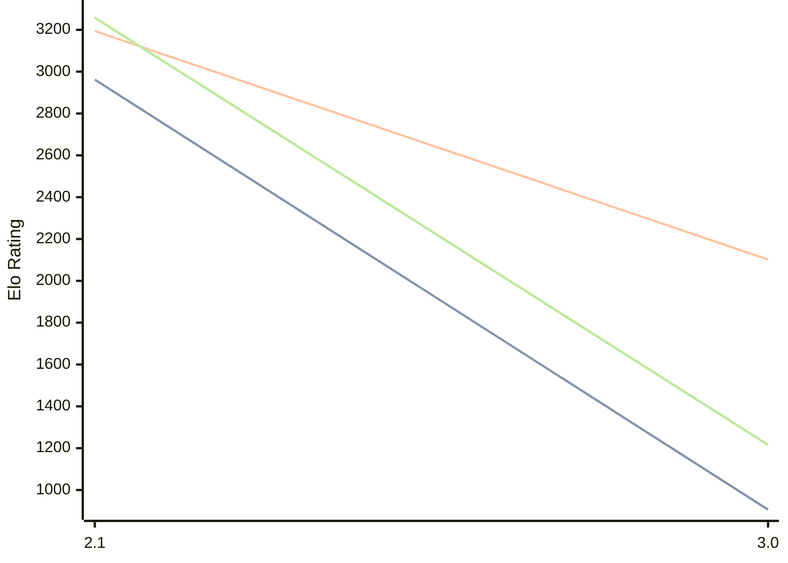

# Engine: Quirky

Author: Anton Kernozhitsky

Home: https://github.com/Wind-Eagle/Quirky

## Elo Ratings

| Version | Published | STC 8.0+0.08s  | LTC 60.0+0.60s | VLTC 2m24s+1.12s | Comment |
| --- | --- | --- | --- | --- | --- |
| 3.0 | 2026-05-16 | 906(-2056) | 2102(-1092) | 1216(-2042) |  |
| 2.1 | 2025-11-25 | 2962 | 3194 | 3258 |  |
 | | | cElo (∆ prev) | cElo (∆ prev) | cElo (∆ prev) | 

<a href="https://github.com/computer-chess-index/cci/issues/new?template=submit-version.yml&title=[VERSION]+Quirky+<version>&body=###%20Engine%20name%0AQuirky%0A%0A###%20Version%0A3.0" target="_blank">Submit new version</a>

 Test Conditions:

GUI/CLI: <a href=https://github.com/cutechess/cutechess target="_blank">Cute-Chess</a> 
Elo Calculation: <a href=https://www.remi-coulom.fr/Bayesian-Elo/ target="_blank">Bayesian-Elo</a> 
CPU: Intel(R) Core(TM) i5-7500T 2.70GHz 
Opening book: 8_moves_v3 
\* STC: 8.0+0.08s, LTC: 60.0+0.60s, VLTC: 2m24s+1.12s

 Lists:
Ratings: <a href=https://github.com/computer-chess-index/cci/blob/main/lists/CCIRatings.csv target="_blank">Complete list</a>

Generated: 2026-09-22 04:41:15

## Ratings Verlauf

## Detailed Evaluation Results

| Version | Time Control | Elo  | Range +/- | Matches | Score | Average Opponent Elo | Draws |
| --- | --- | --- | --- | --- | --- | --- | --- |
| 3.0 | VLTC (2m24s+1.12s) | 1216 | 21 | 1656 | 25% | 1683 | 3% |
| 3.0 | LTC (60.0+0.60s) | 2102 | 23 | 924 | 43% | 2199 | 2% |
| 3.0 | STC (8.0+0.08s) | 906 | 34 | 472 | 55% | 937 | 15% |
| --- | --- | --- | --- | --- | --- | --- | --- |
| 2.1 | VLTC (2m24s+1.12s) | 3258 | 22 | 564 | 54% | 3229 | 59% |
| 2.1 | LTC (60.0+0.60s) | 3194 | 25 | 438 | 52% | 3175 | 63% |
| 2.1 | STC (8.0+0.08s) | 2962 | 23 | 552 | 50% | 2943 | 44% |
| --- | --- | --- | --- | --- | --- | --- | --- |