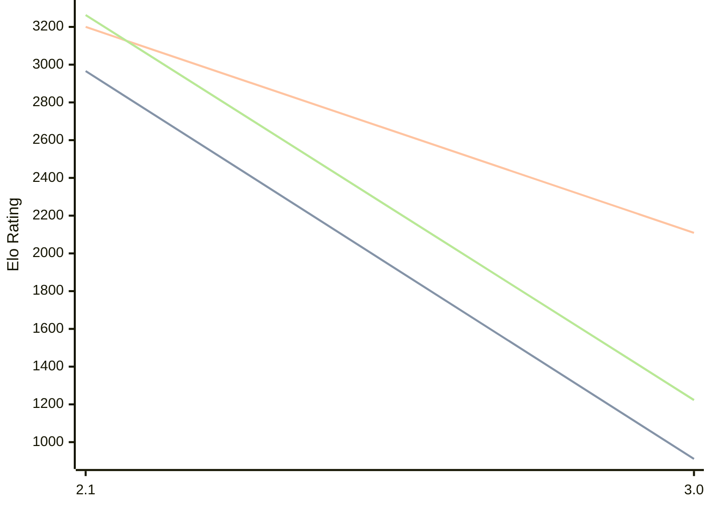

# Engine: Quirky

Author: Anton Kernozhitsky

Home: https://github.com/Wind-Eagle/Quirky

## Elo Ratings E1

| Version | Published | STC 8.0+0.08s  | LTC 60.0+0.60s | VLTC 2m24s+1.12s | Comment |
| --- | --- | --- | --- | --- | --- |
| 3.0 | 2026-05-16 | 2913 | 3081 | 3140 |  |
 | | | cElo (∆ prev) | cElo (∆ prev) | cElo (∆ prev) | 

## Elo Ratings P1

| Version | Published | STC 8.0+0.08s  | LTC 60.0+0.60s | VLTC 2m24s+1.12s | Comment |
| --- | --- | --- | --- | --- | --- |
| 3.0 | 2026-05-16 | 3179 | 3407 | 3499 |  |
 | | | cElo (∆ prev) | cElo (∆ prev) | cElo (∆ prev) | 

## Elo Ratings T1

| Version | Published | STC 8.0+0.08s  | LTC 60.0+0.60s | VLTC 2m24s+1.12s | Comment |
| --- | --- | --- | --- | --- | --- |
| 3.0 | 2026-05-16 | 911(-2055) | 2109(-1091) | 1223(-2040) |  |
| 2.1 | 2025-11-25 | 2966 | 3200 | 3263 |  |
 | | | cElo (∆ prev) | cElo (∆ prev) | cElo (∆ prev) | 

<a href="https://github.com/computer-chess-index/cci/issues/new?template=submit-version.yml&title=[VERSION]+Quirky+<version>&body=###%20Engine%20name%0AQuirky%0A%0A###%20Version%0A3.0" target="_blank">Submit new version</a>

 Test Conditions:

GUI/CLI: <a href=https://github.com/cutechess/cutechess target="_blank">Cute-Chess</a> 
Elo Calculation: <a href=https://www.remi-coulom.fr/Bayesian-Elo/ target="_blank">Bayesian-Elo</a> 
CPU for P1: Intel(R) Core(TM) Ultra 7 265T (1.50 GHz) - P-Core 
CPU for E1: Intel(R) Core(TM) Ultra 7 265T (1.50 GHz) - E-Core 
CPU for T1: Intel(R) Core(TM) i5-7500T 2.70GHz 
Opening book: 8_moves_v3 
\* STC: 8.0+0.08s, LTC: 60.0+0.60s, VLTC: 2m24s+1.12s

 Lists:
Ratings: <a href=https://github.com/computer-chess-index/cci/blob/main/lists/CCIRatings.csv target="_blank">Complete list</a>

Generated: 2026-10-10 04:41:36

## Ratings Verlauf

```mermaid
%%{init: {"theme":"base","themeVariables":{"seriesColors:['#a3a3a3','#222221','#faa371']}}}%%
xychart-beta
  x-axis ["2.1", "3.0"]
  y-axis "Elo Rating" 900 --> 3300
  line "" [2966, 911]
  line "STC (8.0+0.08s)" [2966, 911]
  line "LTC (60.0+0.60s)" [3200, 2109]
  line "" [3263, 1223]
  line "VLTC (2m24s+1.12s)" [3263, 1223]
```

## Detailed Evaluation Results

| Version | Time Control | Elo  | Range +/- | Matches | Score | Average Opponent Elo | Draws |
| --- | --- | --- | --- | --- | --- | --- | --- |
| 3.0 | VLTC (2m24s+1.12s) | 3140 | 32 | 306 | 50% | 3120 | 42% |
| 3.0 | VLTC (2m24s+1.12s) | 1223 | 21 | 1660 | 25% | 1688 | 3% |
| 3.0 | VLTC (2m24s+1.12s) | 3499 | 46 | 164 | 66% | 3151 | 46% |
| 3.0 | LTC (60.0+0.60s) | 3081 | 37 | 242 | 56% | 2930 | 39% |
| 3.0 | LTC (60.0+0.60s) | 2109 | 23 | 928 | 44% | 2203 | 2% |
| 3.0 | LTC (60.0+0.60s) | 3407 | 45 | 156 | 58% | 3313 | 45% |
| 3.0 | STC (8.0+0.08s) | 2913 | 33 | 414 | 71% | 2195 | 31% |
| --- | --- | --- | --- | --- | --- | --- | --- |
| 3.0 | STC (8.0+0.08s) | 911 | 34 | 472 | 55% | 941 | 15% |
| --- | --- | --- | --- | --- | --- | --- | --- |
| 3.0 | STC (8.0+0.08s) | 3179 | 34 | 364 | 71% | 2496 | 34% |
| --- | --- | --- | --- | --- | --- | --- | --- |
| 2.1 | VLTC (2m24s+1.12s) | 3263 | 22 | 564 | 54% | 3235 | 59% |
| 2.1 | LTC (60.0+0.60s) | 3200 | 25 | 438 | 52% | 3181 | 63% |
| 2.1 | STC (8.0+0.08s) | 2966 | 23 | 552 | 50% | 2947 | 44% |
| --- | --- | --- | --- | --- | --- | --- | --- |