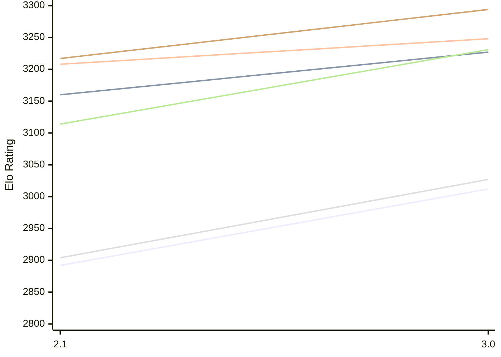
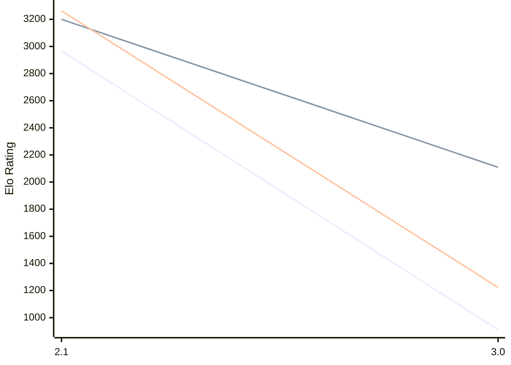

# Engine: Quirky

Author: Anton Kernozhitsky

Home: https://github.com/Wind-Eagle/Quirky

## Elo Ratings E1 (Ultra 7 265T (1.50 GHz) - E-Core)

| Version | Published | STC 8.0+0.08s  | LTC 60.0+0.60s | VLTC 2m24s+1.12s | Comment |
| --- | --- | --- | --- | --- | --- |
| 3.0 | 2026-05-16 | 3012(+120) | 3227(+67) | 3248(+40) |  |
| 2.1 | 2025-11-25 | 2892 | 3160 | 3208 |  |
 | | | cElo (∆ prev) | cElo (∆ prev) | cElo (∆ prev) | 

## Elo Ratings P1 (Ultra 7 265T (1.50 GHz) - P-Core)

| Version | Published | STC 8.0+0.08s  | LTC 60.0+0.60s | VLTC 2m24s+1.12s | Comment |
| --- | --- | --- | --- | --- | --- |
| 3.0 | 2026-05-16 | 3027(+123) | 3231(+117) | 3294(+77) |  |
| 2.1 | 2025-11-25 | 2904 | 3114 | 3217 |  |
 | | | cElo (∆ prev) | cElo (∆ prev) | cElo (∆ prev) | 

## Elo Ratings T1 (i5-7500T 2.70GHz)

| Version | Published | STC 8.0+0.08s  | LTC 60.0+0.60s | VLTC 2m24s+1.12s | Comment |
| --- | --- | --- | --- | --- | --- |
| 3.0 | 2026-05-16 | 911(-2055) | 2109(-1091) | 1223(-2040) |  |
| 2.1 | 2025-11-25 | 2966 | 3200 | 3263 |  |
 | | | cElo (∆ prev) | cElo (∆ prev) | cElo (∆ prev) | 

<a href="https://github.com/computer-chess-index/cci/issues/new?template=submit-version.yml&title=[VERSION]+Quirky+<version>&body=###%20Engine%20name%0AQuirky%0A%0A###%20Version%0A3.0" target="_blank">Submit new version</a>

 Test Conditions:

GUI/CLI: <a href=https://github.com/cutechess/cutechess target="_blank">Cute-Chess</a> 
Elo Calculation: <a href=https://www.remi-coulom.fr/Bayesian-Elo/ target="_blank">Bayesian-Elo</a> 
CPU for P1: Intel(R) Core(TM) Ultra 7 265T (1.50 GHz) - P-Core 
CPU for E1: Intel(R) Core(TM) Ultra 7 265T (1.50 GHz) - E-Core 
CPU for T1: Intel(R) Core(TM) i5-7500T 2.70GHz 
Opening book: 8_moves_v3 
\* STC: 8.0+0.08s, LTC: 60.0+0.60s, VLTC: 2m24s+1.12s

 Lists:
Ratings: <a href=https://github.com/computer-chess-index/cci/blob/main/lists/CCIRatings.csv target="_blank">Complete list</a>

Generated: 2026-11-23 05:41:45

## Ratings Verlauf E1 / P1

```mermaid
%%{init: {"theme":"base","themeVariables":{"seriesColors:['#a3a3a3','#222221','#faa371']}}}%%
xychart-beta
  x-axis ["2.1", "3.0"]
  y-axis "Elo Rating" 2800 --> 3300
  line "E1: STC (8.0+0.08s)" [2892, 3012]
  line "E1: LTC (60.0+0.60s)" [3160, 3227]
  line "E1: VLTC (2m24s+1.12s)" [3208, 3248]
  line "P1: STC (8.0+0.08s)" [2904, 3027]
  line "P1: LTC (60.0+0.60s)" [3114, 3231]
  line "P1: VLTC (2m24s+1.12s)" [3217, 3294]
```

## Ratings Verlauf T1

```mermaid
%%{init: {"theme":"base","themeVariables":{"seriesColors:['#a3a3a3','#222221','#faa371']}}}%%
xychart-beta
  x-axis ["2.1", "3.0"]
  y-axis "Elo Rating" 900 --> 3300
  line "T1: STC (8.0+0.08s)" [2966, 911]
  line "T1: LTC (60.0+0.60s)" [3200, 2109]
  line "T1: VLTC (2m24s+1.12s)" [3263, 1223]
```

## Detailed Evaluation Results

| Version | Time Control | Variant | Elo  | Range +/- | Matches | Score | Average Opponent Elo | Draws |
| --- | --- |--- | --- | --- | --- | --- | --- | --- |
| 3.0 | VLTC (2m24s+1.12s) | P1 | 3294 | 29 | 346 | 56% | 3144 | 53% |
|  |  | E1 | 3248 | 24 | 534 | 53% | 3212 | 44% |
|  |  | T1 | 1223 | 21 | 1660 | 25% | 1688 | 3% |
|  | LTC (60.0+0.60s) | P1 | 3231 | 29 | 332 | 54% | 3179 | 53% |
|  |  | E1 | 3227 | 23 | 564 | 57% | 3123 | 48% |
|  |  | T1 | 2109 | 23 | 928 | 44% | 2203 | 2% |
|  | STC (8.0+0.08s) | E1 | 3012 | 25 | 624 | 65% | 2526 | 37% |
|  |  | T1 | 911 | 34 | 472 | 55% | 941 | 15% |
|  |  | P1 | 3027 | 25 | 570 | 65% | 2606 | 41% |
| --- | --- |--- | --- | --- | --- | --- | --- | --- |
| 2.1 | VLTC (2m24s+1.12s) | T1 | 3263 | 22 | 564 | 54% | 3235 | 59% |
|  |  | P1 | 3217 | 64 | 72 | 60% | 3112 | 54% |
|  |  | E1 | 3208 | 61 | 80 | 54% | 3109 | 50% |
|  | LTC (60.0+0.60s) | T1 | 3200 | 25 | 438 | 52% | 3181 | 63% |
|  |  | P1 | 3114 | 65 | 78 | 62% | 2959 | 41% |
|  |  | E1 | 3160 | 59 | 80 | 51% | 3150 | 55% |
|  | STC (8.0+0.08s) | T1 | 2966 | 23 | 552 | 50% | 2947 | 44% |
|  |  | P1 | 2904 | 64 | 84 | 51% | 2835 | 40% |
|  |  | E1 | 2892 | 69 | 84 | 64% | 2645 | 26% |