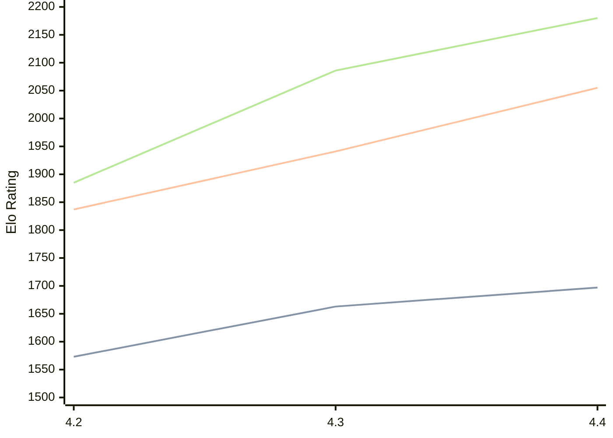

# Engine: Radiance

Author: Paul-Elie Pipelin

Home: https://github.com/ppipelin/radiance

## Elo Ratings

| Version | Published | STC 8.0+0.08s  | LTC 60.0+0.60s | VLTC 2m24s+1.12s | Comment |
| --- | --- | --- | --- | --- | --- |
| 4.4 | 2026-04-23 | 1697(+34) | 2055(+114) | 2180(+94) |  |
| 4.3 | 2026-03-25 | 1663(+90) | 1941(+104) | 2086(+201) |  |
| 4.2 | 2026-01-17 | 1573(+new) | 1837(+new) | 1885(+new) |  |
| 4.1 | 2025-08-16 |  |  |  |  |
| 4.0.1 | 2025-04-17 |  |  |  |  |
| 4.0 | 2025-04-16 |  |  |  |  |
 | | | cElo (∆ prev) | cElo (∆ prev) | cElo (∆ prev) | 

<a href="https://github.com/computer-chess-index/cci/issues/new?template=submit-version.yml&title=[VERSION]+Radiance+<version>&body=###%20Engine%20name%0ARadiance%0A%0A###%20Version%0A4.4" target="_blank">Submit new version</a>

 Test Conditions:

GUI/CLI: <a href=https://github.com/cutechess/cutechess target="_blank">Cute-Chess</a> 
Elo Calculation: <a href=https://www.remi-coulom.fr/Bayesian-Elo/ target="_blank">Bayesian-Elo</a> 
CPU: Intel(R) Core(TM) i5-7500T 2.70GHz 
Opening book: 8_moves_v3 
\* STC: 8.0+0.08s, LTC: 60.0+0.60s, VLTC: 2m24s+1.12s

 Lists:
Ratings: <a href=https://github.com/computer-chess-index/cci/blob/main/lists/CCIRatings.csv target="_blank">Complete list</a>

Generated: 2026-07-16 06:27:56

## Ratings Verlauf

## Ratings Verlauf

⬛ STC (8.0+0.08s) &nbsp;&nbsp; 🟧 LTC (60.0+0.60s) &nbsp;&nbsp; 🟩 VLTC (2m24s+1.12s)

dark mode: 🟩STC (8.0+0.08s) 🟧LTC (60.0+0.60s) ⬜VLTC (2m24s+1.12s)

## Detailed Evaluation Results

| Version | Time Control | Elo  | Range +/- | Matches | Score | Average Opponent Elo | Draws |
| --- | --- | --- | --- | --- | --- | --- | --- |
| 4.4 | VLTC (2m24s+1.12s) | 2180 | 31 | 372 | 49% | 2178 | 22% |
| 4.4 | LTC (60.0+0.60s) | 2055 | 29 | 414 | 51% | 2033 | 22% |
| 4.4 | STC (8.0+0.08s) | 1697 | 29 | 434 | 49% | 1700 | 19% |
| --- | --- | --- | --- | --- | --- | --- | --- |
| 4.3 | VLTC (2m24s+1.12s) | 2086 | 30 | 412 | 54% | 2044 | 18% |
| 4.3 | LTC (60.0+0.60s) | 1941 | 31 | 362 | 49% | 1951 | 23% |
| 4.3 | STC (8.0+0.08s) | 1663 | 32 | 360 | 49% | 1671 | 22% |
| --- | --- | --- | --- | --- | --- | --- | --- |
| 4.2 | VLTC (2m24s+1.12s) | 1885 | 36 | 304 | 45% | 1976 | 19% |
| 4.2 | LTC (60.0+0.60s) | 1837 | 39 | 246 | 47% | 1893 | 18% |
| 4.2 | STC (8.0+0.08s) | 1573 | 34 | 328 | 45% | 1650 | 17% |
| --- | --- | --- | --- | --- | --- | --- | --- |