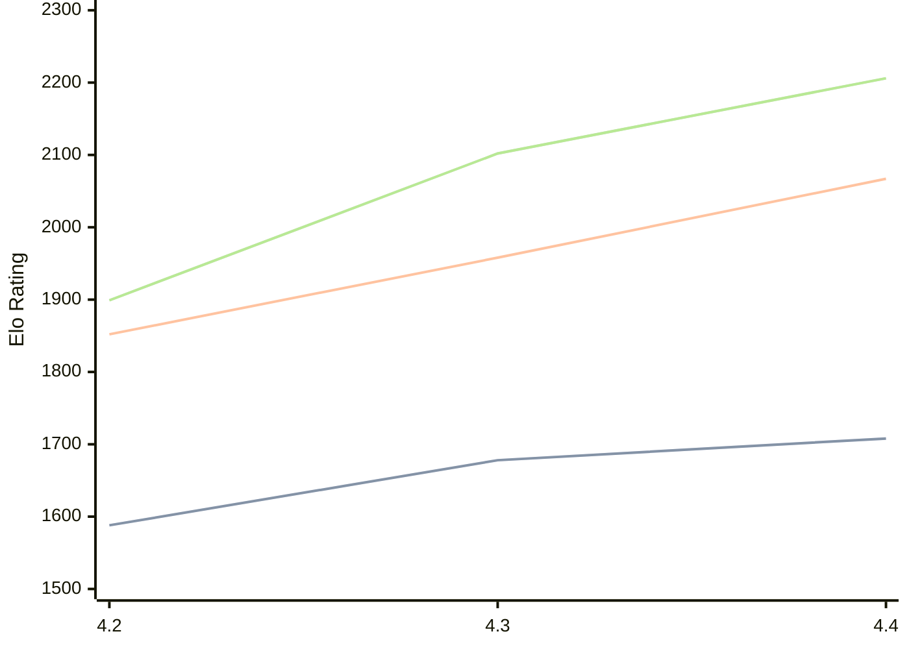

# Engine: Radiance

Author: Paul-Elie Pipelin

Home: https://github.com/ppipelin/radiance

## Elo Ratings

| Version | Published | STC 8.0+0.08s  | LTC 60.0+0.60s | VLTC 2m24s+1.12s | Comment |
| --- | --- | --- | --- | --- | --- |
| 4.4 | 2026-04-23 | 1708(+30) | 2067(+109) | 2206(+104) |  |
| 4.3 | 2026-03-25 | 1678(+90) | 1958(+106) | 2102(+203) |  |
| 4.2 | 2026-01-17 | 1588 | 1852 | 1899 |  |
 | | | cElo (∆ prev) | cElo (∆ prev) | cElo (∆ prev) | 

<a href="https://github.com/computer-chess-index/cci/issues/new?template=submit-version.yml&title=[VERSION]+Radiance+<version>&body=###%20Engine%20name%0ARadiance%0A%0A###%20Version%0A4.4" target="_blank">Submit new version</a>

 Test Conditions:

GUI/CLI: <a href=https://github.com/cutechess/cutechess target="_blank">Cute-Chess</a> 
Elo Calculation: <a href=https://www.remi-coulom.fr/Bayesian-Elo/ target="_blank">Bayesian-Elo</a> 
CPU: Intel(R) Core(TM) i5-7500T 2.70GHz 
Opening book: 8_moves_v3 
\* STC: 8.0+0.08s, LTC: 60.0+0.60s, VLTC: 2m24s+1.12s

 Lists:
Ratings: <a href=https://github.com/computer-chess-index/cci/blob/main/lists/CCIRatings.csv target="_blank">Complete list</a>

Generated: 2026-09-25 04:41:39

## Ratings Verlauf

## Detailed Evaluation Results

| Version | Time Control | Elo  | Range +/- | Matches | Score | Average Opponent Elo | Draws |
| --- | --- | --- | --- | --- | --- | --- | --- |
| 4.4 | VLTC (2m24s+1.12s) | 2206 | 28 | 444 | 50% | 2199 | 21% |
| 4.4 | LTC (60.0+0.60s) | 2067 | 26 | 506 | 51% | 2056 | 22% |
| 4.4 | STC (8.0+0.08s) | 1708 | 26 | 574 | 48% | 1719 | 19% |
| --- | --- | --- | --- | --- | --- | --- | --- |
| 4.3 | VLTC (2m24s+1.12s) | 2102 | 30 | 412 | 54% | 2061 | 18% |
| 4.3 | LTC (60.0+0.60s) | 1958 | 31 | 362 | 49% | 1967 | 23% |
| 4.3 | STC (8.0+0.08s) | 1678 | 32 | 360 | 49% | 1686 | 22% |
| --- | --- | --- | --- | --- | --- | --- | --- |
| 4.2 | VLTC (2m24s+1.12s) | 1899 | 36 | 304 | 45% | 1993 | 19% |
| 4.2 | LTC (60.0+0.60s) | 1852 | 39 | 246 | 47% | 1909 | 18% |
| 4.2 | STC (8.0+0.08s) | 1588 | 34 | 328 | 45% | 1666 | 17% |
| --- | --- | --- | --- | --- | --- | --- | --- |