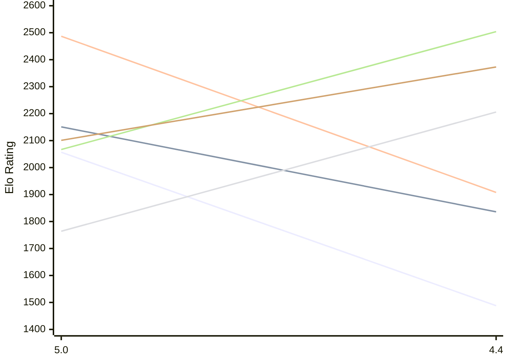
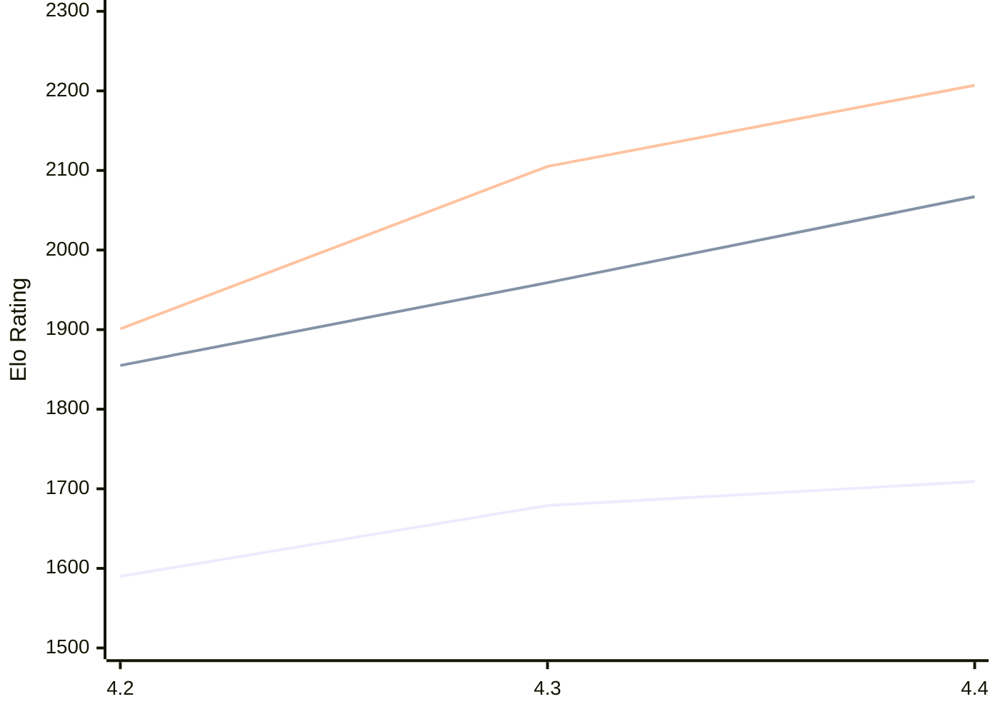

# Engine: Radiance

Author: Paul-Elie Pipelin

Home: https://github.com/ppipelin/radiance

## Elo Ratings E1

| Version | Published | STC 8.0+0.08s  | LTC 60.0+0.60s | VLTC 2m24s+1.12s | Comment |
| --- | --- | --- | --- | --- | --- |
| 5.0 | 2026-10-10 | 2057(+569) | 2151(+315) | 2487(+579) |  |
| 4.4 | 2026-04-23 | 1488 | 1836 | 1908 |  |
 | | | cElo (∆ prev) | cElo (∆ prev) | cElo (∆ prev) | 

## Elo Ratings P1

| Version | Published | STC 8.0+0.08s  | LTC 60.0+0.60s | VLTC 2m24s+1.12s | Comment |
| --- | --- | --- | --- | --- | --- |
| 5.0 | 2026-10-10 | 2206(+442) | 2504(+437) | 2373(+272) |  |
| 4.4 | 2026-04-23 | 1764 | 2067 | 2101 |  |
 | | | cElo (∆ prev) | cElo (∆ prev) | cElo (∆ prev) | 

## Elo Ratings T1

| Version | Published | STC 8.0+0.08s  | LTC 60.0+0.60s | VLTC 2m24s+1.12s | Comment |
| --- | --- | --- | --- | --- | --- |
| 4.4 | 2026-04-23 | 1709(+30) | 2067(+108) | 2207(+102) |  |
| 4.3 | 2026-03-25 | 1679(+89) | 1959(+104) | 2105(+204) |  |
| 4.2 | 2026-01-17 | 1590 | 1855 | 1901 |  |
 | | | cElo (∆ prev) | cElo (∆ prev) | cElo (∆ prev) | 

<a href="https://github.com/computer-chess-index/cci/issues/new?template=submit-version.yml&title=[VERSION]+Radiance+<version>&body=###%20Engine%20name%0ARadiance%0A%0A###%20Version%0A4.4" target="_blank">Submit new version</a>

 Test Conditions:

GUI/CLI: <a href=https://github.com/cutechess/cutechess target="_blank">Cute-Chess</a> 
Elo Calculation: <a href=https://www.remi-coulom.fr/Bayesian-Elo/ target="_blank">Bayesian-Elo</a> 
CPU for P1: Intel(R) Core(TM) Ultra 7 265T (1.50 GHz) - P-Core 
CPU for E1: Intel(R) Core(TM) Ultra 7 265T (1.50 GHz) - E-Core 
CPU for T1: Intel(R) Core(TM) i5-7500T 2.70GHz 
Opening book: 8_moves_v3 
\* STC: 8.0+0.08s, LTC: 60.0+0.60s, VLTC: 2m24s+1.12s

 Lists:
Ratings: <a href=https://github.com/computer-chess-index/cci/blob/main/lists/CCIRatings.csv target="_blank">Complete list</a>

Generated: 2026-10-11 11:18:14

## Ratings Verlauf E1 / P1

```mermaid
%%{init: {"theme":"base","themeVariables":{"seriesColors:['#a3a3a3','#222221','#faa371']}}}%%
xychart-beta
  x-axis ["5.0", "4.4"]
  y-axis "Elo Rating" 1400 --> 2600
  line "E1: STC (8.0+0.08s)" [2057, 1488]
  line "E1: LTC (60.0+0.60s)" [2151, 1836]
  line "E1: VLTC (2m24s+1.12s)" [2487, 1908]
  line "P1: STC (8.0+0.08s)" [1764, 2206]
  line "P1: LTC (60.0+0.60s)" [2067, 2504]
  line "P1: VLTC (2m24s+1.12s)" [2101, 2373]
```

## Ratings Verlauf T1

```mermaid
%%{init: {"theme":"base","themeVariables":{"seriesColors:['#a3a3a3','#222221','#faa371']}}}%%
xychart-beta
  x-axis ["4.2", "4.3", "4.4"]
  y-axis "Elo Rating" 1500 --> 2300
  line "T1: STC (8.0+0.08s)" [1590, 1679, 1709]
  line "T1: LTC (60.0+0.60s)" [1855, 1959, 2067]
  line "T1: VLTC (2m24s+1.12s)" [1901, 2105, 2207]
```

## Detailed Evaluation Results

| Version | Time Control | Elo  | Range +/- | Matches | Score | Average Opponent Elo | Draws |
| --- | --- | --- | --- | --- | --- | --- | --- |
| 5.0 | VLTC (2m24s+1.12s) | 2373 | 268 | 4 | 88% | 2106 | 25% |
| 5.0 | VLTC (2m24s+1.12s) | 2487 | 329 | 8 | 100% | 1908 | 0% |
| 5.0 | LTC (60.0+0.60s) | 2504 | 346 | 4 | 100% | 2064 | 0% |
| 5.0 | LTC (60.0+0.60s) | 2151 | 369 | 2 | 100% | 1839 | 0% |
| 5.0 | STC (8.0+0.08s) | 2206 | 344 | 4 | 100% | 1767 | 0% |
| --- | --- | --- | --- | --- | --- | --- | --- |
| 5.0 | STC (8.0+0.08s) | 2057 | 275 | 6 | 92% | 1640 | 17% |
| --- | --- | --- | --- | --- | --- | --- | --- |
| 4.4 | VLTC (2m24s+1.12s) | 2101 | 78 | 64 | 48% | 2165 | 17% |
| 4.4 | VLTC (2m24s+1.12s) | 1908 | 47 | 170 | 45% | 1987 | 16% |
| 4.4 | VLTC (2m24s+1.12s) | 2207 | 28 | 444 | 50% | 2201 | 21% |
| 4.4 | LTC (60.0+0.60s) | 2067 | 54 | 122 | 53% | 2055 | 22% |
| 4.4 | LTC (60.0+0.60s) | 1836 | 55 | 124 | 45% | 1935 | 22% |
| 4.4 | LTC (60.0+0.60s) | 2067 | 26 | 510 | 50% | 2057 | 22% |
| 4.4 | STC (8.0+0.08s) | 1488 | 48 | 160 | 44% | 1561 | 18% |
| --- | --- | --- | --- | --- | --- | --- | --- |
| 4.4 | STC (8.0+0.08s) | 1709 | 26 | 576 | 48% | 1721 | 19% |
| --- | --- | --- | --- | --- | --- | --- | --- |
| 4.4 | STC (8.0+0.08s) | 1764 | 70 | 70 | 52% | 1740 | 21% |
| --- | --- | --- | --- | --- | --- | --- | --- |
| 4.3 | VLTC (2m24s+1.12s) | 2105 | 30 | 412 | 54% | 2063 | 18% |
| 4.3 | LTC (60.0+0.60s) | 1959 | 31 | 362 | 49% | 1968 | 23% |
| 4.3 | STC (8.0+0.08s) | 1679 | 32 | 360 | 49% | 1689 | 22% |
| --- | --- | --- | --- | --- | --- | --- | --- |
| 4.2 | VLTC (2m24s+1.12s) | 1901 | 36 | 304 | 45% | 1994 | 19% |
| 4.2 | LTC (60.0+0.60s) | 1855 | 39 | 246 | 47% | 1910 | 18% |
| 4.2 | STC (8.0+0.08s) | 1590 | 34 | 328 | 45% | 1667 | 17% |
| --- | --- | --- | --- | --- | --- | --- | --- |