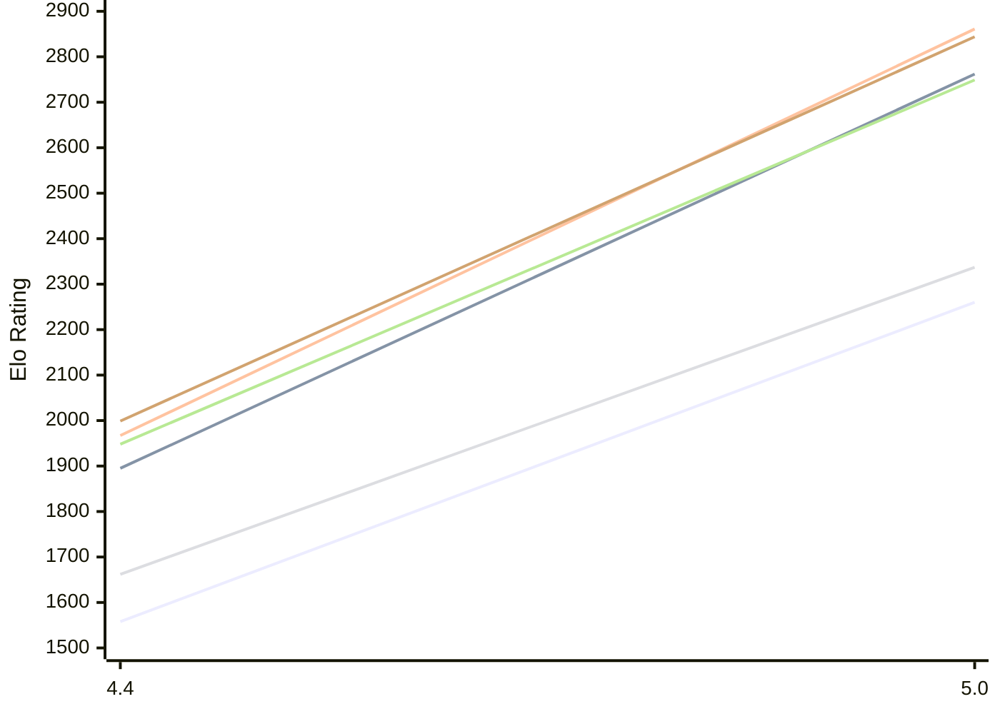
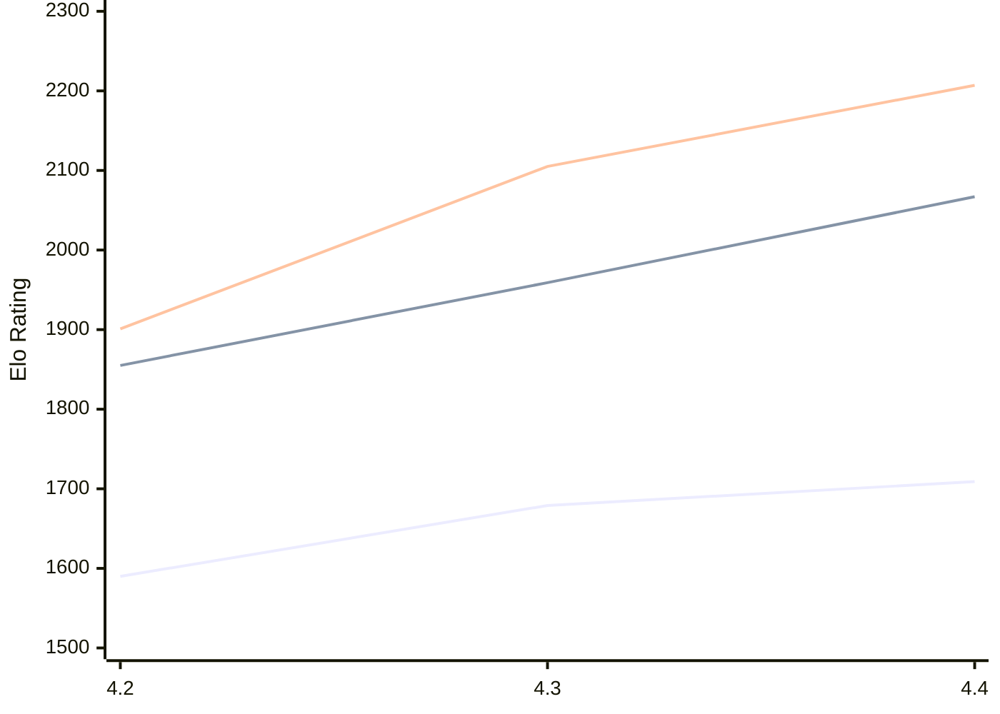

# Engine: Radiance

Author: Paul-Elie Pipelin

Home: https://github.com/ppipelin/radiance

## Elo Ratings E1 (Ultra 7 265T (1.50 GHz) - E-Core)

| Version | Published | STC 8.0+0.08s  | LTC 60.0+0.60s | VLTC 2m24s+1.12s | Comment |
| --- | --- | --- | --- | --- | --- |
| 5.0 | 2026-10-10 | 2260(+702) | 2762(+867) | 2861(+894) |  |
| 4.4 | 2026-04-23 | 1558 | 1895 | 1967 |  |
 | | | cElo (∆ prev) | cElo (∆ prev) | cElo (∆ prev) | 

## Elo Ratings P1 (Ultra 7 265T (1.50 GHz) - P-Core)

| Version | Published | STC 8.0+0.08s  | LTC 60.0+0.60s | VLTC 2m24s+1.12s | Comment |
| --- | --- | --- | --- | --- | --- |
| 5.0 | 2026-10-10 | 2337(+675) | 2749(+801) | 2844(+845) |  |
| 4.4 | 2026-04-23 | 1662 | 1948 | 1999 |  |
 | | | cElo (∆ prev) | cElo (∆ prev) | cElo (∆ prev) | 

## Elo Ratings T1 (i5-7500T 2.70GHz)

| Version | Published | STC 8.0+0.08s  | LTC 60.0+0.60s | VLTC 2m24s+1.12s | Comment |
| --- | --- | --- | --- | --- | --- |
| 4.4 | 2026-04-23 | 1709(+30) | 2067(+108) | 2207(+102) |  |
| 4.3 | 2026-03-25 | 1679(+89) | 1959(+104) | 2105(+204) |  |
| 4.2 | 2026-01-17 | 1590 | 1855 | 1901 |  |
 | | | cElo (∆ prev) | cElo (∆ prev) | cElo (∆ prev) | 

<a href="https://github.com/computer-chess-index/cci/issues/new?template=submit-version.yml&title=[VERSION]+Radiance+<version>&body=###%20Engine%20name%0ARadiance%0A%0A###%20Version%0A4.4" target="_blank">Submit new version</a>

 Test Conditions:

GUI/CLI: <a href=https://github.com/cutechess/cutechess target="_blank">Cute-Chess</a> 
Elo Calculation: <a href=https://www.remi-coulom.fr/Bayesian-Elo/ target="_blank">Bayesian-Elo</a> 
CPU for P1: Intel(R) Core(TM) Ultra 7 265T (1.50 GHz) - P-Core 
CPU for E1: Intel(R) Core(TM) Ultra 7 265T (1.50 GHz) - E-Core 
CPU for T1: Intel(R) Core(TM) i5-7500T 2.70GHz 
Opening book: 8_moves_v3 
\* STC: 8.0+0.08s, LTC: 60.0+0.60s, VLTC: 2m24s+1.12s

 Lists:
Ratings: <a href=https://github.com/computer-chess-index/cci/blob/main/lists/CCIRatings.csv target="_blank">Complete list</a>

Generated: 2026-11-19 05:41:59

## Ratings Verlauf E1 / P1

```mermaid
%%{init: {"theme":"base","themeVariables":{"seriesColors:['#a3a3a3','#222221','#faa371']}}}%%
xychart-beta
  x-axis ["4.4", "5.0"]
  y-axis "Elo Rating" 1500 --> 2900
  line "E1: STC (8.0+0.08s)" [1558, 2260]
  line "E1: LTC (60.0+0.60s)" [1895, 2762]
  line "E1: VLTC (2m24s+1.12s)" [1967, 2861]
  line "P1: STC (8.0+0.08s)" [1662, 2337]
  line "P1: LTC (60.0+0.60s)" [1948, 2749]
  line "P1: VLTC (2m24s+1.12s)" [1999, 2844]
```

## Ratings Verlauf T1

```mermaid
%%{init: {"theme":"base","themeVariables":{"seriesColors:['#a3a3a3','#222221','#faa371']}}}%%
xychart-beta
  x-axis ["4.2", "4.3", "4.4"]
  y-axis "Elo Rating" 1500 --> 2300
  line "T1: STC (8.0+0.08s)" [1590, 1679, 1709]
  line "T1: LTC (60.0+0.60s)" [1855, 1959, 2067]
  line "T1: VLTC (2m24s+1.12s)" [1901, 2105, 2207]
```

## Detailed Evaluation Results

| Version | Time Control | Variant | Elo  | Range +/- | Matches | Score | Average Opponent Elo | Draws |
| --- | --- |--- | --- | --- | --- | --- | --- | --- |
| 5.0 | VLTC (2m24s+1.12s) | P1 | 2844 | 36 | 244 | 55% | 2788 | 38% |
|  |  | E1 | 2861 | 34 | 280 | 52% | 2828 | 35% |
|  | LTC (60.0+0.60s) | P1 | 2749 | 38 | 232 | 46% | 2777 | 31% |
|  |  | E1 | 2762 | 32 | 316 | 51% | 2757 | 36% |
|  | STC (8.0+0.08s) | P1 | 2337 | 49 | 148 | 53% | 2298 | 22% |
|  |  | E1 | 2260 | 39 | 232 | 53% | 2195 | 26% |
| --- | --- |--- | --- | --- | --- | --- | --- | --- |
| 4.4 | VLTC (2m24s+1.12s) | T1 | 2207 | 28 | 444 | 50% | 2201 | 21% |
|  |  | P1 | 1999 | 69 | 84 | 50% | 2022 | 14% |
|  |  | E1 | 1967 | 46 | 178 | 46% | 2034 | 17% |
|  | LTC (60.0+0.60s) | T1 | 2067 | 26 | 510 | 50% | 2057 | 22% |
|  |  | P1 | 1948 | 51 | 132 | 52% | 1940 | 23% |
|  |  | E1 | 1895 | 51 | 142 | 45% | 1985 | 20% |
|  | STC (8.0+0.08s) | T1 | 1709 | 26 | 576 | 48% | 1721 | 19% |
|  |  | P1 | 1662 | 64 | 88 | 54% | 1597 | 22% |
|  |  | E1 | 1558 | 47 | 174 | 43% | 1644 | 17% |
| --- | --- |--- | --- | --- | --- | --- | --- | --- |
| 4.3 | VLTC (2m24s+1.12s) | T1 | 2105 | 30 | 412 | 54% | 2063 | 18% |
|  | LTC (60.0+0.60s) | T1 | 1959 | 31 | 362 | 49% | 1968 | 23% |
|  | STC (8.0+0.08s) | T1 | 1679 | 32 | 360 | 49% | 1689 | 22% |
| --- | --- |--- | --- | --- | --- | --- | --- | --- |
| 4.2 | VLTC (2m24s+1.12s) | T1 | 1901 | 36 | 304 | 45% | 1994 | 19% |
|  | LTC (60.0+0.60s) | T1 | 1855 | 39 | 246 | 47% | 1910 | 18% |
|  | STC (8.0+0.08s) | T1 | 1590 | 34 | 328 | 45% | 1667 | 17% |