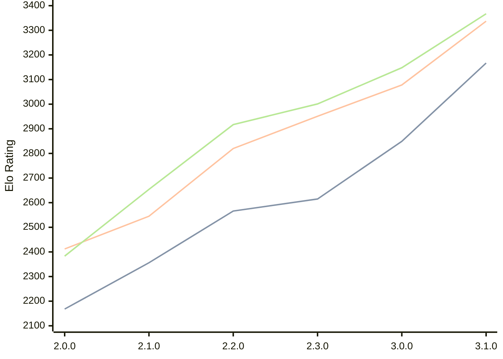

# Engine: Raphael

Author: Rei Meguro

Home: https://github.com/Orbital-Web/Raphael

## Ratings nach Version

| Version | Published | STC 8.0+0.08s  | LTC 60.0+0.60s | VLTC 2m24s+1.12s | Comment |
| --- | --- | --- | --- | --- | --- |
| 3.1.0 | 2026-03-01 | 3167(+318) | 3337(+259) | 3367(+219) |  |
| 3.0.0 | 2026-02-12 | 2849(+234) | 3078(+127) | 3148(+147) |  |
| 2.3.0 | 2026-01-26 | 2615(+49) | 2951(+131) | 3001(+84) |  |
| 2.2.0 | 2026-01-08 | 2566(+210) | 2820(+275) | 2917(+263) |  |
| 2.1.0 | 2026-01-01 | 2356(+188) | 2545(+133) | 2654(+271) |  |
| 2.0.0 | 2025-12-23 | 2168(+new) | 2412(+new) | 2383(+new) |  |
| 1.8.0 | 2024-12-27 |  |  |  |  |
| 1.7.6 | 2024-12-16 |  |  |  |  |
| 1.7.0 | 2023-08-27 |  |  |  |  |
| 1.6.0 | 2023-08-21 |  |  |  |  |
| 1.5.0 | 2023-08-16 |  |  |  |  |
| 1.4.0 | 2023-08-10 |  |  |  |  |
| 1.3.0 | 2023-08-05 |  |  |  |  |
| 1.2.0 | 2023-07-24 |  |  |  |  |
| 1.1.0 | 2023-07-23 |  |  |  |  |
| 1.0.0 | 2023-07-19 |  |  |  |  |
| 0.5.1 | 2023-07-17 |  |  |  |  |
| 0.5.0 | 2023-07-07 |  |  |  |  |
 | | | cElo (∆ prev) | cElo (∆ prev) | cElo (∆ prev) | 

 Test Conditions:

GUI/CLI: <a href=https://github.com/cutechess/cutechess target="_blank">Cute-Chess</a> 
Elo Calculation: <a href=https://www.remi-coulom.fr/Bayesian-Elo/ target="_blank">Bayesian-Elo</a> 
CPU: Intel(R) Core(TM) i5-7500T 2.70GHz 
Opening book: 8_moves_v3 
\* STC: 8.0+0.08s, LTC: 60.0+0.60s, VLTC: 2m24s+1.12s

 Lists:
Ratings: <a href=https://github.com/computer-chess-index/cci/blob/main/lists/CCIRatings.csv target="_blank">Complete list</a>

Generated: 2026-03-07 06:25:25

## Ratings Verlauf

⬛ STC (8.0+0.08s) &nbsp;&nbsp; 🟧 LTC (60.0+0.60s) &nbsp;&nbsp; 🟩 VLTC (2m24s+1.12s)

