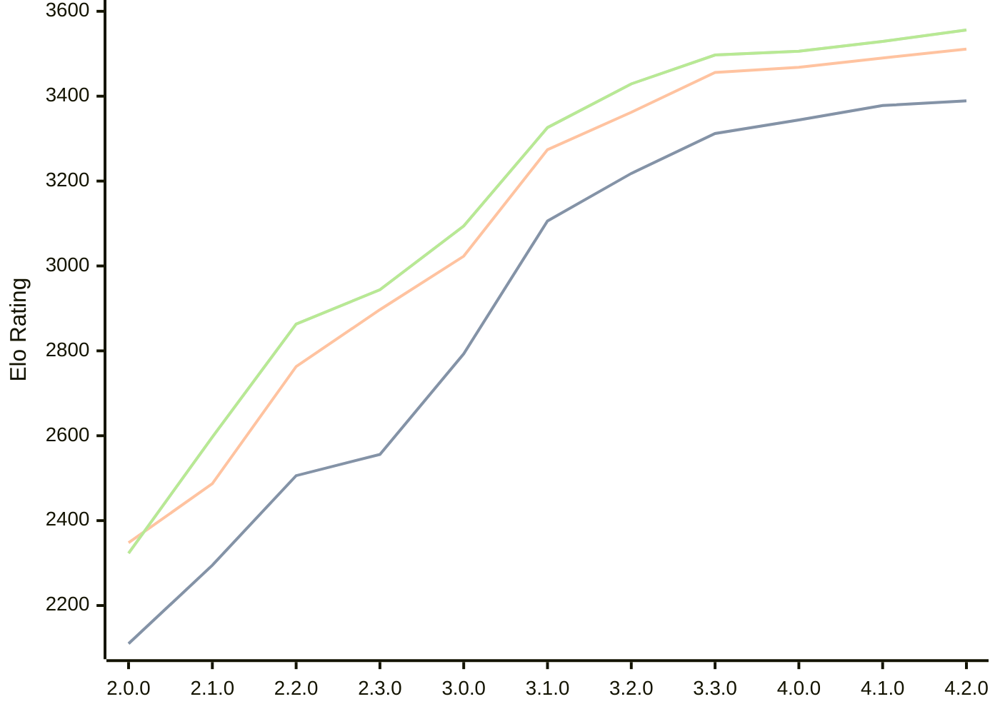

# Engine: Raphael

Author: Rei Meguro

Home: https://github.com/Orbital-Web/Raphael

## Elo Ratings

| Version | Published | STC 8.0+0.08s  | LTC 60.0+0.60s | VLTC 2m24s+1.12s | Comment |
| --- | --- | --- | --- | --- | --- |
| 4.2.0 | 2026-06-27 | 3389(+11) | 3511(+21) | 3556(+27) |  |
| 4.1.0 | 2026-05-17 | 3378(+34) | 3490(+22) | 3529(+23) |  |
| 4.0.0 | 2026-04-26 | 3344(+32) | 3468(+12) | 3506(+9) |  |
| 3.3.0 | 2026-04-06 | 3312(+94) | 3456(+94) | 3497(+68) |  |
| 3.2.0 | 2026-03-19 | 3218(+112) | 3362(+88) | 3429(+103) |  |
| 3.1.0 | 2026-03-01 | 3106(+313) | 3274(+251) | 3326(+232) |  |
| 3.0.0 | 2026-02-12 | 2793(+237) | 3023(+126) | 3094(+150) |  |
| 2.3.0 | 2026-01-26 | 2556(+50) | 2897(+134) | 2944(+81) |  |
| 2.2.0 | 2026-01-08 | 2506(+211) | 2763(+276) | 2863(+266) |  |
| 2.1.0 | 2026-01-01 | 2295(+185) | 2487(+139) | 2597(+274) |  |
| 2.0.0 | 2025-12-23 | 2110(+new) | 2348(+new) | 2323(+new) |  |
| 1.8.0 | 2024-12-27 |  |  |  |  |
| 1.7.6 | 2024-12-16 |  |  |  |  |
| 1.7.0 | 2023-08-27 |  |  |  |  |
| 1.6.0 | 2023-08-21 |  |  |  |  |
| 1.5.0 | 2023-08-16 |  |  |  |  |
| 1.4.0 | 2023-08-10 |  |  |  |  |
| 1.3.0 | 2023-08-05 |  |  |  |  |
| 1.2.0 | 2023-07-24 |  |  |  |  |
| 1.1.0 | 2023-07-23 |  |  |  |  |
| 1.0.0 | 2023-07-19 |  |  |  |  |
| 0.5.1 | 2023-07-17 |  |  |  |  |
| 0.5.0 | 2023-07-07 |  |  |  |  |
 | | | cElo (∆ prev) | cElo (∆ prev) | cElo (∆ prev) | 

<a href="https://github.com/computer-chess-index/cci/issues/new?template=submit-version.yml&title=[VERSION]+Raphael+<version>&body=###%20Engine%20name%0ARaphael%0A%0A###%20Version%0A4.2.0" target="_blank">Submit new version</a>

 Test Conditions:

GUI/CLI: <a href=https://github.com/cutechess/cutechess target="_blank">Cute-Chess</a> 
Elo Calculation: <a href=https://www.remi-coulom.fr/Bayesian-Elo/ target="_blank">Bayesian-Elo</a> 
CPU: Intel(R) Core(TM) i5-7500T 2.70GHz 
Opening book: 8_moves_v3 
\* STC: 8.0+0.08s, LTC: 60.0+0.60s, VLTC: 2m24s+1.12s

 Lists:
Ratings: <a href=https://github.com/computer-chess-index/cci/blob/main/lists/CCIRatings.csv target="_blank">Complete list</a>

Generated: 2026-07-06 06:28:02

## Ratings Verlauf

## Ratings Verlauf

⬛ STC (8.0+0.08s) &nbsp;&nbsp; 🟧 LTC (60.0+0.60s) &nbsp;&nbsp; 🟩 VLTC (2m24s+1.12s)

dark mode: 🟩STC (8.0+0.08s) 🟧LTC (60.0+0.60s) ⬜VLTC (2m24s+1.12s)

## Detailed Evaluation Results

| Version | Time Control | Elo  | Range +/- | Matches | Score | Average Opponent Elo | Draws |
| --- | --- | --- | --- | --- | --- | --- | --- |
| 4.2.0 | VLTC (2m24s+1.12s) | 3556 | 49 | 92 | 51% | 3548 | 91% |
| 4.2.0 | LTC (60.0+0.60s) | 3511 | 48 | 100 | 49% | 3518 | 82% |
| 4.2.0 | STC (8.0+0.08s) | 3389 | 44 | 128 | 50% | 3387 | 73% |
| --- | --- | --- | --- | --- | --- | --- | --- |
| 4.1.0 | VLTC (2m24s+1.12s) | 3529 | 27 | 310 | 50% | 3533 | 90% |
| 4.1.0 | LTC (60.0+0.60s) | 3490 | 28 | 304 | 51% | 3484 | 84% |
| 4.1.0 | STC (8.0+0.08s) | 3378 | 28 | 322 | 49% | 3387 | 71% |
| --- | --- | --- | --- | --- | --- | --- | --- |
| 4.0.0 | VLTC (2m24s+1.12s) | 3506 | 27 | 318 | 50% | 3507 | 88% |
| 4.0.0 | LTC (60.0+0.60s) | 3468 | 27 | 324 | 50% | 3468 | 83% |
| 4.0.0 | STC (8.0+0.08s) | 3344 | 27 | 344 | 50% | 3347 | 75% |
| --- | --- | --- | --- | --- | --- | --- | --- |
| 3.3.0 | VLTC (2m24s+1.12s) | 3497 | 26 | 338 | 50% | 3499 | 83% |
| 3.3.0 | LTC (60.0+0.60s) | 3456 | 26 | 346 | 52% | 3445 | 84% |
| 3.3.0 | STC (8.0+0.08s) | 3312 | 26 | 364 | 52% | 3294 | 74% |
| --- | --- | --- | --- | --- | --- | --- | --- |
| 3.2.0 | VLTC (2m24s+1.12s) | 3429 | 26 | 354 | 51% | 3425 | 80% |
| 3.2.0 | LTC (60.0+0.60s) | 3362 | 25 | 388 | 53% | 3344 | 80% |
| 3.2.0 | STC (8.0+0.08s) | 3218 | 26 | 376 | 49% | 3227 | 65% |
| --- | --- | --- | --- | --- | --- | --- | --- |
| 3.1.0 | VLTC (2m24s+1.12s) | 3326 | 29 | 304 | 52% | 3312 | 65% |
| 3.1.0 | LTC (60.0+0.60s) | 3274 | 31 | 270 | 51% | 3264 | 68% |
| 3.1.0 | STC (8.0+0.08s) | 3106 | 33 | 260 | 50% | 3102 | 54% |
| --- | --- | --- | --- | --- | --- | --- | --- |
| 3.0.0 | VLTC (2m24s+1.12s) | 3094 | 33 | 268 | 49% | 3105 | 46% |
| 3.0.0 | LTC (60.0+0.60s) | 3023 | 30 | 332 | 48% | 3035 | 46% |
| 3.0.0 | STC (8.0+0.08s) | 2793 | 35 | 244 | 50% | 2796 | 46% |
| --- | --- | --- | --- | --- | --- | --- | --- |
| 2.3.0 | VLTC (2m24s+1.12s) | 2944 | 40 | 188 | 50% | 2944 | 41% |
| 2.3.0 | LTC (60.0+0.60s) | 2897 | 35 | 240 | 49% | 2907 | 43% |
| 2.3.0 | STC (8.0+0.08s) | 2556 | 41 | 196 | 50% | 2558 | 29% |
| --- | --- | --- | --- | --- | --- | --- | --- |
| 2.2.0 | VLTC (2m24s+1.12s) | 2863 | 36 | 254 | 53% | 2832 | 33% |
| 2.2.0 | LTC (60.0+0.60s) | 2763 | 40 | 196 | 52% | 2750 | 37% |
| 2.2.0 | STC (8.0+0.08s) | 2506 | 41 | 202 | 50% | 2499 | 28% |
| --- | --- | --- | --- | --- | --- | --- | --- |
| 2.1.0 | VLTC (2m24s+1.12s) | 2597 | 47 | 140 | 52% | 2574 | 39% |
| 2.1.0 | LTC (60.0+0.60s) | 2487 | 45 | 164 | 50% | 2485 | 27% |
| 2.1.0 | STC (8.0+0.08s) | 2295 | 48 | 142 | 51% | 2290 | 30% |
| --- | --- | --- | --- | --- | --- | --- | --- |
| 2.0.0 | VLTC (2m24s+1.12s) | 2323 | 41 | 196 | 50% | 2348 | 35% |
| 2.0.0 | LTC (60.0+0.60s) | 2348 | 50 | 130 | 48% | 2363 | 32% |
| 2.0.0 | STC (8.0+0.08s) | 2110 | 49 | 138 | 49% | 2120 | 31% |
| --- | --- | --- | --- | --- | --- | --- | --- |