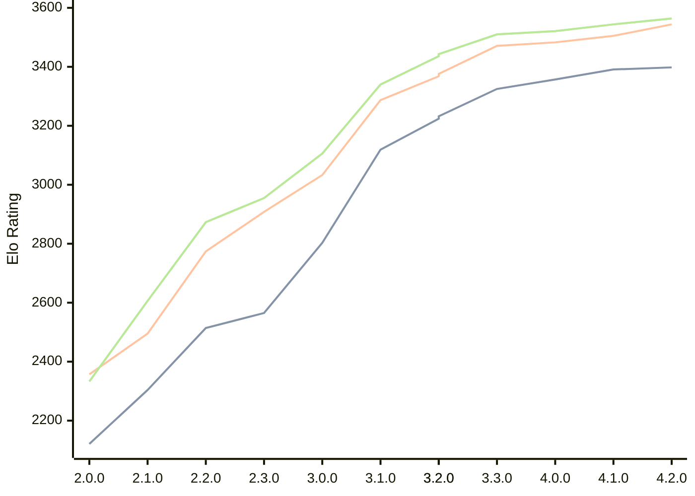

# Engine: Raphael

Author: Rei Meguro

Home: https://github.com/Orbital-Web/Raphael

## Elo Ratings

| Version | Published | STC 8.0+0.08s  | LTC 60.0+0.60s | VLTC 2m24s+1.12s | Comment |
| --- | --- | --- | --- | --- | --- |
| 4.2.0 | 2026-06-27 | 3398(+7) | 3544(+39) | 3564(+20) |  |
| 4.1.0 | 2026-05-17 | 3391(+34) | 3505(+22) | 3544(+23) |  |
| 4.0.0 | 2026-04-26 | 3357(+32) | 3483(+12) | 3521(+11) |  |
| 3.3.0 | 2026-04-06 | 3325(+101) | 3471(+103) | 3510(+74) |  |
| 3.2.0 | 2026-03-19 | 3224(-8) | 3368(-8) | 3436(-7) |  |
| 3.2.0 | 2026-03-19 | 3232(+113) | 3376(+89) | 3443(+103) |  |
| 3.1.0 | 2026-03-01 | 3119(+316) | 3287(+254) | 3340(+234) |  |
| 3.0.0 | 2026-02-12 | 2803(+238) | 3033(+125) | 3106(+151) |  |
| 2.3.0 | 2026-01-26 | 2565(+51) | 2908(+134) | 2955(+82) |  |
| 2.2.0 | 2026-01-08 | 2514(+210) | 2774(+279) | 2873(+267) |  |
| 2.1.0 | 2026-01-01 | 2304(+183) | 2495(+138) | 2606(+273) |  |
| 2.0.0 | 2025-12-23 | 2121 | 2357 | 2333 |  |
 | | | cElo (∆ prev) | cElo (∆ prev) | cElo (∆ prev) | 

<a href="https://github.com/computer-chess-index/cci/issues/new?template=submit-version.yml&title=[VERSION]+Raphael+<version>&body=###%20Engine%20name%0ARaphael%0A%0A###%20Version%0A4.2.0" target="_blank">Submit new version</a>

 Test Conditions:

GUI/CLI: <a href=https://github.com/cutechess/cutechess target="_blank">Cute-Chess</a> 
Elo Calculation: <a href=https://www.remi-coulom.fr/Bayesian-Elo/ target="_blank">Bayesian-Elo</a> 
CPU: Intel(R) Core(TM) i5-7500T 2.70GHz 
Opening book: 8_moves_v3 
\* STC: 8.0+0.08s, LTC: 60.0+0.60s, VLTC: 2m24s+1.12s

 Lists:
Ratings: <a href=https://github.com/computer-chess-index/cci/blob/main/lists/CCIRatings.csv target="_blank">Complete list</a>

Generated: 2026-09-05 04:38:04

## Ratings Verlauf

## Detailed Evaluation Results

| Version | Time Control | Elo  | Range +/- | Matches | Score | Average Opponent Elo | Draws |
| --- | --- | --- | --- | --- | --- | --- | --- |
| 4.2.0 | VLTC (2m24s+1.12s) | 3564 | 27 | 310 | 51% | 3559 | 89% |
| 4.2.0 | LTC (60.0+0.60s) | 3544 | 25 | 386 | 51% | 3536 | 84% |
| 4.2.0 | STC (8.0+0.08s) | 3398 | 27 | 336 | 50% | 3401 | 72% |
| --- | --- | --- | --- | --- | --- | --- | --- |
| 4.1.0 | VLTC (2m24s+1.12s) | 3544 | 27 | 310 | 50% | 3548 | 90% |
| 4.1.0 | LTC (60.0+0.60s) | 3505 | 28 | 304 | 51% | 3499 | 84% |
| 4.1.0 | STC (8.0+0.08s) | 3391 | 28 | 322 | 49% | 3401 | 71% |
| --- | --- | --- | --- | --- | --- | --- | --- |
| 4.0.0 | VLTC (2m24s+1.12s) | 3521 | 27 | 318 | 50% | 3522 | 88% |
| 4.0.0 | LTC (60.0+0.60s) | 3483 | 27 | 324 | 50% | 3483 | 83% |
| 4.0.0 | STC (8.0+0.08s) | 3357 | 27 | 344 | 50% | 3362 | 75% |
| --- | --- | --- | --- | --- | --- | --- | --- |
| 3.3.0 | VLTC (2m24s+1.12s) | 3510 | 26 | 338 | 50% | 3514 | 83% |
| 3.3.0 | LTC (60.0+0.60s) | 3471 | 26 | 346 | 52% | 3459 | 84% |
| 3.3.0 | STC (8.0+0.08s) | 3325 | 26 | 364 | 52% | 3308 | 74% |
| --- | --- | --- | --- | --- | --- | --- | --- |
| 3.2.0 | VLTC (2m24s+1.12s) | 3436 | 26 | 354 | 51% | 3432 | 80% |
| 3.2.0 | VLTC (2m24s+1.12s) | 3443 | 26 | 354 | 51% | 3440 | 80% |
| 3.2.0 | LTC (60.0+0.60s) | 3368 | 25 | 388 | 53% | 3351 | 80% |
| 3.2.0 | LTC (60.0+0.60s) | 3376 | 25 | 388 | 53% | 3357 | 80% |
| 3.2.0 | STC (8.0+0.08s) | 3232 | 26 | 376 | 49% | 3240 | 65% |
| --- | --- | --- | --- | --- | --- | --- | --- |
| 3.2.0 | STC (8.0+0.08s) | 3224 | 26 | 376 | 49% | 3233 | 65% |
| --- | --- | --- | --- | --- | --- | --- | --- |
| 3.1.0 | VLTC (2m24s+1.12s) | 3340 | 29 | 304 | 52% | 3325 | 65% |
| 3.1.0 | LTC (60.0+0.60s) | 3287 | 31 | 270 | 51% | 3279 | 68% |
| 3.1.0 | STC (8.0+0.08s) | 3119 | 33 | 260 | 50% | 3114 | 54% |
| --- | --- | --- | --- | --- | --- | --- | --- |
| 3.0.0 | VLTC (2m24s+1.12s) | 3106 | 33 | 268 | 49% | 3116 | 46% |
| 3.0.0 | LTC (60.0+0.60s) | 3033 | 30 | 332 | 48% | 3046 | 46% |
| 3.0.0 | STC (8.0+0.08s) | 2803 | 35 | 244 | 50% | 2805 | 46% |
| --- | --- | --- | --- | --- | --- | --- | --- |
| 2.3.0 | VLTC (2m24s+1.12s) | 2955 | 40 | 188 | 50% | 2955 | 41% |
| 2.3.0 | LTC (60.0+0.60s) | 2908 | 35 | 240 | 49% | 2917 | 43% |
| 2.3.0 | STC (8.0+0.08s) | 2565 | 41 | 196 | 50% | 2566 | 29% |
| --- | --- | --- | --- | --- | --- | --- | --- |
| 2.2.0 | VLTC (2m24s+1.12s) | 2873 | 36 | 254 | 53% | 2843 | 33% |
| 2.2.0 | LTC (60.0+0.60s) | 2774 | 40 | 196 | 52% | 2761 | 37% |
| 2.2.0 | STC (8.0+0.08s) | 2514 | 41 | 202 | 50% | 2507 | 28% |
| --- | --- | --- | --- | --- | --- | --- | --- |
| 2.1.0 | VLTC (2m24s+1.12s) | 2606 | 47 | 140 | 52% | 2584 | 39% |
| 2.1.0 | LTC (60.0+0.60s) | 2495 | 45 | 164 | 50% | 2493 | 27% |
| 2.1.0 | STC (8.0+0.08s) | 2304 | 48 | 142 | 51% | 2299 | 30% |
| --- | --- | --- | --- | --- | --- | --- | --- |
| 2.0.0 | VLTC (2m24s+1.12s) | 2333 | 41 | 196 | 50% | 2357 | 35% |
| 2.0.0 | LTC (60.0+0.60s) | 2357 | 50 | 130 | 48% | 2371 | 32% |
| 2.0.0 | STC (8.0+0.08s) | 2121 | 49 | 138 | 49% | 2130 | 31% |
| --- | --- | --- | --- | --- | --- | --- | --- |