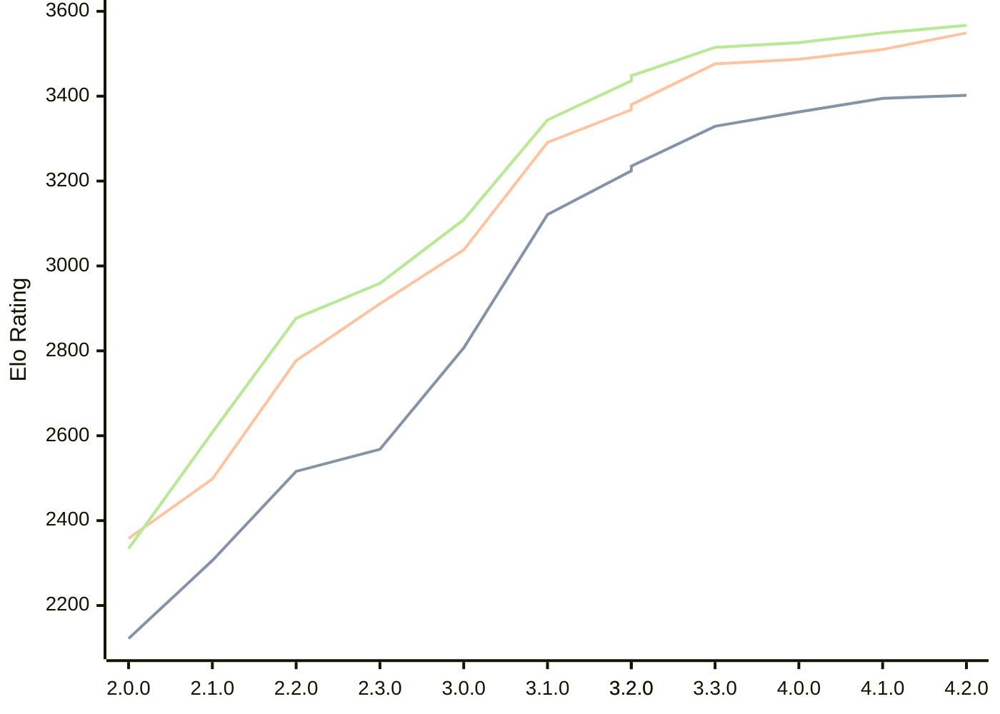

# Engine: Raphael

Author: Rei Meguro

Home: https://github.com/Orbital-Web/Raphael

## Elo Ratings

| Version | Published | STC 8.0+0.08s  | LTC 60.0+0.60s | VLTC 2m24s+1.12s | Comment |
| --- | --- | --- | --- | --- | --- |
| 4.2.0 | 2026-06-27 | 3402(+7) | 3549(+39) | 3567(+18) |  |
| 4.1.0 | 2026-05-17 | 3395(+32) | 3510(+23) | 3549(+23) |  |
| 4.0.0 | 2026-04-26 | 3363(+34) | 3487(+11) | 3526(+11) |  |
| 3.3.0 | 2026-04-06 | 3329(+105) | 3476(+108) | 3515(+79) |  |
| 3.2.0 | 2026-03-19 | 3224(-11) | 3368(-12) | 3436(-12) |  |
| 3.2.0 | 2026-03-19 | 3235(+114) | 3380(+89) | 3448(+104) |  |
| 3.1.0 | 2026-03-01 | 3121(+314) | 3291(+253) | 3344(+235) |  |
| 3.0.0 | 2026-02-12 | 2807(+239) | 3038(+127) | 3109(+150) |  |
| 2.3.0 | 2026-01-26 | 2568(+52) | 2911(+134) | 2959(+82) |  |
| 2.2.0 | 2026-01-08 | 2516(+210) | 2777(+279) | 2877(+269) |  |
| 2.1.0 | 2026-01-01 | 2306(+184) | 2498(+140) | 2608(+274) |  |
| 2.0.0 | 2025-12-23 | 2122 | 2358 | 2334 |  |
 | | | cElo (∆ prev) | cElo (∆ prev) | cElo (∆ prev) | 

<a href="https://github.com/computer-chess-index/cci/issues/new?template=submit-version.yml&title=[VERSION]+Raphael+<version>&body=###%20Engine%20name%0ARaphael%0A%0A###%20Version%0A4.2.0" target="_blank">Submit new version</a>

 Test Conditions:

GUI/CLI: <a href=https://github.com/cutechess/cutechess target="_blank">Cute-Chess</a> 
Elo Calculation: <a href=https://www.remi-coulom.fr/Bayesian-Elo/ target="_blank">Bayesian-Elo</a> 
CPU: Intel(R) Core(TM) i5-7500T 2.70GHz 
Opening book: 8_moves_v3 
\* STC: 8.0+0.08s, LTC: 60.0+0.60s, VLTC: 2m24s+1.12s

 Lists:
Ratings: <a href=https://github.com/computer-chess-index/cci/blob/main/lists/CCIRatings.csv target="_blank">Complete list</a>

Generated: 2026-09-17 04:41:20

## Ratings Verlauf

## Detailed Evaluation Results

| Version | Time Control | Elo  | Range +/- | Matches | Score | Average Opponent Elo | Draws |
| --- | --- | --- | --- | --- | --- | --- | --- |
| 4.2.0 | VLTC (2m24s+1.12s) | 3567 | 26 | 346 | 50% | 3565 | 88% |
| 4.2.0 | LTC (60.0+0.60s) | 3549 | 24 | 418 | 51% | 3541 | 83% |
| 4.2.0 | STC (8.0+0.08s) | 3402 | 26 | 356 | 50% | 3405 | 72% |
| --- | --- | --- | --- | --- | --- | --- | --- |
| 4.1.0 | VLTC (2m24s+1.12s) | 3549 | 27 | 310 | 50% | 3552 | 90% |
| 4.1.0 | LTC (60.0+0.60s) | 3510 | 28 | 304 | 51% | 3505 | 84% |
| 4.1.0 | STC (8.0+0.08s) | 3395 | 28 | 322 | 49% | 3405 | 71% |
| --- | --- | --- | --- | --- | --- | --- | --- |
| 4.0.0 | VLTC (2m24s+1.12s) | 3526 | 27 | 318 | 50% | 3526 | 88% |
| 4.0.0 | LTC (60.0+0.60s) | 3487 | 27 | 324 | 50% | 3487 | 83% |
| 4.0.0 | STC (8.0+0.08s) | 3363 | 27 | 344 | 50% | 3366 | 75% |
| --- | --- | --- | --- | --- | --- | --- | --- |
| 3.3.0 | VLTC (2m24s+1.12s) | 3515 | 26 | 338 | 50% | 3518 | 83% |
| 3.3.0 | LTC (60.0+0.60s) | 3476 | 26 | 346 | 52% | 3464 | 84% |
| 3.3.0 | STC (8.0+0.08s) | 3329 | 26 | 364 | 52% | 3312 | 74% |
| --- | --- | --- | --- | --- | --- | --- | --- |
| 3.2.0 | VLTC (2m24s+1.12s) | 3436 | 26 | 354 | 51% | 3432 | 80% |
| 3.2.0 | VLTC (2m24s+1.12s) | 3448 | 26 | 354 | 51% | 3444 | 80% |
| 3.2.0 | LTC (60.0+0.60s) | 3380 | 25 | 388 | 53% | 3362 | 80% |
| 3.2.0 | LTC (60.0+0.60s) | 3368 | 25 | 388 | 53% | 3351 | 80% |
| 3.2.0 | STC (8.0+0.08s) | 3235 | 26 | 376 | 49% | 3243 | 65% |
| --- | --- | --- | --- | --- | --- | --- | --- |
| 3.2.0 | STC (8.0+0.08s) | 3224 | 26 | 376 | 49% | 3233 | 65% |
| --- | --- | --- | --- | --- | --- | --- | --- |
| 3.1.0 | VLTC (2m24s+1.12s) | 3344 | 29 | 304 | 52% | 3329 | 65% |
| 3.1.0 | LTC (60.0+0.60s) | 3291 | 31 | 270 | 51% | 3282 | 68% |
| 3.1.0 | STC (8.0+0.08s) | 3121 | 33 | 260 | 50% | 3117 | 54% |
| --- | --- | --- | --- | --- | --- | --- | --- |
| 3.0.0 | VLTC (2m24s+1.12s) | 3109 | 33 | 268 | 49% | 3120 | 46% |
| 3.0.0 | LTC (60.0+0.60s) | 3038 | 30 | 332 | 48% | 3050 | 46% |
| 3.0.0 | STC (8.0+0.08s) | 2807 | 35 | 244 | 50% | 2809 | 46% |
| --- | --- | --- | --- | --- | --- | --- | --- |
| 2.3.0 | VLTC (2m24s+1.12s) | 2959 | 40 | 188 | 50% | 2959 | 41% |
| 2.3.0 | LTC (60.0+0.60s) | 2911 | 35 | 240 | 49% | 2921 | 43% |
| 2.3.0 | STC (8.0+0.08s) | 2568 | 41 | 196 | 50% | 2569 | 29% |
| --- | --- | --- | --- | --- | --- | --- | --- |
| 2.2.0 | VLTC (2m24s+1.12s) | 2877 | 36 | 254 | 53% | 2846 | 33% |
| 2.2.0 | LTC (60.0+0.60s) | 2777 | 40 | 196 | 52% | 2763 | 37% |
| 2.2.0 | STC (8.0+0.08s) | 2516 | 41 | 202 | 50% | 2510 | 28% |
| --- | --- | --- | --- | --- | --- | --- | --- |
| 2.1.0 | VLTC (2m24s+1.12s) | 2608 | 47 | 140 | 52% | 2587 | 39% |
| 2.1.0 | LTC (60.0+0.60s) | 2498 | 45 | 164 | 50% | 2495 | 27% |
| 2.1.0 | STC (8.0+0.08s) | 2306 | 48 | 142 | 51% | 2300 | 30% |
| --- | --- | --- | --- | --- | --- | --- | --- |
| 2.0.0 | VLTC (2m24s+1.12s) | 2334 | 41 | 196 | 50% | 2358 | 35% |
| 2.0.0 | LTC (60.0+0.60s) | 2358 | 50 | 130 | 48% | 2372 | 32% |
| 2.0.0 | STC (8.0+0.08s) | 2122 | 49 | 138 | 49% | 2132 | 31% |
| --- | --- | --- | --- | --- | --- | --- | --- |