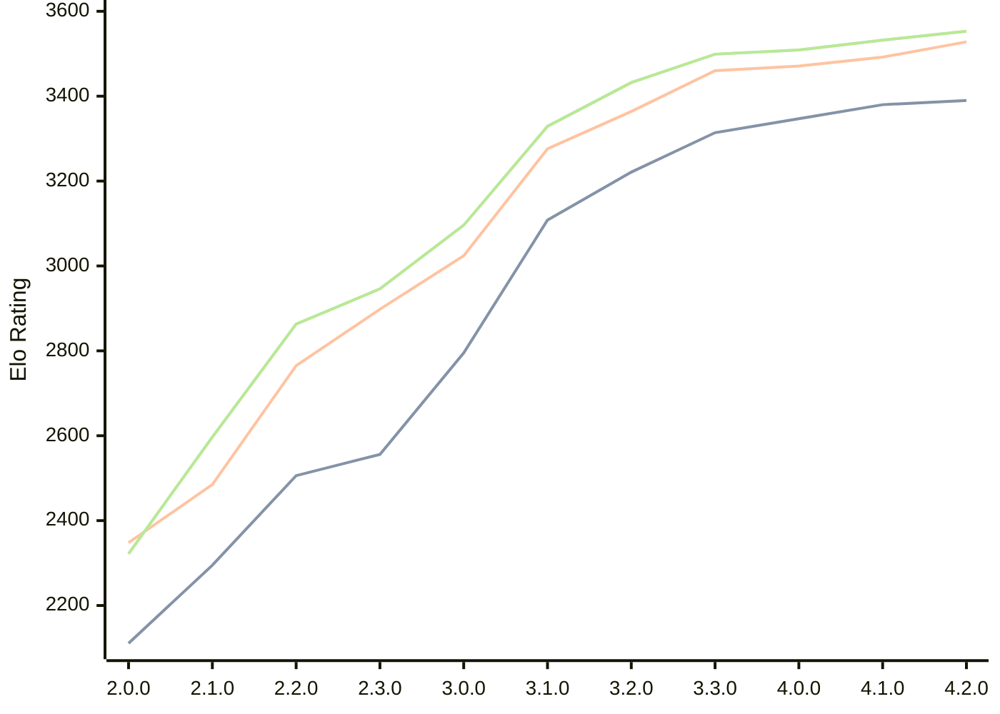

# Engine: Raphael

Author: Rei Meguro

Home: https://github.com/Orbital-Web/Raphael

## Elo Ratings

| Version | Published | STC 8.0+0.08s  | LTC 60.0+0.60s | VLTC 2m24s+1.12s | Comment |
| --- | --- | --- | --- | --- | --- |
| 4.2.0 | 2026-06-27 | 3390(+10) | 3528(+36) | 3553(+21) |  |
| 4.1.0 | 2026-05-17 | 3380(+33) | 3492(+21) | 3532(+23) |  |
| 4.0.0 | 2026-04-26 | 3347(+33) | 3471(+11) | 3509(+10) |  |
| 3.3.0 | 2026-04-06 | 3314(+93) | 3460(+96) | 3499(+67) |  |
| 3.2.0 | 2026-03-19 | 3221(+113) | 3364(+88) | 3432(+103) |  |
| 3.1.0 | 2026-03-01 | 3108(+313) | 3276(+252) | 3329(+233) |  |
| 3.0.0 | 2026-02-12 | 2795(+239) | 3024(+126) | 3096(+150) |  |
| 2.3.0 | 2026-01-26 | 2556(+50) | 2898(+133) | 2946(+83) |  |
| 2.2.0 | 2026-01-08 | 2506(+211) | 2765(+280) | 2863(+266) |  |
| 2.1.0 | 2026-01-01 | 2295(+184) | 2485(+137) | 2597(+275) |  |
| 2.0.0 | 2025-12-23 | 2111 | 2348 | 2322 |  |
 | | | cElo (∆ prev) | cElo (∆ prev) | cElo (∆ prev) | 

<a href="https://github.com/computer-chess-index/cci/issues/new?template=submit-version.yml&title=[VERSION]+Raphael+<version>&body=###%20Engine%20name%0ARaphael%0A%0A###%20Version%0A4.2.0" target="_blank">Submit new version</a>

 Test Conditions:

GUI/CLI: <a href=https://github.com/cutechess/cutechess target="_blank">Cute-Chess</a> 
Elo Calculation: <a href=https://www.remi-coulom.fr/Bayesian-Elo/ target="_blank">Bayesian-Elo</a> 
CPU: Intel(R) Core(TM) i5-7500T 2.70GHz 
Opening book: 8_moves_v3 
\* STC: 8.0+0.08s, LTC: 60.0+0.60s, VLTC: 2m24s+1.12s

 Lists:
Ratings: <a href=https://github.com/computer-chess-index/cci/blob/main/lists/CCIRatings.csv target="_blank">Complete list</a>

Generated: 2026-08-10 07:53:11

## Ratings Verlauf

⬛ STC (8.0+0.08s) &nbsp;&nbsp; 🟧 LTC (60.0+0.60s) &nbsp;&nbsp; 🟩 VLTC (2m24s+1.12s)

dark mode: 🟩STC (8.0+0.08s) 🟧LTC (60.0+0.60s) ⬜VLTC (2m24s+1.12s)

## Detailed Evaluation Results

| Version | Time Control | Elo  | Range +/- | Matches | Score | Average Opponent Elo | Draws |
| --- | --- | --- | --- | --- | --- | --- | --- |
| 4.2.0 | VLTC (2m24s+1.12s) | 3553 | 28 | 282 | 51% | 3548 | 89% |
| 4.2.0 | LTC (60.0+0.60s) | 3528 | 27 | 332 | 51% | 3524 | 84% |
| 4.2.0 | STC (8.0+0.08s) | 3390 | 30 | 276 | 50% | 3390 | 73% |
| --- | --- | --- | --- | --- | --- | --- | --- |
| 4.1.0 | VLTC (2m24s+1.12s) | 3532 | 27 | 310 | 50% | 3536 | 90% |
| 4.1.0 | LTC (60.0+0.60s) | 3492 | 28 | 304 | 51% | 3487 | 84% |
| 4.1.0 | STC (8.0+0.08s) | 3380 | 28 | 322 | 49% | 3390 | 71% |
| --- | --- | --- | --- | --- | --- | --- | --- |
| 4.0.0 | VLTC (2m24s+1.12s) | 3509 | 27 | 318 | 50% | 3510 | 88% |
| 4.0.0 | LTC (60.0+0.60s) | 3471 | 27 | 324 | 50% | 3471 | 83% |
| 4.0.0 | STC (8.0+0.08s) | 3347 | 27 | 344 | 50% | 3349 | 75% |
| --- | --- | --- | --- | --- | --- | --- | --- |
| 3.3.0 | VLTC (2m24s+1.12s) | 3499 | 26 | 338 | 50% | 3502 | 83% |
| 3.3.0 | LTC (60.0+0.60s) | 3460 | 26 | 346 | 52% | 3448 | 84% |
| 3.3.0 | STC (8.0+0.08s) | 3314 | 26 | 364 | 52% | 3297 | 74% |
| --- | --- | --- | --- | --- | --- | --- | --- |
| 3.2.0 | VLTC (2m24s+1.12s) | 3432 | 26 | 354 | 51% | 3428 | 80% |
| 3.2.0 | LTC (60.0+0.60s) | 3364 | 25 | 388 | 53% | 3347 | 80% |
| 3.2.0 | STC (8.0+0.08s) | 3221 | 26 | 376 | 49% | 3229 | 65% |
| --- | --- | --- | --- | --- | --- | --- | --- |
| 3.1.0 | VLTC (2m24s+1.12s) | 3329 | 29 | 304 | 52% | 3313 | 65% |
| 3.1.0 | LTC (60.0+0.60s) | 3276 | 31 | 270 | 51% | 3267 | 68% |
| 3.1.0 | STC (8.0+0.08s) | 3108 | 33 | 260 | 50% | 3104 | 54% |
| --- | --- | --- | --- | --- | --- | --- | --- |
| 3.0.0 | VLTC (2m24s+1.12s) | 3096 | 33 | 268 | 49% | 3106 | 46% |
| 3.0.0 | LTC (60.0+0.60s) | 3024 | 30 | 332 | 48% | 3036 | 46% |
| 3.0.0 | STC (8.0+0.08s) | 2795 | 35 | 244 | 50% | 2797 | 46% |
| --- | --- | --- | --- | --- | --- | --- | --- |
| 2.3.0 | VLTC (2m24s+1.12s) | 2946 | 40 | 188 | 50% | 2946 | 41% |
| 2.3.0 | LTC (60.0+0.60s) | 2898 | 35 | 240 | 49% | 2908 | 43% |
| 2.3.0 | STC (8.0+0.08s) | 2556 | 41 | 196 | 50% | 2558 | 29% |
| --- | --- | --- | --- | --- | --- | --- | --- |
| 2.2.0 | VLTC (2m24s+1.12s) | 2863 | 36 | 254 | 53% | 2834 | 33% |
| 2.2.0 | LTC (60.0+0.60s) | 2765 | 40 | 196 | 52% | 2751 | 37% |
| 2.2.0 | STC (8.0+0.08s) | 2506 | 41 | 202 | 50% | 2498 | 28% |
| --- | --- | --- | --- | --- | --- | --- | --- |
| 2.1.0 | VLTC (2m24s+1.12s) | 2597 | 47 | 140 | 52% | 2574 | 39% |
| 2.1.0 | LTC (60.0+0.60s) | 2485 | 45 | 164 | 50% | 2484 | 27% |
| 2.1.0 | STC (8.0+0.08s) | 2295 | 48 | 142 | 51% | 2288 | 30% |
| --- | --- | --- | --- | --- | --- | --- | --- |
| 2.0.0 | VLTC (2m24s+1.12s) | 2322 | 41 | 196 | 50% | 2348 | 35% |
| 2.0.0 | LTC (60.0+0.60s) | 2348 | 50 | 130 | 48% | 2361 | 32% |
| 2.0.0 | STC (8.0+0.08s) | 2111 | 49 | 138 | 49% | 2121 | 31% |
| --- | --- | --- | --- | --- | --- | --- | --- |