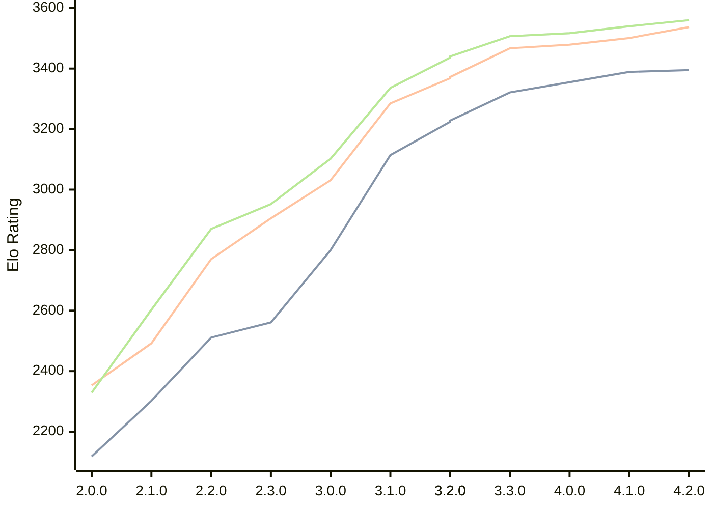

# Engine: Raphael

Author: Rei Meguro

Home: https://github.com/Orbital-Web/Raphael

## Elo Ratings

| Version | Published | STC 8.0+0.08s  | LTC 60.0+0.60s | VLTC 2m24s+1.12s | Comment |
| --- | --- | --- | --- | --- | --- |
| 4.2.0 | 2026-06-27 | 3395(+6) | 3537(+36) | 3560(+20) |  |
| 4.1.0 | 2026-05-17 | 3389(+34) | 3501(+22) | 3540(+23) |  |
| 4.0.0 | 2026-04-26 | 3355(+34) | 3479(+12) | 3517(+10) |  |
| 3.3.0 | 2026-04-06 | 3321(+97) | 3467(+99) | 3507(+71) |  |
| 3.2.0 | 2026-03-19 | 3224(-4) | 3368(-4) | 3436(-4) |  |
| 3.2.0 | 2026-03-19 | 3228(+114) | 3372(+87) | 3440(+104) |  |
| 3.1.0 | 2026-03-01 | 3114(+314) | 3285(+254) | 3336(+234) |  |
| 3.0.0 | 2026-02-12 | 2800(+239) | 3031(+126) | 3102(+150) |  |
| 2.3.0 | 2026-01-26 | 2561(+50) | 2905(+135) | 2952(+82) |  |
| 2.2.0 | 2026-01-08 | 2511(+209) | 2770(+278) | 2870(+267) |  |
| 2.1.0 | 2026-01-01 | 2302(+184) | 2492(+139) | 2603(+274) |  |
| 2.0.0 | 2025-12-23 | 2118 | 2353 | 2329 |  |
 | | | cElo (∆ prev) | cElo (∆ prev) | cElo (∆ prev) | 

<a href="https://github.com/computer-chess-index/cci/issues/new?template=submit-version.yml&title=[VERSION]+Raphael+<version>&body=###%20Engine%20name%0ARaphael%0A%0A###%20Version%0A4.2.0" target="_blank">Submit new version</a>

 Test Conditions:

GUI/CLI: <a href=https://github.com/cutechess/cutechess target="_blank">Cute-Chess</a> 
Elo Calculation: <a href=https://www.remi-coulom.fr/Bayesian-Elo/ target="_blank">Bayesian-Elo</a> 
CPU: Intel(R) Core(TM) i5-7500T 2.70GHz 
Opening book: 8_moves_v3 
\* STC: 8.0+0.08s, LTC: 60.0+0.60s, VLTC: 2m24s+1.12s

 Lists:
Ratings: <a href=https://github.com/computer-chess-index/cci/blob/main/lists/CCIRatings.csv target="_blank">Complete list</a>

Generated: 2026-08-25 06:28:46

## Ratings Verlauf

⬛ STC (8.0+0.08s) &nbsp;&nbsp; 🟧 LTC (60.0+0.60s) &nbsp;&nbsp; 🟩 VLTC (2m24s+1.12s)

dark mode: 🟩STC (8.0+0.08s) 🟧LTC (60.0+0.60s) ⬜VLTC (2m24s+1.12s)

## Detailed Evaluation Results

| Version | Time Control | Elo  | Range +/- | Matches | Score | Average Opponent Elo | Draws |
| --- | --- | --- | --- | --- | --- | --- | --- |
| 4.2.0 | VLTC (2m24s+1.12s) | 3560 | 27 | 306 | 51% | 3556 | 89% |
| 4.2.0 | LTC (60.0+0.60s) | 3537 | 26 | 354 | 51% | 3533 | 84% |
| 4.2.0 | STC (8.0+0.08s) | 3395 | 28 | 308 | 50% | 3398 | 73% |
| --- | --- | --- | --- | --- | --- | --- | --- |
| 4.1.0 | VLTC (2m24s+1.12s) | 3540 | 27 | 310 | 50% | 3544 | 90% |
| 4.1.0 | LTC (60.0+0.60s) | 3501 | 28 | 304 | 51% | 3495 | 84% |
| 4.1.0 | STC (8.0+0.08s) | 3389 | 28 | 322 | 49% | 3397 | 71% |
| --- | --- | --- | --- | --- | --- | --- | --- |
| 4.0.0 | VLTC (2m24s+1.12s) | 3517 | 27 | 318 | 50% | 3518 | 88% |
| 4.0.0 | LTC (60.0+0.60s) | 3479 | 27 | 324 | 50% | 3479 | 83% |
| 4.0.0 | STC (8.0+0.08s) | 3355 | 27 | 344 | 50% | 3357 | 75% |
| --- | --- | --- | --- | --- | --- | --- | --- |
| 3.3.0 | VLTC (2m24s+1.12s) | 3507 | 26 | 338 | 50% | 3510 | 83% |
| 3.3.0 | LTC (60.0+0.60s) | 3467 | 26 | 346 | 52% | 3456 | 84% |
| 3.3.0 | STC (8.0+0.08s) | 3321 | 26 | 364 | 52% | 3303 | 74% |
| --- | --- | --- | --- | --- | --- | --- | --- |
| 3.2.0 | VLTC (2m24s+1.12s) | 3436 | 26 | 354 | 51% | 3432 | 80% |
| 3.2.0 | VLTC (2m24s+1.12s) | 3440 | 26 | 354 | 51% | 3436 | 80% |
| 3.2.0 | LTC (60.0+0.60s) | 3368 | 25 | 388 | 53% | 3351 | 80% |
| 3.2.0 | LTC (60.0+0.60s) | 3372 | 25 | 388 | 53% | 3355 | 80% |
| 3.2.0 | STC (8.0+0.08s) | 3224 | 26 | 376 | 49% | 3233 | 65% |
| --- | --- | --- | --- | --- | --- | --- | --- |
| 3.2.0 | STC (8.0+0.08s) | 3228 | 26 | 376 | 49% | 3236 | 65% |
| --- | --- | --- | --- | --- | --- | --- | --- |
| 3.1.0 | VLTC (2m24s+1.12s) | 3336 | 29 | 304 | 52% | 3321 | 65% |
| 3.1.0 | LTC (60.0+0.60s) | 3285 | 31 | 270 | 51% | 3275 | 68% |
| 3.1.0 | STC (8.0+0.08s) | 3114 | 33 | 260 | 50% | 3112 | 54% |
| --- | --- | --- | --- | --- | --- | --- | --- |
| 3.0.0 | VLTC (2m24s+1.12s) | 3102 | 33 | 268 | 49% | 3113 | 46% |
| 3.0.0 | LTC (60.0+0.60s) | 3031 | 30 | 332 | 48% | 3043 | 46% |
| 3.0.0 | STC (8.0+0.08s) | 2800 | 35 | 244 | 50% | 2803 | 46% |
| --- | --- | --- | --- | --- | --- | --- | --- |
| 2.3.0 | VLTC (2m24s+1.12s) | 2952 | 40 | 188 | 50% | 2952 | 41% |
| 2.3.0 | LTC (60.0+0.60s) | 2905 | 35 | 240 | 49% | 2915 | 43% |
| 2.3.0 | STC (8.0+0.08s) | 2561 | 41 | 196 | 50% | 2564 | 29% |
| --- | --- | --- | --- | --- | --- | --- | --- |
| 2.2.0 | VLTC (2m24s+1.12s) | 2870 | 36 | 254 | 53% | 2840 | 33% |
| 2.2.0 | LTC (60.0+0.60s) | 2770 | 40 | 196 | 52% | 2757 | 37% |
| 2.2.0 | STC (8.0+0.08s) | 2511 | 41 | 202 | 50% | 2504 | 28% |
| --- | --- | --- | --- | --- | --- | --- | --- |
| 2.1.0 | VLTC (2m24s+1.12s) | 2603 | 47 | 140 | 52% | 2580 | 39% |
| 2.1.0 | LTC (60.0+0.60s) | 2492 | 45 | 164 | 50% | 2489 | 27% |
| 2.1.0 | STC (8.0+0.08s) | 2302 | 48 | 142 | 51% | 2295 | 30% |
| --- | --- | --- | --- | --- | --- | --- | --- |
| 2.0.0 | VLTC (2m24s+1.12s) | 2329 | 41 | 196 | 50% | 2354 | 35% |
| 2.0.0 | LTC (60.0+0.60s) | 2353 | 50 | 130 | 48% | 2368 | 32% |
| 2.0.0 | STC (8.0+0.08s) | 2118 | 49 | 138 | 49% | 2128 | 31% |
| --- | --- | --- | --- | --- | --- | --- | --- |