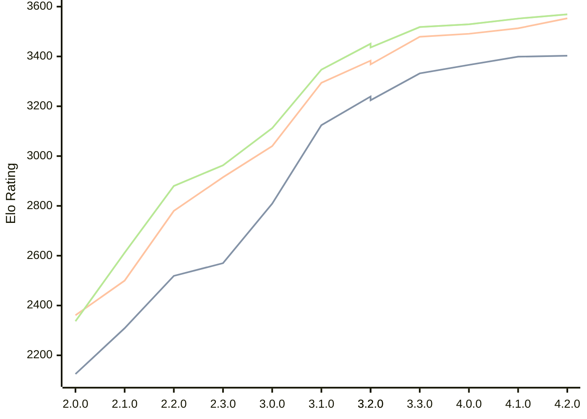

# Engine: Raphael

Author: Rei Meguro

Home: https://github.com/Orbital-Web/Raphael

## Elo Ratings

| Version | Published | STC 8.0+0.08s  | LTC 60.0+0.60s | VLTC 2m24s+1.12s | Comment |
| --- | --- | --- | --- | --- | --- |
| 4.2.0 | 2026-06-27 | 3403(+4) | 3553(+40) | 3569(+17) |  |
| 4.1.0 | 2026-05-17 | 3399(+33) | 3513(+22) | 3552(+23) |  |
| 4.0.0 | 2026-04-26 | 3366(+34) | 3491(+12) | 3529(+11) |  |
| 3.3.0 | 2026-04-06 | 3332(+93) | 3479(+96) | 3518(+67) |  |
| 3.2.0 | 2026-03-19 | 3239(+15) | 3383(+15) | 3451(+15) |  |
| 3.2.0 | 2026-03-19 | 3224(+100) | 3368(+74) | 3436(+89) |  |
| 3.1.0 | 2026-03-01 | 3124(+315) | 3294(+254) | 3347(+235) |  |
| 3.0.0 | 2026-02-12 | 2809(+239) | 3040(+125) | 3112(+149) |  |
| 2.3.0 | 2026-01-26 | 2570(+51) | 2915(+135) | 2963(+83) |  |
| 2.2.0 | 2026-01-08 | 2519(+210) | 2780(+280) | 2880(+268) |  |
| 2.1.0 | 2026-01-01 | 2309(+184) | 2500(+139) | 2612(+275) |  |
| 2.0.0 | 2025-12-23 | 2125 | 2361 | 2337 |  |
 | | | cElo (∆ prev) | cElo (∆ prev) | cElo (∆ prev) | 

<a href="https://github.com/computer-chess-index/cci/issues/new?template=submit-version.yml&title=[VERSION]+Raphael+<version>&body=###%20Engine%20name%0ARaphael%0A%0A###%20Version%0A4.2.0" target="_blank">Submit new version</a>

 Test Conditions:

GUI/CLI: <a href=https://github.com/cutechess/cutechess target="_blank">Cute-Chess</a> 
Elo Calculation: <a href=https://www.remi-coulom.fr/Bayesian-Elo/ target="_blank">Bayesian-Elo</a> 
CPU: Intel(R) Core(TM) i5-7500T 2.70GHz 
Opening book: 8_moves_v3 
\* STC: 8.0+0.08s, LTC: 60.0+0.60s, VLTC: 2m24s+1.12s

 Lists:
Ratings: <a href=https://github.com/computer-chess-index/cci/blob/main/lists/CCIRatings.csv target="_blank">Complete list</a>

Generated: 2026-09-26 04:41:22

## Ratings Verlauf

## Detailed Evaluation Results

| Version | Time Control | Elo  | Range +/- | Matches | Score | Average Opponent Elo | Draws |
| --- | --- | --- | --- | --- | --- | --- | --- |
| 4.2.0 | VLTC (2m24s+1.12s) | 3569 | 25 | 350 | 50% | 3568 | 88% |
| 4.2.0 | LTC (60.0+0.60s) | 3553 | 23 | 426 | 51% | 3544 | 84% |
| 4.2.0 | STC (8.0+0.08s) | 3403 | 26 | 360 | 49% | 3407 | 72% |
| --- | --- | --- | --- | --- | --- | --- | --- |
| 4.1.0 | VLTC (2m24s+1.12s) | 3552 | 27 | 310 | 50% | 3555 | 90% |
| 4.1.0 | LTC (60.0+0.60s) | 3513 | 28 | 304 | 51% | 3507 | 84% |
| 4.1.0 | STC (8.0+0.08s) | 3399 | 28 | 322 | 49% | 3409 | 71% |
| --- | --- | --- | --- | --- | --- | --- | --- |
| 4.0.0 | VLTC (2m24s+1.12s) | 3529 | 27 | 318 | 50% | 3530 | 88% |
| 4.0.0 | LTC (60.0+0.60s) | 3491 | 27 | 324 | 50% | 3490 | 83% |
| 4.0.0 | STC (8.0+0.08s) | 3366 | 27 | 344 | 50% | 3368 | 75% |
| --- | --- | --- | --- | --- | --- | --- | --- |
| 3.3.0 | VLTC (2m24s+1.12s) | 3518 | 26 | 338 | 50% | 3522 | 83% |
| 3.3.0 | LTC (60.0+0.60s) | 3479 | 26 | 346 | 52% | 3467 | 84% |
| 3.3.0 | STC (8.0+0.08s) | 3332 | 26 | 364 | 52% | 3314 | 74% |
| --- | --- | --- | --- | --- | --- | --- | --- |
| 3.2.0 | VLTC (2m24s+1.12s) | 3451 | 26 | 354 | 51% | 3448 | 80% |
| 3.2.0 | VLTC (2m24s+1.12s) | 3436 | 26 | 354 | 51% | 3432 | 80% |
| 3.2.0 | LTC (60.0+0.60s) | 3368 | 25 | 388 | 53% | 3351 | 80% |
| 3.2.0 | LTC (60.0+0.60s) | 3383 | 25 | 388 | 53% | 3366 | 80% |
| 3.2.0 | STC (8.0+0.08s) | 3224 | 26 | 376 | 49% | 3233 | 65% |
| --- | --- | --- | --- | --- | --- | --- | --- |
| 3.2.0 | STC (8.0+0.08s) | 3239 | 26 | 376 | 49% | 3247 | 65% |
| --- | --- | --- | --- | --- | --- | --- | --- |
| 3.1.0 | VLTC (2m24s+1.12s) | 3347 | 29 | 304 | 52% | 3332 | 65% |
| 3.1.0 | LTC (60.0+0.60s) | 3294 | 31 | 270 | 51% | 3285 | 68% |
| 3.1.0 | STC (8.0+0.08s) | 3124 | 33 | 260 | 50% | 3121 | 54% |
| --- | --- | --- | --- | --- | --- | --- | --- |
| 3.0.0 | VLTC (2m24s+1.12s) | 3112 | 33 | 268 | 49% | 3123 | 46% |
| 3.0.0 | LTC (60.0+0.60s) | 3040 | 30 | 332 | 48% | 3052 | 46% |
| 3.0.0 | STC (8.0+0.08s) | 2809 | 35 | 244 | 50% | 2812 | 46% |
| --- | --- | --- | --- | --- | --- | --- | --- |
| 2.3.0 | VLTC (2m24s+1.12s) | 2963 | 40 | 188 | 50% | 2962 | 41% |
| 2.3.0 | LTC (60.0+0.60s) | 2915 | 35 | 240 | 49% | 2924 | 43% |
| 2.3.0 | STC (8.0+0.08s) | 2570 | 41 | 196 | 50% | 2572 | 29% |
| --- | --- | --- | --- | --- | --- | --- | --- |
| 2.2.0 | VLTC (2m24s+1.12s) | 2880 | 36 | 254 | 53% | 2849 | 33% |
| 2.2.0 | LTC (60.0+0.60s) | 2780 | 40 | 196 | 52% | 2766 | 37% |
| 2.2.0 | STC (8.0+0.08s) | 2519 | 41 | 202 | 50% | 2512 | 28% |
| --- | --- | --- | --- | --- | --- | --- | --- |
| 2.1.0 | VLTC (2m24s+1.12s) | 2612 | 47 | 140 | 52% | 2589 | 39% |
| 2.1.0 | LTC (60.0+0.60s) | 2500 | 45 | 164 | 50% | 2498 | 27% |
| 2.1.0 | STC (8.0+0.08s) | 2309 | 48 | 142 | 51% | 2303 | 30% |
| --- | --- | --- | --- | --- | --- | --- | --- |
| 2.0.0 | VLTC (2m24s+1.12s) | 2337 | 41 | 196 | 50% | 2361 | 35% |
| 2.0.0 | LTC (60.0+0.60s) | 2361 | 50 | 130 | 48% | 2375 | 32% |
| 2.0.0 | STC (8.0+0.08s) | 2125 | 49 | 138 | 49% | 2134 | 31% |
| --- | --- | --- | --- | --- | --- | --- | --- |