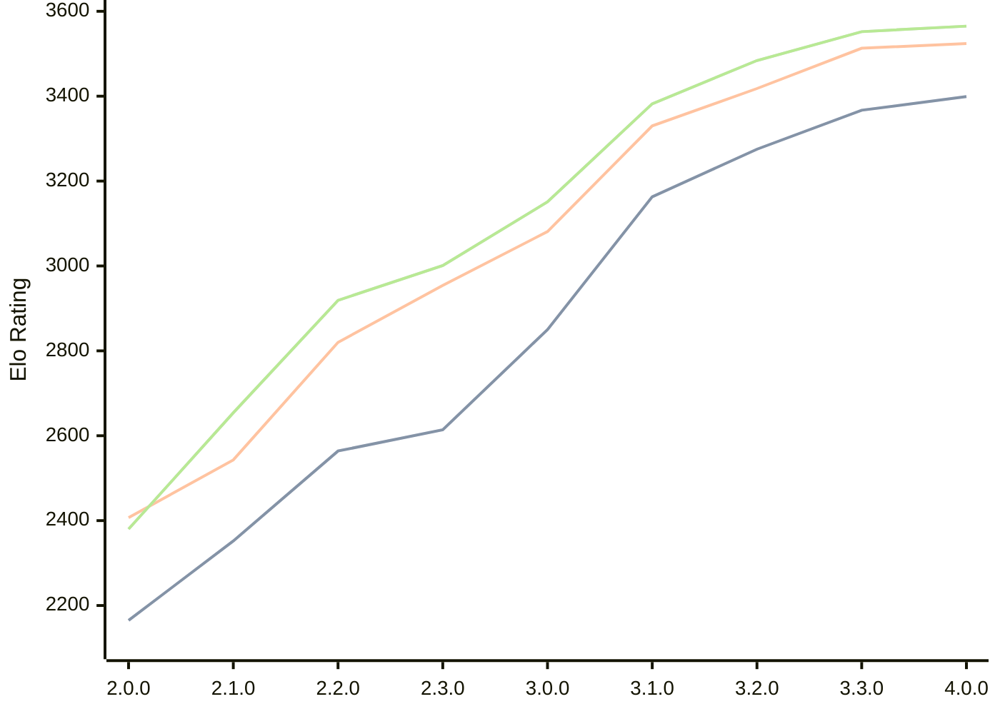

# Engine: Raphael

Author: Rei Meguro

Home: https://github.com/Orbital-Web/Raphael

## Elo Ratings

| Version | Published | STC 8.0+0.08s  | LTC 60.0+0.60s | VLTC 2m24s+1.12s | Comment |
| --- | --- | --- | --- | --- | --- |
| 4.0.0 | 2026-04-26 | 3399(+32) | 3524(+11) | 3565(+13) |  |
| 3.3.0 | 2026-04-06 | 3367(+92) | 3513(+95) | 3552(+68) |  |
| 3.2.0 | 2026-03-19 | 3275(+112) | 3418(+88) | 3484(+102) |  |
| 3.1.0 | 2026-03-01 | 3163(+313) | 3330(+249) | 3382(+231) |  |
| 3.0.0 | 2026-02-12 | 2850(+236) | 3081(+127) | 3151(+150) |  |
| 2.3.0 | 2026-01-26 | 2614(+50) | 2954(+134) | 3001(+82) |  |
| 2.2.0 | 2026-01-08 | 2564(+212) | 2820(+277) | 2919(+265) |  |
| 2.1.0 | 2026-01-01 | 2352(+187) | 2543(+136) | 2654(+274) |  |
| 2.0.0 | 2025-12-23 | 2165(+new) | 2407(+new) | 2380(+new) |  |
| 1.8.0 | 2024-12-27 |  |  |  |  |
| 1.7.6 | 2024-12-16 |  |  |  |  |
| 1.7.0 | 2023-08-27 |  |  |  |  |
| 1.6.0 | 2023-08-21 |  |  |  |  |
| 1.5.0 | 2023-08-16 |  |  |  |  |
| 1.4.0 | 2023-08-10 |  |  |  |  |
| 1.3.0 | 2023-08-05 |  |  |  |  |
| 1.2.0 | 2023-07-24 |  |  |  |  |
| 1.1.0 | 2023-07-23 |  |  |  |  |
| 1.0.0 | 2023-07-19 |  |  |  |  |
| 0.5.1 | 2023-07-17 |  |  |  |  |
| 0.5.0 | 2023-07-07 |  |  |  |  |
 | | | cElo (∆ prev) | cElo (∆ prev) | cElo (∆ prev) | 

<a href="https://github.com/computer-chess-index/cci/issues/new?template=submit-version.yml&title=[VERSION]+Raphael+<version>&body=###%20Engine%20name%0ARaphael%0A%0A###%20Version%0A4.0.0" target="_blank">Submit new version</a>

 Test Conditions:

GUI/CLI: <a href=https://github.com/cutechess/cutechess target="_blank">Cute-Chess</a> 
Elo Calculation: <a href=https://www.remi-coulom.fr/Bayesian-Elo/ target="_blank">Bayesian-Elo</a> 
CPU: Intel(R) Core(TM) i5-7500T 2.70GHz 
Opening book: 8_moves_v3 
\* STC: 8.0+0.08s, LTC: 60.0+0.60s, VLTC: 2m24s+1.12s

 Lists:
Ratings: <a href=https://github.com/computer-chess-index/cci/blob/main/lists/CCIRatings.csv target="_blank">Complete list</a>

Generated: 2026-05-03 08:20:11

## Ratings Verlauf

⬛ STC (8.0+0.08s) &nbsp;&nbsp; 🟧 LTC (60.0+0.60s) &nbsp;&nbsp; 🟩 VLTC (2m24s+1.12s)

dark mode: 🟩STC (8.0+0.08s) 🟧LTC (60.0+0.60s) ⬜VLTC (2m24s+1.12s)

## Detailed Evaluation Results

| Version | Time Control | Elo  | Range +/- | Matches | Score | Average Opponent Elo | Draws |
| --- | --- | --- | --- | --- | --- | --- | --- |
| 4.0.0 | VLTC (2m24s+1.12s) | 3565 | 30 | 254 | 50% | 3567 | 89% |
| 4.0.0 | LTC (60.0+0.60s) | 3524 | 29 | 284 | 50% | 3526 | 83% |
| 4.0.0 | STC (8.0+0.08s) | 3399 | 29 | 300 | 50% | 3402 | 76% |
| --- | --- | --- | --- | --- | --- | --- | --- |
| 3.3.0 | VLTC (2m24s+1.12s) | 3552 | 26 | 338 | 50% | 3555 | 83% |
| 3.3.0 | LTC (60.0+0.60s) | 3513 | 26 | 346 | 52% | 3501 | 84% |
| 3.3.0 | STC (8.0+0.08s) | 3367 | 26 | 364 | 52% | 3349 | 74% |
| --- | --- | --- | --- | --- | --- | --- | --- |
| 3.2.0 | VLTC (2m24s+1.12s) | 3484 | 26 | 354 | 51% | 3482 | 80% |
| 3.2.0 | LTC (60.0+0.60s) | 3418 | 25 | 388 | 53% | 3399 | 80% |
| 3.2.0 | STC (8.0+0.08s) | 3275 | 26 | 376 | 49% | 3283 | 65% |
| --- | --- | --- | --- | --- | --- | --- | --- |
| 3.1.0 | VLTC (2m24s+1.12s) | 3382 | 29 | 304 | 52% | 3367 | 65% |
| 3.1.0 | LTC (60.0+0.60s) | 3330 | 31 | 270 | 51% | 3321 | 68% |
| 3.1.0 | STC (8.0+0.08s) | 3163 | 33 | 260 | 50% | 3159 | 54% |
| --- | --- | --- | --- | --- | --- | --- | --- |
| 3.0.0 | VLTC (2m24s+1.12s) | 3151 | 33 | 268 | 49% | 3162 | 46% |
| 3.0.0 | LTC (60.0+0.60s) | 3081 | 30 | 332 | 48% | 3092 | 46% |
| 3.0.0 | STC (8.0+0.08s) | 2850 | 35 | 244 | 50% | 2853 | 46% |
| --- | --- | --- | --- | --- | --- | --- | --- |
| 2.3.0 | VLTC (2m24s+1.12s) | 3001 | 40 | 188 | 50% | 3001 | 41% |
| 2.3.0 | LTC (60.0+0.60s) | 2954 | 35 | 240 | 49% | 2963 | 43% |
| 2.3.0 | STC (8.0+0.08s) | 2614 | 41 | 196 | 50% | 2615 | 29% |
| --- | --- | --- | --- | --- | --- | --- | --- |
| 2.2.0 | VLTC (2m24s+1.12s) | 2919 | 36 | 254 | 53% | 2889 | 33% |
| 2.2.0 | LTC (60.0+0.60s) | 2820 | 40 | 196 | 52% | 2807 | 37% |
| 2.2.0 | STC (8.0+0.08s) | 2564 | 41 | 202 | 50% | 2557 | 28% |
| --- | --- | --- | --- | --- | --- | --- | --- |
| 2.1.0 | VLTC (2m24s+1.12s) | 2654 | 47 | 140 | 52% | 2633 | 39% |
| 2.1.0 | LTC (60.0+0.60s) | 2543 | 45 | 164 | 50% | 2542 | 27% |
| 2.1.0 | STC (8.0+0.08s) | 2352 | 48 | 142 | 51% | 2346 | 30% |
| --- | --- | --- | --- | --- | --- | --- | --- |
| 2.0.0 | VLTC (2m24s+1.12s) | 2380 | 41 | 196 | 50% | 2404 | 35% |
| 2.0.0 | LTC (60.0+0.60s) | 2407 | 50 | 130 | 48% | 2422 | 32% |
| 2.0.0 | STC (8.0+0.08s) | 2165 | 49 | 138 | 49% | 2175 | 31% |
| --- | --- | --- | --- | --- | --- | --- | --- |