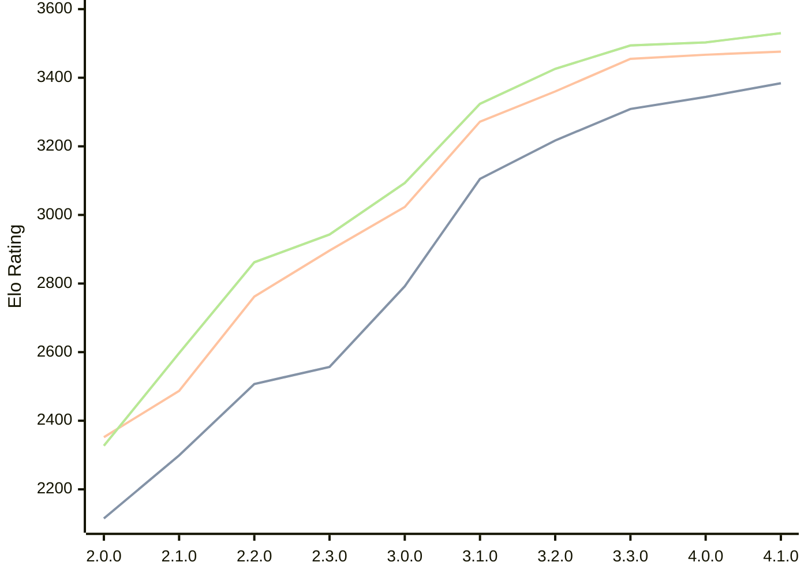

# Engine: Raphael

Author: Rei Meguro

Home: https://github.com/Orbital-Web/Raphael

## Elo Ratings

| Version | Published | STC 8.0+0.08s  | LTC 60.0+0.60s | VLTC 2m24s+1.12s | Comment |
| --- | --- | --- | --- | --- | --- |
| 4.1.0 | 2026-05-17 | 3384(+40) | 3476(+9) | 3530(+27) |  |
| 4.0.0 | 2026-04-26 | 3344(+35) | 3467(+12) | 3503(+9) |  |
| 3.3.0 | 2026-04-06 | 3309(+92) | 3455(+95) | 3494(+68) |  |
| 3.2.0 | 2026-03-19 | 3217(+112) | 3360(+88) | 3426(+102) |  |
| 3.1.0 | 2026-03-01 | 3105(+313) | 3272(+249) | 3324(+231) |  |
| 3.0.0 | 2026-02-12 | 2792(+235) | 3023(+127) | 3093(+150) |  |
| 2.3.0 | 2026-01-26 | 2557(+50) | 2896(+134) | 2943(+81) |  |
| 2.2.0 | 2026-01-08 | 2507(+208) | 2762(+275) | 2862(+265) |  |
| 2.1.0 | 2026-01-01 | 2299(+184) | 2487(+135) | 2597(+270) |  |
| 2.0.0 | 2025-12-23 | 2115(+new) | 2352(+new) | 2327(+new) |  |
| 1.8.0 | 2024-12-27 |  |  |  |  |
| 1.7.6 | 2024-12-16 |  |  |  |  |
| 1.7.0 | 2023-08-27 |  |  |  |  |
| 1.6.0 | 2023-08-21 |  |  |  |  |
| 1.5.0 | 2023-08-16 |  |  |  |  |
| 1.4.0 | 2023-08-10 |  |  |  |  |
| 1.3.0 | 2023-08-05 |  |  |  |  |
| 1.2.0 | 2023-07-24 |  |  |  |  |
| 1.1.0 | 2023-07-23 |  |  |  |  |
| 1.0.0 | 2023-07-19 |  |  |  |  |
| 0.5.1 | 2023-07-17 |  |  |  |  |
| 0.5.0 | 2023-07-07 |  |  |  |  |
 | | | cElo (∆ prev) | cElo (∆ prev) | cElo (∆ prev) | 

<a href="https://github.com/computer-chess-index/cci/issues/new?template=submit-version.yml&title=[VERSION]+Raphael+<version>&body=###%20Engine%20name%0ARaphael%0A%0A###%20Version%0A4.1.0" target="_blank">Submit new version</a>

 Test Conditions:

GUI/CLI: <a href=https://github.com/cutechess/cutechess target="_blank">Cute-Chess</a> 
Elo Calculation: <a href=https://www.remi-coulom.fr/Bayesian-Elo/ target="_blank">Bayesian-Elo</a> 
CPU: Intel(R) Core(TM) i5-7500T 2.70GHz 
Opening book: 8_moves_v3 
\* STC: 8.0+0.08s, LTC: 60.0+0.60s, VLTC: 2m24s+1.12s

 Lists:
Ratings: <a href=https://github.com/computer-chess-index/cci/blob/main/lists/CCIRatings.csv target="_blank">Complete list</a>

Generated: 2026-05-20 06:28:07

## Ratings Verlauf

⬛ STC (8.0+0.08s) &nbsp;&nbsp; 🟧 LTC (60.0+0.60s) &nbsp;&nbsp; 🟩 VLTC (2m24s+1.12s)

dark mode: 🟩STC (8.0+0.08s) 🟧LTC (60.0+0.60s) ⬜VLTC (2m24s+1.12s)

## Detailed Evaluation Results

| Version | Time Control | Elo  | Range +/- | Matches | Score | Average Opponent Elo | Draws |
| --- | --- | --- | --- | --- | --- | --- | --- |
| 4.1.0 | VLTC (2m24s+1.12s) | 3530 | 34 | 190 | 50% | 3533 | 91% |
| 4.1.0 | LTC (60.0+0.60s) | 3476 | 35 | 192 | 50% | 3479 | 82% |
| 4.1.0 | STC (8.0+0.08s) | 3384 | 34 | 208 | 49% | 3393 | 74% |
| --- | --- | --- | --- | --- | --- | --- | --- |
| 4.0.0 | VLTC (2m24s+1.12s) | 3503 | 27 | 314 | 50% | 3505 | 88% |
| 4.0.0 | LTC (60.0+0.60s) | 3467 | 27 | 320 | 50% | 3465 | 83% |
| 4.0.0 | STC (8.0+0.08s) | 3344 | 27 | 336 | 50% | 3344 | 76% |
| --- | --- | --- | --- | --- | --- | --- | --- |
| 3.3.0 | VLTC (2m24s+1.12s) | 3494 | 26 | 338 | 50% | 3497 | 83% |
| 3.3.0 | LTC (60.0+0.60s) | 3455 | 26 | 346 | 52% | 3443 | 84% |
| 3.3.0 | STC (8.0+0.08s) | 3309 | 26 | 364 | 52% | 3291 | 74% |
| --- | --- | --- | --- | --- | --- | --- | --- |
| 3.2.0 | VLTC (2m24s+1.12s) | 3426 | 26 | 354 | 51% | 3424 | 80% |
| 3.2.0 | LTC (60.0+0.60s) | 3360 | 25 | 388 | 53% | 3341 | 80% |
| 3.2.0 | STC (8.0+0.08s) | 3217 | 26 | 376 | 49% | 3225 | 65% |
| --- | --- | --- | --- | --- | --- | --- | --- |
| 3.1.0 | VLTC (2m24s+1.12s) | 3324 | 29 | 304 | 52% | 3309 | 65% |
| 3.1.0 | LTC (60.0+0.60s) | 3272 | 31 | 270 | 51% | 3263 | 68% |
| 3.1.0 | STC (8.0+0.08s) | 3105 | 33 | 260 | 50% | 3101 | 54% |
| --- | --- | --- | --- | --- | --- | --- | --- |
| 3.0.0 | VLTC (2m24s+1.12s) | 3093 | 33 | 268 | 49% | 3102 | 46% |
| 3.0.0 | LTC (60.0+0.60s) | 3023 | 30 | 332 | 48% | 3033 | 46% |
| 3.0.0 | STC (8.0+0.08s) | 2792 | 35 | 244 | 50% | 2795 | 46% |
| --- | --- | --- | --- | --- | --- | --- | --- |
| 2.3.0 | VLTC (2m24s+1.12s) | 2943 | 40 | 188 | 50% | 2942 | 41% |
| 2.3.0 | LTC (60.0+0.60s) | 2896 | 35 | 240 | 49% | 2905 | 43% |
| 2.3.0 | STC (8.0+0.08s) | 2557 | 41 | 196 | 50% | 2558 | 29% |
| --- | --- | --- | --- | --- | --- | --- | --- |
| 2.2.0 | VLTC (2m24s+1.12s) | 2862 | 36 | 254 | 53% | 2831 | 33% |
| 2.2.0 | LTC (60.0+0.60s) | 2762 | 40 | 196 | 52% | 2749 | 37% |
| 2.2.0 | STC (8.0+0.08s) | 2507 | 41 | 202 | 50% | 2500 | 28% |
| --- | --- | --- | --- | --- | --- | --- | --- |
| 2.1.0 | VLTC (2m24s+1.12s) | 2597 | 47 | 140 | 52% | 2576 | 39% |
| 2.1.0 | LTC (60.0+0.60s) | 2487 | 45 | 164 | 50% | 2485 | 27% |
| 2.1.0 | STC (8.0+0.08s) | 2299 | 48 | 142 | 51% | 2292 | 30% |
| --- | --- | --- | --- | --- | --- | --- | --- |
| 2.0.0 | VLTC (2m24s+1.12s) | 2327 | 41 | 196 | 50% | 2352 | 35% |
| 2.0.0 | LTC (60.0+0.60s) | 2352 | 50 | 130 | 48% | 2365 | 32% |
| 2.0.0 | STC (8.0+0.08s) | 2115 | 49 | 138 | 49% | 2125 | 31% |
| --- | --- | --- | --- | --- | --- | --- | --- |