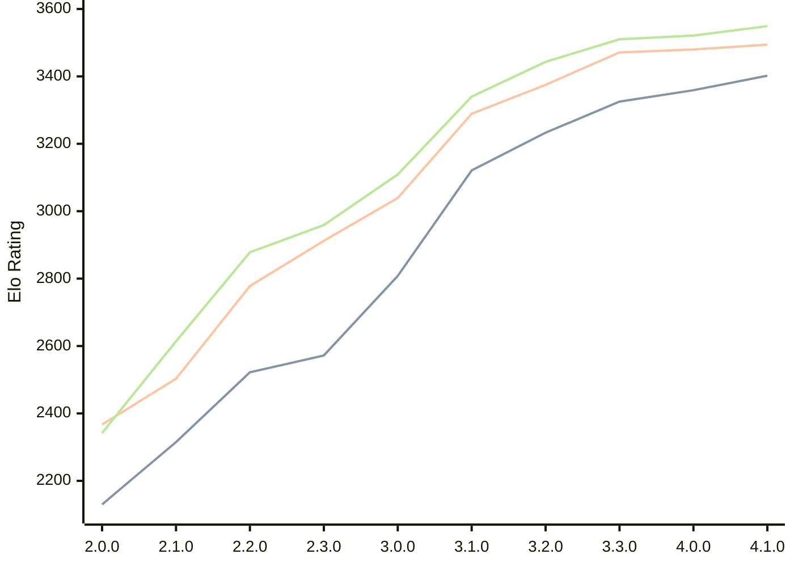

# Engine: Raphael

Author: Rei Meguro

Home: https://github.com/Orbital-Web/Raphael

## Elo Ratings

| Version | Published | STC 8.0+0.08s  | LTC 60.0+0.60s | VLTC 2m24s+1.12s | Comment |
| --- | --- | --- | --- | --- | --- |
| 4.1.0 | 2026-05-17 | 3402(+43) | 3494(+14) | 3549(+28) |  |
| 4.0.0 | 2026-04-26 | 3359(+34) | 3480(+9) | 3521(+11) |  |
| 3.3.0 | 2026-04-06 | 3325(+92) | 3471(+96) | 3510(+67) |  |
| 3.2.0 | 2026-03-19 | 3233(+112) | 3375(+86) | 3443(+103) |  |
| 3.1.0 | 2026-03-01 | 3121(+313) | 3289(+250) | 3340(+231) |  |
| 3.0.0 | 2026-02-12 | 2808(+236) | 3039(+127) | 3109(+150) |  |
| 2.3.0 | 2026-01-26 | 2572(+50) | 2912(+134) | 2959(+81) |  |
| 2.2.0 | 2026-01-08 | 2522(+207) | 2778(+275) | 2878(+264) |  |
| 2.1.0 | 2026-01-01 | 2315(+185) | 2503(+136) | 2614(+272) |  |
| 2.0.0 | 2025-12-23 | 2130(+new) | 2367(+new) | 2342(+new) |  |
| 1.8.0 | 2024-12-27 |  |  |  |  |
| 1.7.6 | 2024-12-16 |  |  |  |  |
| 1.7.0 | 2023-08-27 |  |  |  |  |
| 1.6.0 | 2023-08-21 |  |  |  |  |
| 1.5.0 | 2023-08-16 |  |  |  |  |
| 1.4.0 | 2023-08-10 |  |  |  |  |
| 1.3.0 | 2023-08-05 |  |  |  |  |
| 1.2.0 | 2023-07-24 |  |  |  |  |
| 1.1.0 | 2023-07-23 |  |  |  |  |
| 1.0.0 | 2023-07-19 |  |  |  |  |
| 0.5.1 | 2023-07-17 |  |  |  |  |
| 0.5.0 | 2023-07-07 |  |  |  |  |
 | | | cElo (∆ prev) | cElo (∆ prev) | cElo (∆ prev) | 

<a href="https://github.com/computer-chess-index/cci/issues/new?template=submit-version.yml&title=[VERSION]+Raphael+<version>&body=###%20Engine%20name%0ARaphael%0A%0A###%20Version%0A4.1.0" target="_blank">Submit new version</a>

 Test Conditions:

GUI/CLI: <a href=https://github.com/cutechess/cutechess target="_blank">Cute-Chess</a> 
Elo Calculation: <a href=https://www.remi-coulom.fr/Bayesian-Elo/ target="_blank">Bayesian-Elo</a> 
CPU: Intel(R) Core(TM) i5-7500T 2.70GHz 
Opening book: 8_moves_v3 
\* STC: 8.0+0.08s, LTC: 60.0+0.60s, VLTC: 2m24s+1.12s

 Lists:
Ratings: <a href=https://github.com/computer-chess-index/cci/blob/main/lists/CCIRatings.csv target="_blank">Complete list</a>

Generated: 2026-05-19 06:28:10

## Ratings Verlauf

⬛ STC (8.0+0.08s) &nbsp;&nbsp; 🟧 LTC (60.0+0.60s) &nbsp;&nbsp; 🟩 VLTC (2m24s+1.12s)

dark mode: 🟩STC (8.0+0.08s) 🟧LTC (60.0+0.60s) ⬜VLTC (2m24s+1.12s)

## Detailed Evaluation Results

| Version | Time Control | Elo  | Range +/- | Matches | Score | Average Opponent Elo | Draws |
| --- | --- | --- | --- | --- | --- | --- | --- |
| 4.1.0 | VLTC (2m24s+1.12s) | 3549 | 38 | 156 | 50% | 3551 | 91% |
| 4.1.0 | LTC (60.0+0.60s) | 3494 | 38 | 164 | 50% | 3495 | 84% |
| 4.1.0 | STC (8.0+0.08s) | 3402 | 37 | 184 | 49% | 3413 | 74% |
| --- | --- | --- | --- | --- | --- | --- | --- |
| 4.0.0 | VLTC (2m24s+1.12s) | 3521 | 27 | 306 | 50% | 3521 | 88% |
| 4.0.0 | LTC (60.0+0.60s) | 3480 | 28 | 304 | 50% | 3483 | 84% |
| 4.0.0 | STC (8.0+0.08s) | 3359 | 27 | 332 | 50% | 3360 | 75% |
| --- | --- | --- | --- | --- | --- | --- | --- |
| 3.3.0 | VLTC (2m24s+1.12s) | 3510 | 26 | 338 | 50% | 3513 | 83% |
| 3.3.0 | LTC (60.0+0.60s) | 3471 | 26 | 346 | 52% | 3459 | 84% |
| 3.3.0 | STC (8.0+0.08s) | 3325 | 26 | 364 | 52% | 3308 | 74% |
| --- | --- | --- | --- | --- | --- | --- | --- |
| 3.2.0 | VLTC (2m24s+1.12s) | 3443 | 26 | 354 | 51% | 3440 | 80% |
| 3.2.0 | LTC (60.0+0.60s) | 3375 | 25 | 388 | 53% | 3357 | 80% |
| 3.2.0 | STC (8.0+0.08s) | 3233 | 26 | 376 | 49% | 3241 | 65% |
| --- | --- | --- | --- | --- | --- | --- | --- |
| 3.1.0 | VLTC (2m24s+1.12s) | 3340 | 29 | 304 | 52% | 3325 | 65% |
| 3.1.0 | LTC (60.0+0.60s) | 3289 | 31 | 270 | 51% | 3279 | 68% |
| 3.1.0 | STC (8.0+0.08s) | 3121 | 33 | 260 | 50% | 3117 | 54% |
| --- | --- | --- | --- | --- | --- | --- | --- |
| 3.0.0 | VLTC (2m24s+1.12s) | 3109 | 33 | 268 | 49% | 3119 | 46% |
| 3.0.0 | LTC (60.0+0.60s) | 3039 | 30 | 332 | 48% | 3050 | 46% |
| 3.0.0 | STC (8.0+0.08s) | 2808 | 35 | 244 | 50% | 2811 | 46% |
| --- | --- | --- | --- | --- | --- | --- | --- |
| 2.3.0 | VLTC (2m24s+1.12s) | 2959 | 40 | 188 | 50% | 2958 | 41% |
| 2.3.0 | LTC (60.0+0.60s) | 2912 | 35 | 240 | 49% | 2921 | 43% |
| 2.3.0 | STC (8.0+0.08s) | 2572 | 41 | 196 | 50% | 2574 | 29% |
| --- | --- | --- | --- | --- | --- | --- | --- |
| 2.2.0 | VLTC (2m24s+1.12s) | 2878 | 36 | 254 | 53% | 2847 | 33% |
| 2.2.0 | LTC (60.0+0.60s) | 2778 | 40 | 196 | 52% | 2765 | 37% |
| 2.2.0 | STC (8.0+0.08s) | 2522 | 41 | 202 | 50% | 2515 | 28% |
| --- | --- | --- | --- | --- | --- | --- | --- |
| 2.1.0 | VLTC (2m24s+1.12s) | 2614 | 47 | 140 | 52% | 2591 | 39% |
| 2.1.0 | LTC (60.0+0.60s) | 2503 | 45 | 164 | 50% | 2500 | 27% |
| 2.1.0 | STC (8.0+0.08s) | 2315 | 48 | 142 | 51% | 2309 | 30% |
| --- | --- | --- | --- | --- | --- | --- | --- |
| 2.0.0 | VLTC (2m24s+1.12s) | 2342 | 41 | 196 | 50% | 2367 | 35% |
| 2.0.0 | LTC (60.0+0.60s) | 2367 | 50 | 130 | 48% | 2381 | 32% |
| 2.0.0 | STC (8.0+0.08s) | 2130 | 49 | 138 | 49% | 2140 | 31% |
| --- | --- | --- | --- | --- | --- | --- | --- |