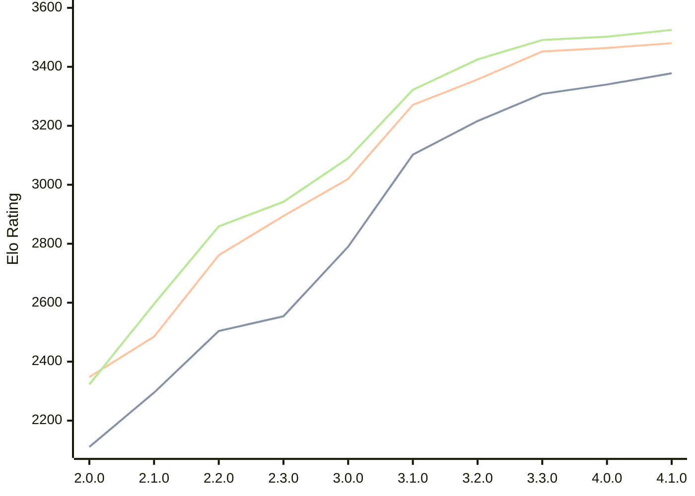

# Engine: Raphael

Author: Rei Meguro

Home: https://github.com/Orbital-Web/Raphael

## Elo Ratings

| Version | Published | STC 8.0+0.08s  | LTC 60.0+0.60s | VLTC 2m24s+1.12s | Comment |
| --- | --- | --- | --- | --- | --- |
| 4.1.0 | 2026-05-17 | 3378(+38) | 3480(+16) | 3525(+23) |  |
| 4.0.0 | 2026-04-26 | 3340(+32) | 3464(+12) | 3502(+11) |  |
| 3.3.0 | 2026-04-06 | 3308(+92) | 3452(+95) | 3491(+66) |  |
| 3.2.0 | 2026-03-19 | 3216(+114) | 3357(+86) | 3425(+103) |  |
| 3.1.0 | 2026-03-01 | 3102(+312) | 3271(+251) | 3322(+232) |  |
| 3.0.0 | 2026-02-12 | 2790(+236) | 3020(+126) | 3090(+148) |  |
| 2.3.0 | 2026-01-26 | 2554(+50) | 2894(+133) | 2942(+83) |  |
| 2.2.0 | 2026-01-08 | 2504(+209) | 2761(+276) | 2859(+263) |  |
| 2.1.0 | 2026-01-01 | 2295(+184) | 2485(+137) | 2596(+273) |  |
| 2.0.0 | 2025-12-23 | 2111(+new) | 2348(+new) | 2323(+new) |  |
| 1.8.0 | 2024-12-27 |  |  |  |  |
| 1.7.6 | 2024-12-16 |  |  |  |  |
| 1.7.0 | 2023-08-27 |  |  |  |  |
| 1.6.0 | 2023-08-21 |  |  |  |  |
| 1.5.0 | 2023-08-16 |  |  |  |  |
| 1.4.0 | 2023-08-10 |  |  |  |  |
| 1.3.0 | 2023-08-05 |  |  |  |  |
| 1.2.0 | 2023-07-24 |  |  |  |  |
| 1.1.0 | 2023-07-23 |  |  |  |  |
| 1.0.0 | 2023-07-19 |  |  |  |  |
| 0.5.1 | 2023-07-17 |  |  |  |  |
| 0.5.0 | 2023-07-07 |  |  |  |  |
 | | | cElo (∆ prev) | cElo (∆ prev) | cElo (∆ prev) | 

<a href="https://github.com/computer-chess-index/cci/issues/new?template=submit-version.yml&title=[VERSION]+Raphael+<version>&body=###%20Engine%20name%0ARaphael%0A%0A###%20Version%0A4.1.0" target="_blank">Submit new version</a>

 Test Conditions:

GUI/CLI: <a href=https://github.com/cutechess/cutechess target="_blank">Cute-Chess</a> 
Elo Calculation: <a href=https://www.remi-coulom.fr/Bayesian-Elo/ target="_blank">Bayesian-Elo</a> 
CPU: Intel(R) Core(TM) i5-7500T 2.70GHz 
Opening book: 8_moves_v3 
\* STC: 8.0+0.08s, LTC: 60.0+0.60s, VLTC: 2m24s+1.12s

 Lists:
Ratings: <a href=https://github.com/computer-chess-index/cci/blob/main/lists/CCIRatings.csv target="_blank">Complete list</a>

Generated: 2026-06-18 06:31:13

## Ratings Verlauf

## Ratings Verlauf

⬛ STC (8.0+0.08s) &nbsp;&nbsp; 🟧 LTC (60.0+0.60s) &nbsp;&nbsp; 🟩 VLTC (2m24s+1.12s)

dark mode: 🟩STC (8.0+0.08s) 🟧LTC (60.0+0.60s) ⬜VLTC (2m24s+1.12s)

## Detailed Evaluation Results

| Version | Time Control | Elo  | Range +/- | Matches | Score | Average Opponent Elo | Draws |
| --- | --- | --- | --- | --- | --- | --- | --- |
| 4.1.0 | VLTC (2m24s+1.12s) | 3525 | 28 | 290 | 49% | 3529 | 90% |
| 4.1.0 | LTC (60.0+0.60s) | 3480 | 29 | 280 | 50% | 3479 | 84% |
| 4.1.0 | STC (8.0+0.08s) | 3378 | 29 | 292 | 49% | 3386 | 72% |
| --- | --- | --- | --- | --- | --- | --- | --- |
| 4.0.0 | VLTC (2m24s+1.12s) | 3502 | 27 | 318 | 50% | 3503 | 88% |
| 4.0.0 | LTC (60.0+0.60s) | 3464 | 27 | 324 | 50% | 3464 | 83% |
| 4.0.0 | STC (8.0+0.08s) | 3340 | 27 | 344 | 50% | 3344 | 75% |
| --- | --- | --- | --- | --- | --- | --- | --- |
| 3.3.0 | VLTC (2m24s+1.12s) | 3491 | 26 | 338 | 50% | 3495 | 83% |
| 3.3.0 | LTC (60.0+0.60s) | 3452 | 26 | 346 | 52% | 3441 | 84% |
| 3.3.0 | STC (8.0+0.08s) | 3308 | 26 | 364 | 52% | 3290 | 74% |
| --- | --- | --- | --- | --- | --- | --- | --- |
| 3.2.0 | VLTC (2m24s+1.12s) | 3425 | 26 | 354 | 51% | 3421 | 80% |
| 3.2.0 | LTC (60.0+0.60s) | 3357 | 25 | 388 | 53% | 3340 | 80% |
| 3.2.0 | STC (8.0+0.08s) | 3216 | 26 | 376 | 49% | 3224 | 65% |
| --- | --- | --- | --- | --- | --- | --- | --- |
| 3.1.0 | VLTC (2m24s+1.12s) | 3322 | 29 | 304 | 52% | 3308 | 65% |
| 3.1.0 | LTC (60.0+0.60s) | 3271 | 31 | 270 | 51% | 3262 | 68% |
| 3.1.0 | STC (8.0+0.08s) | 3102 | 33 | 260 | 50% | 3100 | 54% |
| --- | --- | --- | --- | --- | --- | --- | --- |
| 3.0.0 | VLTC (2m24s+1.12s) | 3090 | 33 | 268 | 49% | 3101 | 46% |
| 3.0.0 | LTC (60.0+0.60s) | 3020 | 30 | 332 | 48% | 3032 | 46% |
| 3.0.0 | STC (8.0+0.08s) | 2790 | 35 | 244 | 50% | 2793 | 46% |
| --- | --- | --- | --- | --- | --- | --- | --- |
| 2.3.0 | VLTC (2m24s+1.12s) | 2942 | 40 | 188 | 50% | 2940 | 41% |
| 2.3.0 | LTC (60.0+0.60s) | 2894 | 35 | 240 | 49% | 2904 | 43% |
| 2.3.0 | STC (8.0+0.08s) | 2554 | 41 | 196 | 50% | 2556 | 29% |
| --- | --- | --- | --- | --- | --- | --- | --- |
| 2.2.0 | VLTC (2m24s+1.12s) | 2859 | 36 | 254 | 53% | 2830 | 33% |
| 2.2.0 | LTC (60.0+0.60s) | 2761 | 40 | 196 | 52% | 2747 | 37% |
| 2.2.0 | STC (8.0+0.08s) | 2504 | 41 | 202 | 50% | 2498 | 28% |
| --- | --- | --- | --- | --- | --- | --- | --- |
| 2.1.0 | VLTC (2m24s+1.12s) | 2596 | 47 | 140 | 52% | 2573 | 39% |
| 2.1.0 | LTC (60.0+0.60s) | 2485 | 45 | 164 | 50% | 2484 | 27% |
| 2.1.0 | STC (8.0+0.08s) | 2295 | 48 | 142 | 51% | 2290 | 30% |
| --- | --- | --- | --- | --- | --- | --- | --- |
| 2.0.0 | VLTC (2m24s+1.12s) | 2323 | 41 | 196 | 50% | 2348 | 35% |
| 2.0.0 | LTC (60.0+0.60s) | 2348 | 50 | 130 | 48% | 2363 | 32% |
| 2.0.0 | STC (8.0+0.08s) | 2111 | 49 | 138 | 49% | 2120 | 31% |
| --- | --- | --- | --- | --- | --- | --- | --- |