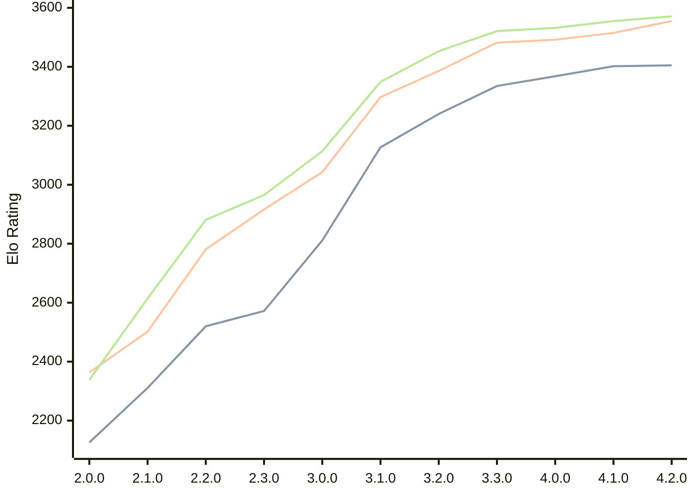

# Engine: Raphael

Author: Rei Meguro

Home: https://github.com/Orbital-Web/Raphael

## Elo Ratings E1

| Version | Published | STC 8.0+0.08s  | LTC 60.0+0.60s | VLTC 2m24s+1.12s | Comment |
| --- | --- | --- | --- | --- | --- |
| 4.2.0 | 2026-06-27 | 3310 | 3522 | 3579 |  |
 | | | cElo (∆ prev) | cElo (∆ prev) | cElo (∆ prev) | 

## Elo Ratings P1

| Version | Published | STC 8.0+0.08s  | LTC 60.0+0.60s | VLTC 2m24s+1.12s | Comment |
| --- | --- | --- | --- | --- | --- |
| 4.2.0 | 2026-06-27 | 3556 | 3764 | 3784 |  |
 | | | cElo (∆ prev) | cElo (∆ prev) | cElo (∆ prev) | 

## Elo Ratings T1

| Version | Published | STC 8.0+0.08s  | LTC 60.0+0.60s | VLTC 2m24s+1.12s | Comment |
| --- | --- | --- | --- | --- | --- |
| 4.2.0 | 2026-06-27 | 3405(+3) | 3555(+40) | 3571(+16) |  |
| 4.1.0 | 2026-05-17 | 3402(+34) | 3515(+23) | 3555(+23) |  |
| 4.0.0 | 2026-04-26 | 3368(+33) | 3492(+10) | 3532(+11) |  |
| 3.3.0 | 2026-04-06 | 3335(+95) | 3482(+96) | 3521(+68) |  |
| 3.2.0 | 2026-03-19 | 3240(+113) | 3386(+89) | 3453(+104) |  |
| 3.1.0 | 2026-03-01 | 3127(+316) | 3297(+254) | 3349(+235) |  |
| 3.0.0 | 2026-02-12 | 2811(+239) | 3043(+127) | 3114(+149) |  |
| 2.3.0 | 2026-01-26 | 2572(+52) | 2916(+135) | 2965(+84) |  |
| 2.2.0 | 2026-01-08 | 2520(+209) | 2781(+279) | 2881(+267) |  |
| 2.1.0 | 2026-01-01 | 2311(+185) | 2502(+139) | 2614(+276) |  |
| 2.0.0 | 2025-12-23 | 2126 | 2363 | 2338 |  |
 | | | cElo (∆ prev) | cElo (∆ prev) | cElo (∆ prev) | 

<a href="https://github.com/computer-chess-index/cci/issues/new?template=submit-version.yml&title=[VERSION]+Raphael+<version>&body=###%20Engine%20name%0ARaphael%0A%0A###%20Version%0A4.2.0" target="_blank">Submit new version</a>

 Test Conditions:

GUI/CLI: <a href=https://github.com/cutechess/cutechess target="_blank">Cute-Chess</a> 
Elo Calculation: <a href=https://www.remi-coulom.fr/Bayesian-Elo/ target="_blank">Bayesian-Elo</a> 
CPU for P1: Intel(R) Core(TM) Ultra 7 265T (1.50 GHz) - P-Core 
CPU for E1: Intel(R) Core(TM) Ultra 7 265T (1.50 GHz) - E-Core 
CPU for T1: Intel(R) Core(TM) i5-7500T 2.70GHz 
Opening book: 8_moves_v3 
\* STC: 8.0+0.08s, LTC: 60.0+0.60s, VLTC: 2m24s+1.12s

 Lists:
Ratings: <a href=https://github.com/computer-chess-index/cci/blob/main/lists/CCIRatings.csv target="_blank">Complete list</a>

Generated: 2026-10-10 04:41:40

## Ratings Verlauf

```mermaid
%%{init: {"theme":"base","themeVariables":{"seriesColors:['#a3a3a3','#222221','#faa371']}}}%%
xychart-beta
  x-axis ["2.0.0", "2.1.0", "2.2.0", "2.3.0", "3.0.0", "3.1.0", "3.2.0", "3.3.0", "4.0.0", "4.1.0", "4.2.0"]
  y-axis "Elo Rating" 2100 --> 3600
  line "" [2126, 2311, 2520, 2572, 2811, 3127, 3240, 3335, 3368, 3402, 3405]
  line "STC (8.0+0.08s)" [2126, 2311, 2520, 2572, 2811, 3127, 3240, 3335, 3368, 3402, 3405]
  line "LTC (60.0+0.60s)" [2363, 2502, 2781, 2916, 3043, 3297, 3386, 3482, 3492, 3515, 3555]
  line "" [2338, 2614, 2881, 2965, 3114, 3349, 3453, 3521, 3532, 3555, 3571]
  line "VLTC (2m24s+1.12s)" [2338, 2614, 2881, 2965, 3114, 3349, 3453, 3521, 3532, 3555, 3571]
```

## Detailed Evaluation Results

| Version | Time Control | Elo  | Range +/- | Matches | Score | Average Opponent Elo | Draws |
| --- | --- | --- | --- | --- | --- | --- | --- |
| 4.2.0 | VLTC (2m24s+1.12s) | 3571 | 25 | 354 | 50% | 3569 | 88% |
| 4.2.0 | VLTC (2m24s+1.12s) | 3784 | 44 | 116 | 50% | 3787 | 91% |
| 4.2.0 | VLTC (2m24s+1.12s) | 3579 | 37 | 164 | 50% | 3579 | 88% |
| 4.2.0 | LTC (60.0+0.60s) | 3555 | 23 | 438 | 51% | 3546 | 84% |
| 4.2.0 | LTC (60.0+0.60s) | 3764 | 42 | 130 | 49% | 3768 | 88% |
| 4.2.0 | LTC (60.0+0.60s) | 3522 | 34 | 206 | 48% | 3537 | 82% |
| 4.2.0 | STC (8.0+0.08s) | 3405 | 26 | 364 | 49% | 3410 | 72% |
| --- | --- | --- | --- | --- | --- | --- | --- |
| 4.2.0 | STC (8.0+0.08s) | 3556 | 35 | 206 | 48% | 3567 | 71% |
| --- | --- | --- | --- | --- | --- | --- | --- |
| 4.2.0 | STC (8.0+0.08s) | 3310 | 33 | 246 | 46% | 3341 | 65% |
| --- | --- | --- | --- | --- | --- | --- | --- |
| 4.1.0 | VLTC (2m24s+1.12s) | 3555 | 27 | 310 | 50% | 3557 | 90% |
| 4.1.0 | LTC (60.0+0.60s) | 3515 | 28 | 304 | 51% | 3510 | 84% |
| 4.1.0 | STC (8.0+0.08s) | 3402 | 28 | 322 | 49% | 3410 | 71% |
| --- | --- | --- | --- | --- | --- | --- | --- |
| 4.0.0 | VLTC (2m24s+1.12s) | 3532 | 27 | 318 | 50% | 3532 | 88% |
| 4.0.0 | LTC (60.0+0.60s) | 3492 | 27 | 324 | 50% | 3492 | 83% |
| 4.0.0 | STC (8.0+0.08s) | 3368 | 27 | 344 | 50% | 3371 | 75% |
| --- | --- | --- | --- | --- | --- | --- | --- |
| 3.3.0 | VLTC (2m24s+1.12s) | 3521 | 26 | 338 | 50% | 3524 | 83% |
| 3.3.0 | LTC (60.0+0.60s) | 3482 | 26 | 346 | 52% | 3470 | 84% |
| 3.3.0 | STC (8.0+0.08s) | 3335 | 26 | 364 | 52% | 3317 | 74% |
| --- | --- | --- | --- | --- | --- | --- | --- |
| 3.2.0 | VLTC (2m24s+1.12s) | 3453 | 26 | 354 | 51% | 3449 | 80% |
| 3.2.0 | LTC (60.0+0.60s) | 3386 | 25 | 388 | 53% | 3367 | 80% |
| 3.2.0 | STC (8.0+0.08s) | 3240 | 26 | 376 | 49% | 3248 | 65% |
| --- | --- | --- | --- | --- | --- | --- | --- |
| 3.1.0 | VLTC (2m24s+1.12s) | 3349 | 29 | 304 | 52% | 3335 | 65% |
| 3.1.0 | LTC (60.0+0.60s) | 3297 | 31 | 270 | 51% | 3287 | 68% |
| 3.1.0 | STC (8.0+0.08s) | 3127 | 33 | 260 | 50% | 3123 | 54% |
| --- | --- | --- | --- | --- | --- | --- | --- |
| 3.0.0 | VLTC (2m24s+1.12s) | 3114 | 33 | 268 | 49% | 3124 | 46% |
| 3.0.0 | LTC (60.0+0.60s) | 3043 | 30 | 332 | 48% | 3055 | 46% |
| 3.0.0 | STC (8.0+0.08s) | 2811 | 35 | 244 | 50% | 2813 | 46% |
| --- | --- | --- | --- | --- | --- | --- | --- |
| 2.3.0 | VLTC (2m24s+1.12s) | 2965 | 40 | 188 | 50% | 2963 | 41% |
| 2.3.0 | LTC (60.0+0.60s) | 2916 | 35 | 240 | 49% | 2925 | 43% |
| 2.3.0 | STC (8.0+0.08s) | 2572 | 41 | 196 | 50% | 2574 | 29% |
| --- | --- | --- | --- | --- | --- | --- | --- |
| 2.2.0 | VLTC (2m24s+1.12s) | 2881 | 36 | 254 | 53% | 2851 | 33% |
| 2.2.0 | LTC (60.0+0.60s) | 2781 | 40 | 196 | 52% | 2768 | 37% |
| 2.2.0 | STC (8.0+0.08s) | 2520 | 41 | 202 | 50% | 2514 | 28% |
| --- | --- | --- | --- | --- | --- | --- | --- |
| 2.1.0 | VLTC (2m24s+1.12s) | 2614 | 47 | 140 | 52% | 2591 | 39% |
| 2.1.0 | LTC (60.0+0.60s) | 2502 | 45 | 164 | 50% | 2500 | 27% |
| 2.1.0 | STC (8.0+0.08s) | 2311 | 48 | 142 | 51% | 2304 | 30% |
| --- | --- | --- | --- | --- | --- | --- | --- |
| 2.0.0 | VLTC (2m24s+1.12s) | 2338 | 41 | 196 | 50% | 2363 | 35% |
| 2.0.0 | LTC (60.0+0.60s) | 2363 | 50 | 130 | 48% | 2377 | 32% |
| 2.0.0 | STC (8.0+0.08s) | 2126 | 49 | 138 | 49% | 2136 | 31% |
| --- | --- | --- | --- | --- | --- | --- | --- |