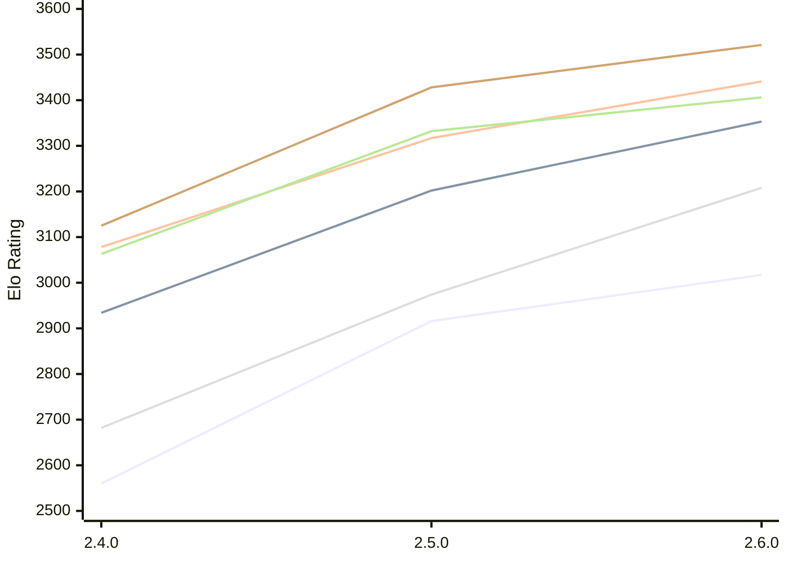

# Engine: Rarog

Author: Miloslav Macůrek

Home: https://github.com/maelic13/rarog

## Elo Ratings E1 (Ultra 7 265T (1.50 GHz) - E-Core)

| Version | Published | STC 8.0+0.08s  | LTC 60.0+0.60s | VLTC 2m24s+1.12s | Comment |
| --- | --- | --- | --- | --- | --- |
| 2.6.0 | 2026-10-22 | 3017(+101) | 3353(+151) | 3441(+124) |  |
| 2.5.0 | 2026-10-05 | 2916(+356) | 3202(+268) | 3317(+239) |  |
| 2.4.0 | 2026-09-11 | 2560 | 2934 | 3078 |  |
 | | | cElo (∆ prev) | cElo (∆ prev) | cElo (∆ prev) | 

## Elo Ratings P1 (Ultra 7 265T (1.50 GHz) - P-Core)

| Version | Published | STC 8.0+0.08s  | LTC 60.0+0.60s | VLTC 2m24s+1.12s | Comment |
| --- | --- | --- | --- | --- | --- |
| 2.6.0 | 2026-10-22 | 3208(+234) | 3406(+74) | 3521(+93) |  |
| 2.5.0 | 2026-10-05 | 2974(+292) | 3332(+269) | 3428(+303) |  |
| 2.4.0 | 2026-09-11 | 2682 | 3063 | 3125 |  |
 | | | cElo (∆ prev) | cElo (∆ prev) | cElo (∆ prev) | 

## Elo Ratings T1 (i5-7500T 2.70GHz)

| Version | Published | STC 8.0+0.08s  | LTC 60.0+0.60s | VLTC 2m24s+1.12s | Comment |
| --- | --- | --- | --- | --- | --- |
| 2.4.0 | 2026-09-11 | 2614 | 2930 | 3015 |  |
 | | | cElo (∆ prev) | cElo (∆ prev) | cElo (∆ prev) | 

<a href="https://github.com/computer-chess-index/cci/issues/new?template=submit-version.yml&title=[VERSION]+Rarog+<version>&body=###%20Engine%20name%0ARarog%0A%0A###%20Version%0A2.4.0" target="_blank">Submit new version</a>

 Test Conditions:

GUI/CLI: <a href=https://github.com/cutechess/cutechess target="_blank">Cute-Chess</a> 
Elo Calculation: <a href=https://www.remi-coulom.fr/Bayesian-Elo/ target="_blank">Bayesian-Elo</a> 
CPU for P1: Intel(R) Core(TM) Ultra 7 265T (1.50 GHz) - P-Core 
CPU for E1: Intel(R) Core(TM) Ultra 7 265T (1.50 GHz) - E-Core 
CPU for T1: Intel(R) Core(TM) i5-7500T 2.70GHz 
Opening book: 8_moves_v3 
\* STC: 8.0+0.08s, LTC: 60.0+0.60s, VLTC: 2m24s+1.12s

 Lists:
Ratings: <a href=https://github.com/computer-chess-index/cci/blob/main/lists/CCIRatings.csv target="_blank">Complete list</a>

Generated: 2026-11-01 05:41:51

## Ratings Verlauf E1 / P1

```mermaid
%%{init: {"theme":"base","themeVariables":{"seriesColors:['#a3a3a3','#222221','#faa371']}}}%%
xychart-beta
  x-axis ["2.4.0", "2.5.0", "2.6.0"]
  y-axis "Elo Rating" 2500 --> 3600
  line "E1: STC (8.0+0.08s)" [2560, 2916, 3017]
  line "E1: LTC (60.0+0.60s)" [2934, 3202, 3353]
  line "E1: VLTC (2m24s+1.12s)" [3078, 3317, 3441]
  line "P1: STC (8.0+0.08s)" [2682, 2974, 3208]
  line "P1: LTC (60.0+0.60s)" [3063, 3332, 3406]
  line "P1: VLTC (2m24s+1.12s)" [3125, 3428, 3521]
```

## Detailed Evaluation Results

| Version | Time Control | Variant | Elo  | Range +/- | Matches | Score | Average Opponent Elo | Draws |
| --- | --- |--- | --- | --- | --- | --- | --- | --- |
| 2.6.0 | VLTC (2m24s+1.12s) | P1 | 3521 | 39 | 176 | 50% | 3518 | 62% |
|  |  | E1 | 3441 | 31 | 278 | 49% | 3449 | 59% |
|  | LTC (60.0+0.60s) | P1 | 3406 | 42 | 158 | 53% | 3376 | 55% |
|  |  | E1 | 3353 | 33 | 252 | 51% | 3344 | 56% |
|  | STC (8.0+0.08s) | P1 | 3208 | 46 | 142 | 52% | 3190 | 44% |
|  |  | E1 | 3017 | 36 | 236 | 49% | 3024 | 40% |
| --- | --- |--- | --- | --- | --- | --- | --- | --- |
| 2.5.0 | VLTC (2m24s+1.12s) | P1 | 3428 | 36 | 206 | 53% | 3406 | 61% |
|  |  | E1 | 3317 | 30 | 312 | 54% | 3291 | 55% |
|  | LTC (60.0+0.60s) | E1 | 3202 | 33 | 264 | 53% | 3175 | 55% |
|  |  | P1 | 3332 | 35 | 230 | 48% | 3344 | 52% |
|  | STC (8.0+0.08s) | E1 | 2916 | 32 | 312 | 56% | 2862 | 38% |
|  |  | P1 | 2974 | 45 | 150 | 51% | 2961 | 40% |
| --- | --- |--- | --- | --- | --- | --- | --- | --- |
| 2.4.0 | VLTC (2m24s+1.12s) | T1 | 3015 | 35 | 256 | 53% | 2984 | 40% |
|  |  | P1 | 3125 | 39 | 198 | 51% | 3119 | 42% |
|  |  | E1 | 3078 | 29 | 367 | 52% | 3067 | 41% |
|  | LTC (60.0+0.60s) | T1 | 2930 | 33 | 292 | 57% | 2861 | 38% |
|  |  | P1 | 3063 | 42 | 168 | 53% | 3028 | 43% |
|  |  | E1 | 2934 | 32 | 310 | 47% | 2966 | 38% |
|  | STC (8.0+0.08s) | T1 | 2614 | 36 | 266 | 52% | 2564 | 29% |
|  |  | P1 | 2682 | 46 | 156 | 46% | 2719 | 31% |
|  |  | E1 | 2560 | 36 | 252 | 41% | 2654 | 33% |