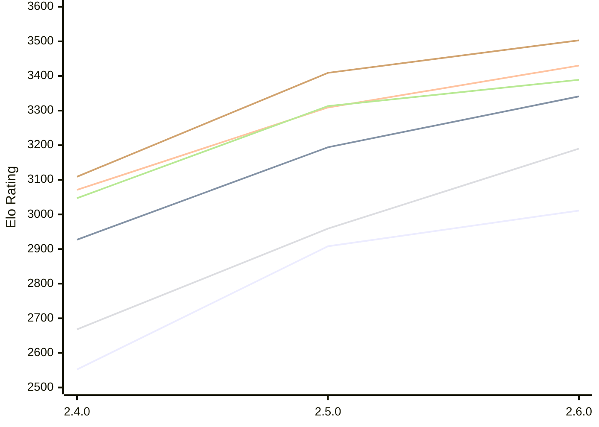

# Engine: Rarog

Author: Miloslav Macůrek

Home: https://github.com/maelic13/rarog

## Elo Ratings E1 (Ultra 7 265T (1.50 GHz) - E-Core)

| Version | Published | STC 8.0+0.08s  | LTC 60.0+0.60s | VLTC 2m24s+1.12s | Comment |
| --- | --- | --- | --- | --- | --- |
| 2.6.0 | 2026-10-22 | 3011(+103) | 3341(+147) | 3430(+121) |  |
| 2.5.0 | 2026-10-05 | 2908(+356) | 3194(+267) | 3309(+238) |  |
| 2.4.0 | 2026-09-11 | 2552 | 2927 | 3071 |  |
 | | | cElo (∆ prev) | cElo (∆ prev) | cElo (∆ prev) | 

## Elo Ratings P1 (Ultra 7 265T (1.50 GHz) - P-Core)

| Version | Published | STC 8.0+0.08s  | LTC 60.0+0.60s | VLTC 2m24s+1.12s | Comment |
| --- | --- | --- | --- | --- | --- |
| 2.6.0 | 2026-10-22 | 3190(+231) | 3389(+76) | 3503(+94) |  |
| 2.5.0 | 2026-10-05 | 2959(+291) | 3313(+266) | 3409(+300) |  |
| 2.4.0 | 2026-09-11 | 2668 | 3047 | 3109 |  |
 | | | cElo (∆ prev) | cElo (∆ prev) | cElo (∆ prev) | 

## Elo Ratings T1 (i5-7500T 2.70GHz)

| Version | Published | STC 8.0+0.08s  | LTC 60.0+0.60s | VLTC 2m24s+1.12s | Comment |
| --- | --- | --- | --- | --- | --- |
| 2.4.0 | 2026-09-11 | 2614 | 2930 | 3015 |  |
 | | | cElo (∆ prev) | cElo (∆ prev) | cElo (∆ prev) | 

<a href="https://github.com/computer-chess-index/cci/issues/new?template=submit-version.yml&title=[VERSION]+Rarog+<version>&body=###%20Engine%20name%0ARarog%0A%0A###%20Version%0A2.4.0" target="_blank">Submit new version</a>

 Test Conditions:

GUI/CLI: <a href=https://github.com/cutechess/cutechess target="_blank">Cute-Chess</a> 
Elo Calculation: <a href=https://www.remi-coulom.fr/Bayesian-Elo/ target="_blank">Bayesian-Elo</a> 
CPU for P1: Intel(R) Core(TM) Ultra 7 265T (1.50 GHz) - P-Core 
CPU for E1: Intel(R) Core(TM) Ultra 7 265T (1.50 GHz) - E-Core 
CPU for T1: Intel(R) Core(TM) i5-7500T 2.70GHz 
Opening book: 8_moves_v3 
\* STC: 8.0+0.08s, LTC: 60.0+0.60s, VLTC: 2m24s+1.12s

 Lists:
Ratings: <a href=https://github.com/computer-chess-index/cci/blob/main/lists/CCIRatings.csv target="_blank">Complete list</a>

Generated: 2026-11-02 05:42:02

## Ratings Verlauf E1 / P1

```mermaid
%%{init: {"theme":"base","themeVariables":{"seriesColors:['#a3a3a3','#222221','#faa371']}}}%%
xychart-beta
  x-axis ["2.4.0", "2.5.0", "2.6.0"]
  y-axis "Elo Rating" 2500 --> 3600
  line "E1: STC (8.0+0.08s)" [2552, 2908, 3011]
  line "E1: LTC (60.0+0.60s)" [2927, 3194, 3341]
  line "E1: VLTC (2m24s+1.12s)" [3071, 3309, 3430]
  line "P1: STC (8.0+0.08s)" [2668, 2959, 3190]
  line "P1: LTC (60.0+0.60s)" [3047, 3313, 3389]
  line "P1: VLTC (2m24s+1.12s)" [3109, 3409, 3503]
```

## Detailed Evaluation Results

| Version | Time Control | Variant | Elo  | Range +/- | Matches | Score | Average Opponent Elo | Draws |
| --- | --- |--- | --- | --- | --- | --- | --- | --- |
| 2.6.0 | VLTC (2m24s+1.12s) | P1 | 3503 | 38 | 180 | 51% | 3498 | 61% |
|  |  | E1 | 3430 | 31 | 284 | 49% | 3440 | 60% |
|  | LTC (60.0+0.60s) | P1 | 3389 | 41 | 162 | 53% | 3359 | 56% |
|  |  | E1 | 3341 | 33 | 256 | 51% | 3336 | 56% |
|  | STC (8.0+0.08s) | P1 | 3190 | 46 | 142 | 52% | 3173 | 44% |
|  |  | E1 | 3011 | 35 | 248 | 49% | 3016 | 41% |
| --- | --- |--- | --- | --- | --- | --- | --- | --- |
| 2.5.0 | VLTC (2m24s+1.12s) | P1 | 3409 | 36 | 206 | 53% | 3387 | 61% |
|  |  | E1 | 3309 | 30 | 312 | 54% | 3283 | 55% |
|  | LTC (60.0+0.60s) | P1 | 3313 | 35 | 230 | 48% | 3325 | 52% |
|  |  | E1 | 3194 | 33 | 264 | 53% | 3167 | 55% |
|  | STC (8.0+0.08s) | E1 | 2908 | 32 | 312 | 56% | 2855 | 38% |
|  |  | P1 | 2959 | 45 | 150 | 51% | 2946 | 40% |
| --- | --- |--- | --- | --- | --- | --- | --- | --- |
| 2.4.0 | VLTC (2m24s+1.12s) | E1 | 3071 | 29 | 367 | 52% | 3059 | 41% |
|  |  | T1 | 3015 | 35 | 256 | 53% | 2984 | 40% |
|  |  | P1 | 3109 | 39 | 198 | 51% | 3101 | 42% |
|  | LTC (60.0+0.60s) | T1 | 2930 | 33 | 292 | 57% | 2861 | 38% |
|  |  | P1 | 3047 | 42 | 168 | 53% | 3012 | 43% |
|  |  | E1 | 2927 | 32 | 310 | 47% | 2958 | 38% |
|  | STC (8.0+0.08s) | T1 | 2614 | 36 | 266 | 52% | 2564 | 29% |
|  |  | P1 | 2668 | 46 | 156 | 46% | 2703 | 31% |
|  |  | E1 | 2552 | 36 | 252 | 41% | 2645 | 33% |