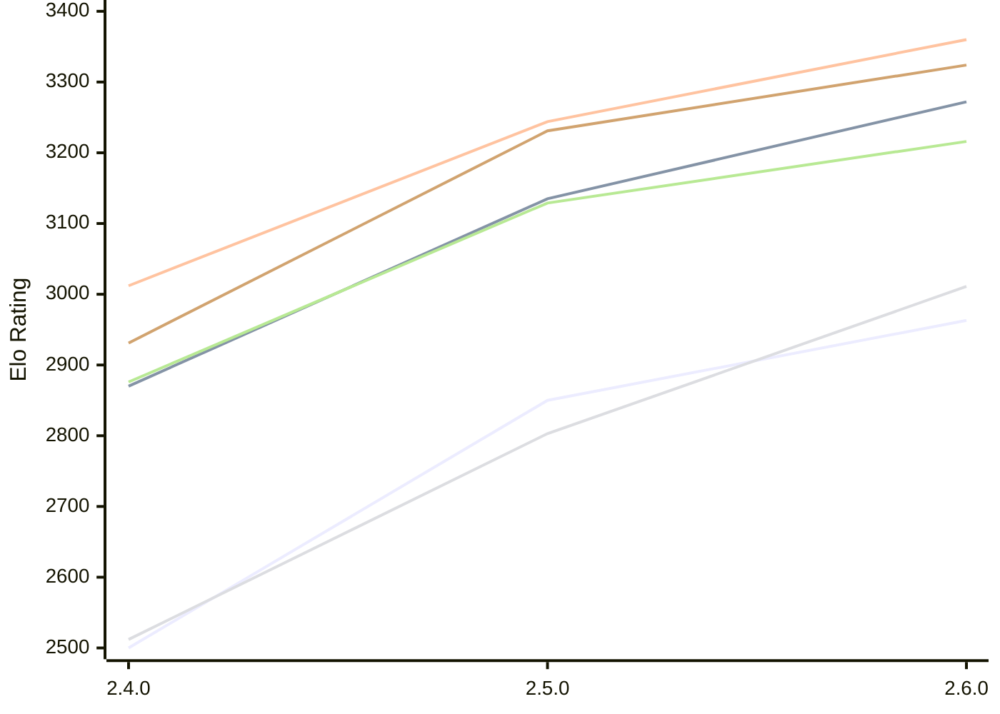

# Engine: Rarog

Author: Miloslav Macůrek

Home: https://github.com/maelic13/rarog

## Elo Ratings E1 (Ultra 7 265T (1.50 GHz) - E-Core)

| Version | Published | STC 8.0+0.08s  | LTC 60.0+0.60s | VLTC 2m24s+1.12s | Comment |
| --- | --- | --- | --- | --- | --- |
| 2.6.0 | 2026-10-22 | 2963(+113) | 3272(+137) | 3360(+116) |  |
| 2.5.0 | 2026-10-05 | 2850(+350) | 3135(+265) | 3244(+232) |  |
| 2.4.0 | 2026-09-11 | 2500 | 2870 | 3012 |  |
 | | | cElo (∆ prev) | cElo (∆ prev) | cElo (∆ prev) | 

## Elo Ratings P1 (Ultra 7 265T (1.50 GHz) - P-Core)

| Version | Published | STC 8.0+0.08s  | LTC 60.0+0.60s | VLTC 2m24s+1.12s | Comment |
| --- | --- | --- | --- | --- | --- |
| 2.6.0 | 2026-10-22 | 3011(+208) | 3216(+87) | 3324(+93) |  |
| 2.5.0 | 2026-10-05 | 2803(+291) | 3129(+253) | 3231(+300) |  |
| 2.4.0 | 2026-09-11 | 2512 | 2876 | 2931 |  |
 | | | cElo (∆ prev) | cElo (∆ prev) | cElo (∆ prev) | 

## Elo Ratings T1 (i5-7500T 2.70GHz)

| Version | Published | STC 8.0+0.08s  | LTC 60.0+0.60s | VLTC 2m24s+1.12s | Comment |
| --- | --- | --- | --- | --- | --- |
| 2.4.0 | 2026-09-11 | 2614 | 2930 | 3015 |  |
 | | | cElo (∆ prev) | cElo (∆ prev) | cElo (∆ prev) | 

<a href="https://github.com/computer-chess-index/cci/issues/new?template=submit-version.yml&title=[VERSION]+Rarog+<version>&body=###%20Engine%20name%0ARarog%0A%0A###%20Version%0A2.4.0" target="_blank">Submit new version</a>

 Test Conditions:

GUI/CLI: <a href=https://github.com/cutechess/cutechess target="_blank">Cute-Chess</a> 
Elo Calculation: <a href=https://www.remi-coulom.fr/Bayesian-Elo/ target="_blank">Bayesian-Elo</a> 
CPU for P1: Intel(R) Core(TM) Ultra 7 265T (1.50 GHz) - P-Core 
CPU for E1: Intel(R) Core(TM) Ultra 7 265T (1.50 GHz) - E-Core 
CPU for T1: Intel(R) Core(TM) i5-7500T 2.70GHz 
Opening book: 8_moves_v3 
\* STC: 8.0+0.08s, LTC: 60.0+0.60s, VLTC: 2m24s+1.12s

 Lists:
Ratings: <a href=https://github.com/computer-chess-index/cci/blob/main/lists/CCIRatings.csv target="_blank">Complete list</a>

Generated: 2026-11-14 05:41:26

## Ratings Verlauf E1 / P1

```mermaid
%%{init: {"theme":"base","themeVariables":{"seriesColors:['#a3a3a3','#222221','#faa371']}}}%%
xychart-beta
  x-axis ["2.4.0", "2.5.0", "2.6.0"]
  y-axis "Elo Rating" 2500 --> 3400
  line "E1: STC (8.0+0.08s)" [2500, 2850, 2963]
  line "E1: LTC (60.0+0.60s)" [2870, 3135, 3272]
  line "E1: VLTC (2m24s+1.12s)" [3012, 3244, 3360]
  line "P1: STC (8.0+0.08s)" [2512, 2803, 3011]
  line "P1: LTC (60.0+0.60s)" [2876, 3129, 3216]
  line "P1: VLTC (2m24s+1.12s)" [2931, 3231, 3324]
```

## Detailed Evaluation Results

| Version | Time Control | Variant | Elo  | Range +/- | Matches | Score | Average Opponent Elo | Draws |
| --- | --- |--- | --- | --- | --- | --- | --- | --- |
| 2.6.0 | VLTC (2m24s+1.12s) | P1 | 3324 | 36 | 200 | 51% | 3320 | 62% |
|  |  | E1 | 3360 | 28 | 338 | 48% | 3371 | 62% |
|  | LTC (60.0+0.60s) | P1 | 3216 | 34 | 238 | 54% | 3186 | 55% |
|  |  | E1 | 3272 | 30 | 312 | 51% | 3263 | 54% |
|  | STC (8.0+0.08s) | P1 | 3011 | 42 | 170 | 49% | 3017 | 44% |
|  |  | E1 | 2963 | 31 | 316 | 50% | 2959 | 41% |
| --- | --- |--- | --- | --- | --- | --- | --- | --- |
| 2.5.0 | VLTC (2m24s+1.12s) | P1 | 3231 | 36 | 206 | 53% | 3209 | 61% |
|  |  | E1 | 3244 | 29 | 320 | 53% | 3220 | 55% |
|  | LTC (60.0+0.60s) | P1 | 3129 | 35 | 238 | 47% | 3152 | 52% |
|  |  | E1 | 3135 | 32 | 280 | 54% | 3106 | 55% |
|  | STC (8.0+0.08s) | P1 | 2803 | 43 | 170 | 50% | 2803 | 41% |
|  |  | E1 | 2850 | 31 | 320 | 55% | 2804 | 38% |
| --- | --- |--- | --- | --- | --- | --- | --- | --- |
| 2.4.0 | VLTC (2m24s+1.12s) | E1 | 3012 | 29 | 367 | 52% | 3001 | 41% |
|  |  | T1 | 3015 | 35 | 256 | 53% | 2984 | 40% |
|  |  | P1 | 2931 | 39 | 198 | 51% | 2924 | 42% |
|  | LTC (60.0+0.60s) | E1 | 2870 | 32 | 310 | 47% | 2901 | 38% |
|  |  | T1 | 2930 | 33 | 292 | 57% | 2861 | 38% |
|  |  | P1 | 2876 | 42 | 168 | 53% | 2843 | 43% |
|  | STC (8.0+0.08s) | T1 | 2614 | 36 | 266 | 52% | 2564 | 29% |
|  |  | P1 | 2512 | 46 | 156 | 46% | 2549 | 31% |
|  |  | E1 | 2500 | 36 | 252 | 41% | 2593 | 33% |