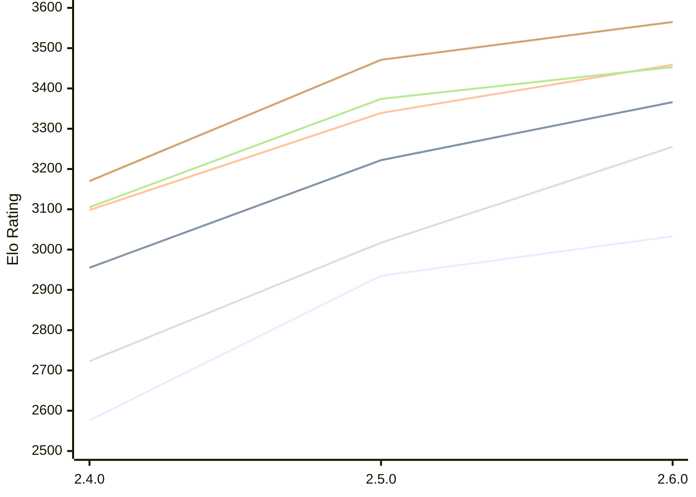

# Engine: Rarog

Author: Miloslav Macůrek

Home: https://github.com/maelic13/rarog

## Elo Ratings E1 (Ultra 7 265T (1.50 GHz) - E-Core)

| Version | Published | STC 8.0+0.08s  | LTC 60.0+0.60s | VLTC 2m24s+1.12s | Comment |
| --- | --- | --- | --- | --- | --- |
| 2.6.0 | 2026-10-22 | 3033(+98) | 3366(+144) | 3459(+120) |  |
| 2.5.0 | 2026-10-05 | 2935(+359) | 3222(+267) | 3339(+241) |  |
| 2.4.0 | 2026-09-11 | 2576 | 2955 | 3098 |  |
 | | | cElo (∆ prev) | cElo (∆ prev) | cElo (∆ prev) | 

## Elo Ratings P1 (Ultra 7 265T (1.50 GHz) - P-Core)

| Version | Published | STC 8.0+0.08s  | LTC 60.0+0.60s | VLTC 2m24s+1.12s | Comment |
| --- | --- | --- | --- | --- | --- |
| 2.6.0 | 2026-10-22 | 3255(+238) | 3453(+79) | 3565(+94) |  |
| 2.5.0 | 2026-10-05 | 3017(+294) | 3374(+269) | 3471(+301) |  |
| 2.4.0 | 2026-09-11 | 2723 | 3105 | 3170 |  |
 | | | cElo (∆ prev) | cElo (∆ prev) | cElo (∆ prev) | 

## Elo Ratings T1 (i5-7500T 2.70GHz)

| Version | Published | STC 8.0+0.08s  | LTC 60.0+0.60s | VLTC 2m24s+1.12s | Comment |
| --- | --- | --- | --- | --- | --- |
| 2.4.0 | 2026-09-11 | 2614 | 2930 | 3015 |  |
 | | | cElo (∆ prev) | cElo (∆ prev) | cElo (∆ prev) | 

<a href="https://github.com/computer-chess-index/cci/issues/new?template=submit-version.yml&title=[VERSION]+Rarog+<version>&body=###%20Engine%20name%0ARarog%0A%0A###%20Version%0A2.4.0" target="_blank">Submit new version</a>

 Test Conditions:

GUI/CLI: <a href=https://github.com/cutechess/cutechess target="_blank">Cute-Chess</a> 
Elo Calculation: <a href=https://www.remi-coulom.fr/Bayesian-Elo/ target="_blank">Bayesian-Elo</a> 
CPU for P1: Intel(R) Core(TM) Ultra 7 265T (1.50 GHz) - P-Core 
CPU for E1: Intel(R) Core(TM) Ultra 7 265T (1.50 GHz) - E-Core 
CPU for T1: Intel(R) Core(TM) i5-7500T 2.70GHz 
Opening book: 8_moves_v3 
\* STC: 8.0+0.08s, LTC: 60.0+0.60s, VLTC: 2m24s+1.12s

 Lists:
Ratings: <a href=https://github.com/computer-chess-index/cci/blob/main/lists/CCIRatings.csv target="_blank">Complete list</a>

Generated: 2026-11-07 05:41:18

## Ratings Verlauf E1 / P1

```mermaid
%%{init: {"theme":"base","themeVariables":{"seriesColors:['#a3a3a3','#222221','#faa371']}}}%%
xychart-beta
  x-axis ["2.4.0", "2.5.0", "2.6.0"]
  y-axis "Elo Rating" 2500 --> 3600
  line "E1: STC (8.0+0.08s)" [2576, 2935, 3033]
  line "E1: LTC (60.0+0.60s)" [2955, 3222, 3366]
  line "E1: VLTC (2m24s+1.12s)" [3098, 3339, 3459]
  line "P1: STC (8.0+0.08s)" [2723, 3017, 3255]
  line "P1: LTC (60.0+0.60s)" [3105, 3374, 3453]
  line "P1: VLTC (2m24s+1.12s)" [3170, 3471, 3565]
```

## Detailed Evaluation Results

| Version | Time Control | Variant | Elo  | Range +/- | Matches | Score | Average Opponent Elo | Draws |
| --- | --- |--- | --- | --- | --- | --- | --- | --- |
| 2.6.0 | VLTC (2m24s+1.12s) | P1 | 3565 | 38 | 180 | 51% | 3560 | 61% |
|  |  | E1 | 3459 | 29 | 318 | 49% | 3468 | 62% |
|  | LTC (60.0+0.60s) | P1 | 3453 | 36 | 210 | 53% | 3424 | 55% |
|  |  | E1 | 3366 | 31 | 292 | 50% | 3366 | 56% |
|  | STC (8.0+0.08s) | P1 | 3255 | 44 | 154 | 52% | 3236 | 44% |
|  |  | E1 | 3033 | 34 | 256 | 49% | 3043 | 41% |
| --- | --- |--- | --- | --- | --- | --- | --- | --- |
| 2.5.0 | VLTC (2m24s+1.12s) | E1 | 3339 | 30 | 312 | 54% | 3313 | 55% |
|  |  | P1 | 3471 | 36 | 206 | 53% | 3449 | 61% |
|  | LTC (60.0+0.60s) | E1 | 3222 | 33 | 264 | 53% | 3195 | 55% |
|  |  | P1 | 3374 | 35 | 230 | 48% | 3387 | 52% |
|  | STC (8.0+0.08s) | E1 | 2935 | 32 | 312 | 56% | 2881 | 38% |
|  |  | P1 | 3017 | 45 | 150 | 51% | 3004 | 40% |
| --- | --- |--- | --- | --- | --- | --- | --- | --- |
| 2.4.0 | VLTC (2m24s+1.12s) | T1 | 3015 | 35 | 256 | 53% | 2984 | 40% |
|  |  | P1 | 3170 | 39 | 198 | 51% | 3162 | 42% |
|  |  | E1 | 3098 | 29 | 367 | 52% | 3087 | 41% |
|  | LTC (60.0+0.60s) | T1 | 2930 | 33 | 292 | 57% | 2861 | 38% |
|  |  | P1 | 3105 | 42 | 168 | 53% | 3070 | 43% |
|  |  | E1 | 2955 | 32 | 310 | 47% | 2986 | 38% |
|  | STC (8.0+0.08s) | T1 | 2614 | 36 | 266 | 52% | 2564 | 29% |
|  |  | P1 | 2723 | 46 | 156 | 46% | 2759 | 31% |
|  |  | E1 | 2576 | 36 | 252 | 41% | 2669 | 33% |