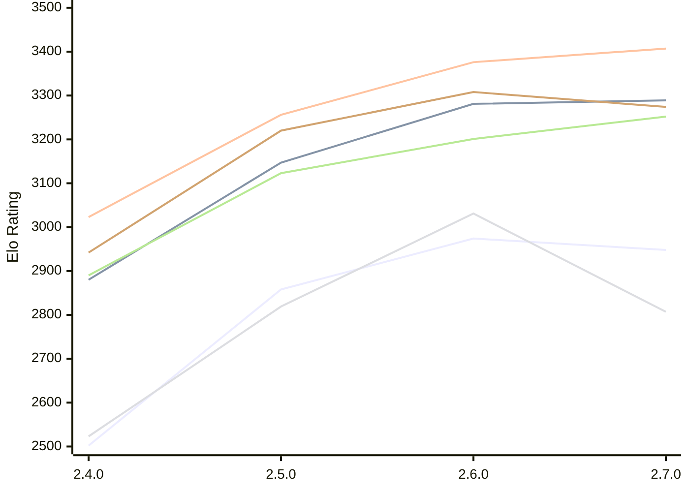

# Engine: Rarog

Author: Miloslav Macůrek

Home: https://github.com/maelic13/rarog

## Elo Ratings E1 (Ultra 7 265T (1.50 GHz) - E-Core)

| Version | Published | STC 8.0+0.08s  | LTC 60.0+0.60s | VLTC 2m24s+1.12s | Comment |
| --- | --- | --- | --- | --- | --- |
| 2.7.0 | 2026-11-13 | 2948(-26) | 3289(+8) | 3407(+31) |  |
| 2.6.0 | 2026-10-22 | 2974(+116) | 3281(+134) | 3376(+120) |  |
| 2.5.0 | 2026-10-05 | 2858(+356) | 3147(+267) | 3256(+233) |  |
| 2.4.0 | 2026-09-11 | 2502 | 2880 | 3023 |  |
 | | | cElo (∆ prev) | cElo (∆ prev) | cElo (∆ prev) | 

## Elo Ratings P1 (Ultra 7 265T (1.50 GHz) - P-Core)

| Version | Published | STC 8.0+0.08s  | LTC 60.0+0.60s | VLTC 2m24s+1.12s | Comment |
| --- | --- | --- | --- | --- | --- |
| 2.7.0 | 2026-11-13 | 2807(-224) | 3252(+51) | 3274(-34) |  |
| 2.6.0 | 2026-10-22 | 3031(+212) | 3201(+78) | 3308(+88) |  |
| 2.5.0 | 2026-10-05 | 2819(+296) | 3123(+233) | 3220(+278) |  |
| 2.4.0 | 2026-09-11 | 2523 | 2890 | 2942 |  |
 | | | cElo (∆ prev) | cElo (∆ prev) | cElo (∆ prev) | 

## Elo Ratings T1 (i5-7500T 2.70GHz)

| Version | Published | STC 8.0+0.08s  | LTC 60.0+0.60s | VLTC 2m24s+1.12s | Comment |
| --- | --- | --- | --- | --- | --- |
| 2.4.0 | 2026-09-11 | 2614 | 2930 | 3015 |  |
 | | | cElo (∆ prev) | cElo (∆ prev) | cElo (∆ prev) | 

<a href="https://github.com/computer-chess-index/cci/issues/new?template=submit-version.yml&title=[VERSION]+Rarog+<version>&body=###%20Engine%20name%0ARarog%0A%0A###%20Version%0A2.4.0" target="_blank">Submit new version</a>

 Test Conditions:

GUI/CLI: <a href=https://github.com/cutechess/cutechess target="_blank">Cute-Chess</a> 
Elo Calculation: <a href=https://www.remi-coulom.fr/Bayesian-Elo/ target="_blank">Bayesian-Elo</a> 
CPU for P1: Intel(R) Core(TM) Ultra 7 265T (1.50 GHz) - P-Core 
CPU for E1: Intel(R) Core(TM) Ultra 7 265T (1.50 GHz) - E-Core 
CPU for T1: Intel(R) Core(TM) i5-7500T 2.70GHz 
Opening book: 8_moves_v3 
\* STC: 8.0+0.08s, LTC: 60.0+0.60s, VLTC: 2m24s+1.12s

 Lists:
Ratings: <a href=https://github.com/computer-chess-index/cci/blob/main/lists/CCIRatings.csv target="_blank">Complete list</a>

Generated: 2026-11-17 05:41:55

## Ratings Verlauf E1 / P1

```mermaid
%%{init: {"theme":"base","themeVariables":{"seriesColors:['#a3a3a3','#222221','#faa371']}}}%%
xychart-beta
  x-axis ["2.4.0", "2.5.0", "2.6.0", "2.7.0"]
  y-axis "Elo Rating" 2500 --> 3500
  line "E1: STC (8.0+0.08s)" [2502, 2858, 2974, 2948]
  line "E1: LTC (60.0+0.60s)" [2880, 3147, 3281, 3289]
  line "E1: VLTC (2m24s+1.12s)" [3023, 3256, 3376, 3407]
  line "P1: STC (8.0+0.08s)" [2523, 2819, 3031, 2807]
  line "P1: LTC (60.0+0.60s)" [2890, 3123, 3201, 3252]
  line "P1: VLTC (2m24s+1.12s)" [2942, 3220, 3308, 3274]
```

## Detailed Evaluation Results

| Version | Time Control | Variant | Elo  | Range +/- | Matches | Score | Average Opponent Elo | Draws |
| --- | --- |--- | --- | --- | --- | --- | --- | --- |
| 2.7.0 | VLTC (2m24s+1.12s) | P1 | 3274 | 117 | 20 | 53% | 3249 | 45% |
|  |  | E1 | 3407 | 81 | 42 | 55% | 3375 | 52% |
|  | LTC (60.0+0.60s) | P1 | 3252 | 109 | 20 | 55% | 3222 | 70% |
|  |  | E1 | 3289 | 79 | 44 | 48% | 3306 | 50% |
|  | STC (8.0+0.08s) | P1 | 2807 | 109 | 28 | 52% | 2800 | 25% |
|  |  | E1 | 2948 | 88 | 40 | 51% | 2931 | 33% |
| --- | --- |--- | --- | --- | --- | --- | --- | --- |
| 2.6.0 | VLTC (2m24s+1.12s) | P1 | 3308 | 36 | 204 | 50% | 3308 | 62% |
|  |  | E1 | 3376 | 28 | 346 | 49% | 3386 | 62% |
|  | LTC (60.0+0.60s) | P1 | 3201 | 34 | 246 | 52% | 3183 | 54% |
|  |  | E1 | 3281 | 30 | 320 | 50% | 3276 | 54% |
|  | STC (8.0+0.08s) | P1 | 3031 | 41 | 184 | 51% | 3028 | 42% |
|  |  | E1 | 2974 | 31 | 320 | 50% | 2974 | 41% |
| --- | --- |--- | --- | --- | --- | --- | --- | --- |
| 2.5.0 | VLTC (2m24s+1.12s) | P1 | 3220 | 36 | 206 | 53% | 3198 | 61% |
|  |  | E1 | 3256 | 29 | 320 | 53% | 3232 | 55% |
|  | LTC (60.0+0.60s) | P1 | 3123 | 35 | 238 | 47% | 3146 | 52% |
|  |  | E1 | 3147 | 32 | 280 | 54% | 3120 | 55% |
|  | STC (8.0+0.08s) | P1 | 2819 | 43 | 170 | 50% | 2820 | 41% |
|  |  | E1 | 2858 | 32 | 320 | 55% | 2815 | 38% |
| --- | --- |--- | --- | --- | --- | --- | --- | --- |
| 2.4.0 | VLTC (2m24s+1.12s) | T1 | 3015 | 35 | 256 | 53% | 2984 | 40% |
|  |  | P1 | 2942 | 39 | 198 | 51% | 2935 | 42% |
|  |  | E1 | 3023 | 29 | 367 | 52% | 3012 | 41% |
|  | LTC (60.0+0.60s) | T1 | 2930 | 33 | 292 | 57% | 2861 | 38% |
|  |  | P1 | 2890 | 42 | 168 | 53% | 2857 | 43% |
|  |  | E1 | 2880 | 32 | 310 | 47% | 2911 | 38% |
|  | STC (8.0+0.08s) | T1 | 2614 | 36 | 266 | 52% | 2564 | 29% |
|  |  | P1 | 2523 | 46 | 156 | 46% | 2560 | 31% |
|  |  | E1 | 2502 | 36 | 252 | 41% | 2596 | 33% |