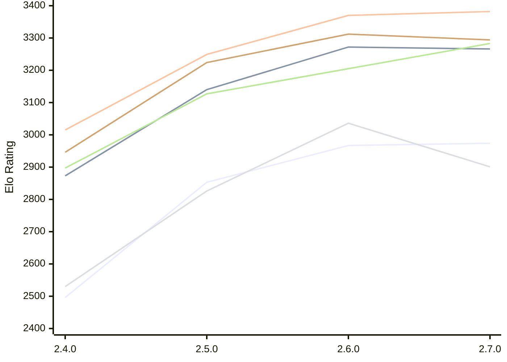

# Engine: Rarog

Author: Miloslav Macůrek

Home: https://github.com/maelic13/rarog

## Elo Ratings E1 (Ultra 7 265T (1.50 GHz) - E-Core)

| Version | Published | STC 8.0+0.08s  | LTC 60.0+0.60s | VLTC 2m24s+1.12s | Comment |
| --- | --- | --- | --- | --- | --- |
| 2.7.0 | 2026-11-13 | 2974(+7) | 3266(-6) | 3382(+12) |  |
| 2.6.0 | 2026-10-22 | 2967(+114) | 3272(+132) | 3370(+121) |  |
| 2.5.0 | 2026-10-05 | 2853(+357) | 3140(+267) | 3249(+234) |  |
| 2.4.0 | 2026-09-11 | 2496 | 2873 | 3015 |  |
 | | | cElo (∆ prev) | cElo (∆ prev) | cElo (∆ prev) | 

## Elo Ratings P1 (Ultra 7 265T (1.50 GHz) - P-Core)

| Version | Published | STC 8.0+0.08s  | LTC 60.0+0.60s | VLTC 2m24s+1.12s | Comment |
| --- | --- | --- | --- | --- | --- |
| 2.7.0 | 2026-11-13 | 2901(-135) | 3283(+78) | 3294(-18) |  |
| 2.6.0 | 2026-10-22 | 3036(+210) | 3205(+78) | 3312(+88) |  |
| 2.5.0 | 2026-10-05 | 2826(+296) | 3127(+230) | 3224(+278) |  |
| 2.4.0 | 2026-09-11 | 2530 | 2897 | 2946 |  |
 | | | cElo (∆ prev) | cElo (∆ prev) | cElo (∆ prev) | 

## Elo Ratings T1 (i5-7500T 2.70GHz)

| Version | Published | STC 8.0+0.08s  | LTC 60.0+0.60s | VLTC 2m24s+1.12s | Comment |
| --- | --- | --- | --- | --- | --- |
| 2.4.0 | 2026-09-11 | 2614 | 2930 | 3015 |  |
 | | | cElo (∆ prev) | cElo (∆ prev) | cElo (∆ prev) | 

<a href="https://github.com/computer-chess-index/cci/issues/new?template=submit-version.yml&title=[VERSION]+Rarog+<version>&body=###%20Engine%20name%0ARarog%0A%0A###%20Version%0A2.4.0" target="_blank">Submit new version</a>

 Test Conditions:

GUI/CLI: <a href=https://github.com/cutechess/cutechess target="_blank">Cute-Chess</a> 
Elo Calculation: <a href=https://www.remi-coulom.fr/Bayesian-Elo/ target="_blank">Bayesian-Elo</a> 
CPU for P1: Intel(R) Core(TM) Ultra 7 265T (1.50 GHz) - P-Core 
CPU for E1: Intel(R) Core(TM) Ultra 7 265T (1.50 GHz) - E-Core 
CPU for T1: Intel(R) Core(TM) i5-7500T 2.70GHz 
Opening book: 8_moves_v3 
\* STC: 8.0+0.08s, LTC: 60.0+0.60s, VLTC: 2m24s+1.12s

 Lists:
Ratings: <a href=https://github.com/computer-chess-index/cci/blob/main/lists/CCIRatings.csv target="_blank">Complete list</a>

Generated: 2026-11-19 05:42:05

## Ratings Verlauf E1 / P1

```mermaid
%%{init: {"theme":"base","themeVariables":{"seriesColors:['#a3a3a3','#222221','#faa371']}}}%%
xychart-beta
  x-axis ["2.4.0", "2.5.0", "2.6.0", "2.7.0"]
  y-axis "Elo Rating" 2400 --> 3400
  line "E1: STC (8.0+0.08s)" [2496, 2853, 2967, 2974]
  line "E1: LTC (60.0+0.60s)" [2873, 3140, 3272, 3266]
  line "E1: VLTC (2m24s+1.12s)" [3015, 3249, 3370, 3382]
  line "P1: STC (8.0+0.08s)" [2530, 2826, 3036, 2901]
  line "P1: LTC (60.0+0.60s)" [2897, 3127, 3205, 3283]
  line "P1: VLTC (2m24s+1.12s)" [2946, 3224, 3312, 3294]
```

## Detailed Evaluation Results

| Version | Time Control | Variant | Elo  | Range +/- | Matches | Score | Average Opponent Elo | Draws |
| --- | --- |--- | --- | --- | --- | --- | --- | --- |
| 2.7.0 | VLTC (2m24s+1.12s) | P1 | 3294 | 51 | 100 | 51% | 3287 | 63% |
|  |  | E1 | 3382 | 40 | 164 | 51% | 3375 | 62% |
|  | LTC (60.0+0.60s) | P1 | 3283 | 47 | 116 | 52% | 3270 | 63% |
|  |  | E1 | 3266 | 40 | 174 | 48% | 3279 | 53% |
|  | STC (8.0+0.08s) | P1 | 2901 | 46 | 150 | 53% | 2876 | 34% |
|  |  | E1 | 2974 | 34 | 268 | 54% | 2938 | 41% |
| --- | --- |--- | --- | --- | --- | --- | --- | --- |
| 2.6.0 | VLTC (2m24s+1.12s) | P1 | 3312 | 36 | 204 | 50% | 3310 | 62% |
|  |  | E1 | 3370 | 28 | 346 | 49% | 3379 | 62% |
|  | LTC (60.0+0.60s) | P1 | 3205 | 34 | 246 | 52% | 3187 | 54% |
|  |  | E1 | 3272 | 30 | 320 | 50% | 3268 | 54% |
|  | STC (8.0+0.08s) | P1 | 3036 | 41 | 184 | 51% | 3033 | 42% |
|  |  | E1 | 2967 | 31 | 320 | 50% | 2967 | 41% |
| --- | --- |--- | --- | --- | --- | --- | --- | --- |
| 2.5.0 | VLTC (2m24s+1.12s) | P1 | 3224 | 36 | 206 | 53% | 3202 | 61% |
|  |  | E1 | 3249 | 29 | 320 | 53% | 3225 | 55% |
|  | LTC (60.0+0.60s) | P1 | 3127 | 35 | 238 | 47% | 3151 | 52% |
|  |  | E1 | 3140 | 32 | 280 | 54% | 3112 | 55% |
|  | STC (8.0+0.08s) | P1 | 2826 | 43 | 170 | 50% | 2827 | 41% |
|  |  | E1 | 2853 | 32 | 320 | 55% | 2808 | 38% |
| --- | --- |--- | --- | --- | --- | --- | --- | --- |
| 2.4.0 | VLTC (2m24s+1.12s) | P1 | 2946 | 39 | 198 | 51% | 2939 | 42% |
|  |  | E1 | 3015 | 29 | 367 | 52% | 3004 | 41% |
|  |  | T1 | 3015 | 35 | 256 | 53% | 2984 | 40% |
|  | LTC (60.0+0.60s) | E1 | 2873 | 32 | 310 | 47% | 2904 | 38% |
|  |  | T1 | 2930 | 33 | 292 | 57% | 2861 | 38% |
|  |  | P1 | 2897 | 42 | 168 | 53% | 2863 | 43% |
|  | STC (8.0+0.08s) | E1 | 2496 | 36 | 252 | 41% | 2591 | 33% |
|  |  | T1 | 2614 | 36 | 266 | 52% | 2564 | 29% |
|  |  | P1 | 2530 | 46 | 156 | 46% | 2566 | 31% |