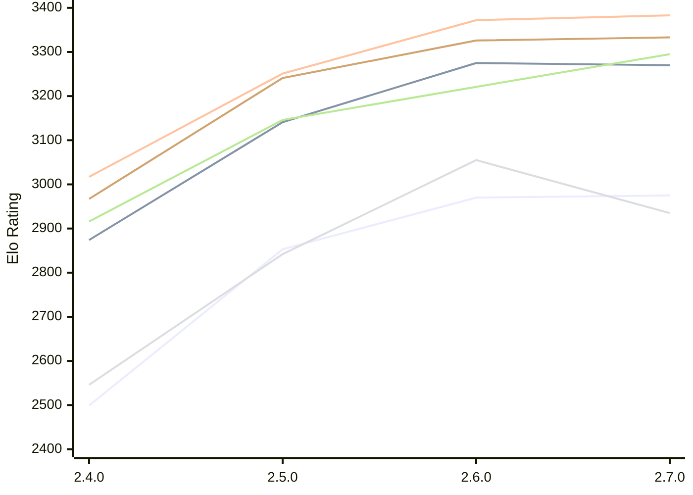

# Engine: Rarog

Author: Miloslav Macůrek

Home: https://github.com/maelic13/rarog

## Elo Ratings E1 (Ultra 7 265T (1.50 GHz) - E-Core)

| Version | Published | STC 8.0+0.08s  | LTC 60.0+0.60s | VLTC 2m24s+1.12s | Comment |
| --- | --- | --- | --- | --- | --- |
| 2.7.0 | 2026-11-13 | 2975(+5) | 3270(-5) | 3383(+11) |  |
| 2.6.0 | 2026-10-22 | 2970(+117) | 3275(+134) | 3372(+121) |  |
| 2.5.0 | 2026-10-05 | 2853(+354) | 3141(+267) | 3251(+234) |  |
| 2.4.0 | 2026-09-11 | 2499 | 2874 | 3017 |  |
 | | | cElo (∆ prev) | cElo (∆ prev) | cElo (∆ prev) | 

## Elo Ratings P1 (Ultra 7 265T (1.50 GHz) - P-Core)

| Version | Published | STC 8.0+0.08s  | LTC 60.0+0.60s | VLTC 2m24s+1.12s | Comment |
| --- | --- | --- | --- | --- | --- |
| 2.7.0 | 2026-11-13 | 2935(-120) | 3295(+74) | 3333(+7) |  |
| 2.6.0 | 2026-10-22 | 3055(+213) | 3221(+75) | 3326(+85) |  |
| 2.5.0 | 2026-10-05 | 2842(+296) | 3146(+230) | 3241(+274) |  |
| 2.4.0 | 2026-09-11 | 2546 | 2916 | 2967 |  |
 | | | cElo (∆ prev) | cElo (∆ prev) | cElo (∆ prev) | 

## Elo Ratings T1 (i5-7500T 2.70GHz)

| Version | Published | STC 8.0+0.08s  | LTC 60.0+0.60s | VLTC 2m24s+1.12s | Comment |
| --- | --- | --- | --- | --- | --- |
| 2.4.0 | 2026-09-11 | 2614 | 2930 | 3015 |  |
 | | | cElo (∆ prev) | cElo (∆ prev) | cElo (∆ prev) | 

<a href="https://github.com/computer-chess-index/cci/issues/new?template=submit-version.yml&title=[VERSION]+Rarog+<version>&body=###%20Engine%20name%0ARarog%0A%0A###%20Version%0A2.4.0" target="_blank">Submit new version</a>

 Test Conditions:

GUI/CLI: <a href=https://github.com/cutechess/cutechess target="_blank">Cute-Chess</a> 
Elo Calculation: <a href=https://www.remi-coulom.fr/Bayesian-Elo/ target="_blank">Bayesian-Elo</a> 
CPU for P1: Intel(R) Core(TM) Ultra 7 265T (1.50 GHz) - P-Core 
CPU for E1: Intel(R) Core(TM) Ultra 7 265T (1.50 GHz) - E-Core 
CPU for T1: Intel(R) Core(TM) i5-7500T 2.70GHz 
Opening book: 8_moves_v3 
\* STC: 8.0+0.08s, LTC: 60.0+0.60s, VLTC: 2m24s+1.12s

 Lists:
Ratings: <a href=https://github.com/computer-chess-index/cci/blob/main/lists/CCIRatings.csv target="_blank">Complete list</a>

Generated: 2026-11-23 05:41:53

## Ratings Verlauf E1 / P1

```mermaid
%%{init: {"theme":"base","themeVariables":{"seriesColors:['#a3a3a3','#222221','#faa371']}}}%%
xychart-beta
  x-axis ["2.4.0", "2.5.0", "2.6.0", "2.7.0"]
  y-axis "Elo Rating" 2400 --> 3400
  line "E1: STC (8.0+0.08s)" [2499, 2853, 2970, 2975]
  line "E1: LTC (60.0+0.60s)" [2874, 3141, 3275, 3270]
  line "E1: VLTC (2m24s+1.12s)" [3017, 3251, 3372, 3383]
  line "P1: STC (8.0+0.08s)" [2546, 2842, 3055, 2935]
  line "P1: LTC (60.0+0.60s)" [2916, 3146, 3221, 3295]
  line "P1: VLTC (2m24s+1.12s)" [2967, 3241, 3326, 3333]
```

## Detailed Evaluation Results

| Version | Time Control | Variant | Elo  | Range +/- | Matches | Score | Average Opponent Elo | Draws |
| --- | --- |--- | --- | --- | --- | --- | --- | --- |
| 2.7.0 | VLTC (2m24s+1.12s) | P1 | 3333 | 39 | 176 | 52% | 3316 | 58% |
|  |  | E1 | 3383 | 38 | 178 | 51% | 3380 | 64% |
|  | LTC (60.0+0.60s) | P1 | 3295 | 46 | 124 | 51% | 3289 | 62% |
|  |  | E1 | 3270 | 38 | 188 | 49% | 3281 | 55% |
|  | STC (8.0+0.08s) | P1 | 2935 | 41 | 186 | 54% | 2901 | 37% |
|  |  | E1 | 2975 | 30 | 334 | 53% | 2947 | 43% |
| --- | --- |--- | --- | --- | --- | --- | --- | --- |
| 2.6.0 | VLTC (2m24s+1.12s) | P1 | 3326 | 36 | 204 | 50% | 3326 | 62% |
|  |  | E1 | 3372 | 28 | 346 | 49% | 3382 | 62% |
|  | LTC (60.0+0.60s) | E1 | 3275 | 30 | 320 | 50% | 3271 | 54% |
|  |  | P1 | 3221 | 33 | 250 | 52% | 3206 | 54% |
|  | STC (8.0+0.08s) | E1 | 2970 | 31 | 320 | 50% | 2970 | 41% |
|  |  | P1 | 3055 | 41 | 184 | 51% | 3054 | 42% |
| --- | --- |--- | --- | --- | --- | --- | --- | --- |
| 2.5.0 | VLTC (2m24s+1.12s) | P1 | 3241 | 36 | 206 | 53% | 3220 | 61% |
|  |  | E1 | 3251 | 29 | 320 | 53% | 3227 | 55% |
|  | LTC (60.0+0.60s) | P1 | 3146 | 35 | 238 | 47% | 3170 | 52% |
|  |  | E1 | 3141 | 32 | 280 | 54% | 3113 | 55% |
|  | STC (8.0+0.08s) | P1 | 2842 | 43 | 170 | 50% | 2844 | 41% |
|  |  | E1 | 2853 | 32 | 320 | 55% | 2808 | 38% |
| --- | --- |--- | --- | --- | --- | --- | --- | --- |
| 2.4.0 | VLTC (2m24s+1.12s) | T1 | 3015 | 35 | 256 | 53% | 2984 | 40% |
|  |  | P1 | 2967 | 39 | 198 | 51% | 2959 | 42% |
|  |  | E1 | 3017 | 29 | 367 | 52% | 3006 | 41% |
|  | LTC (60.0+0.60s) | T1 | 2930 | 33 | 292 | 57% | 2861 | 38% |
|  |  | P1 | 2916 | 42 | 168 | 53% | 2882 | 43% |
|  |  | E1 | 2874 | 32 | 310 | 47% | 2905 | 38% |
|  | STC (8.0+0.08s) | T1 | 2614 | 36 | 266 | 52% | 2564 | 29% |
|  |  | P1 | 2546 | 46 | 156 | 46% | 2583 | 31% |
|  |  | E1 | 2499 | 36 | 252 | 41% | 2593 | 33% |