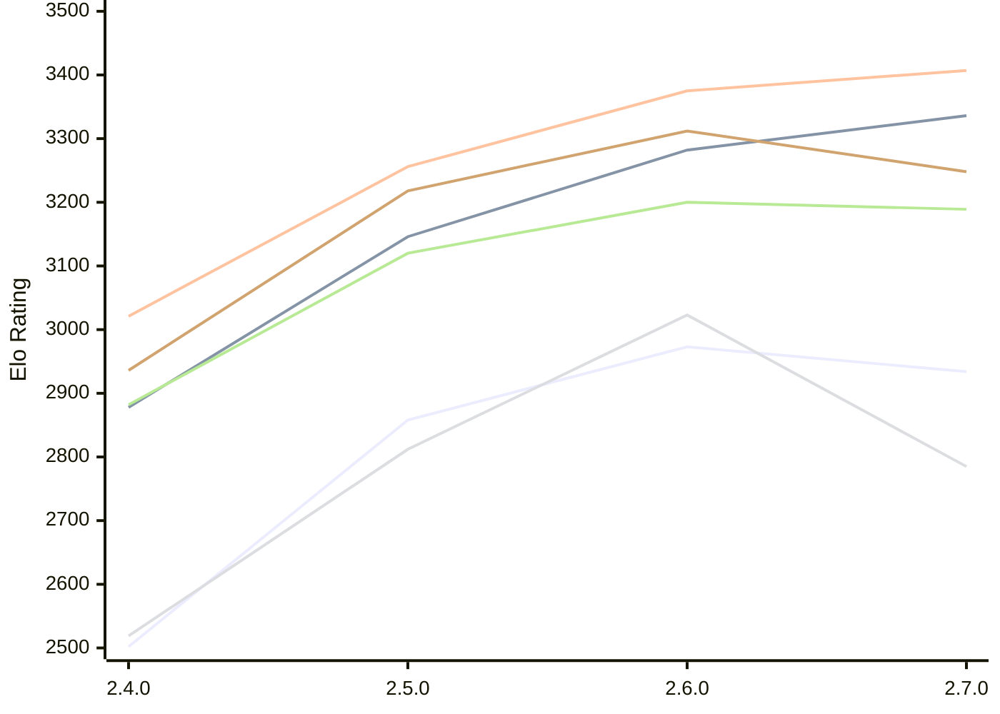

# Engine: Rarog

Author: Miloslav Macůrek

Home: https://github.com/maelic13/rarog

## Elo Ratings E1 (Ultra 7 265T (1.50 GHz) - E-Core)

| Version | Published | STC 8.0+0.08s  | LTC 60.0+0.60s | VLTC 2m24s+1.12s | Comment |
| --- | --- | --- | --- | --- | --- |
| 2.7.0 | 2026-11-13 | 2934(-39) | 3336(+54) | 3407(+32) |  |
| 2.6.0 | 2026-10-22 | 2973(+115) | 3282(+136) | 3375(+119) |  |
| 2.5.0 | 2026-10-05 | 2858(+356) | 3146(+268) | 3256(+235) |  |
| 2.4.0 | 2026-09-11 | 2502 | 2878 | 3021 |  |
 | | | cElo (∆ prev) | cElo (∆ prev) | cElo (∆ prev) | 

## Elo Ratings P1 (Ultra 7 265T (1.50 GHz) - P-Core)

| Version | Published | STC 8.0+0.08s  | LTC 60.0+0.60s | VLTC 2m24s+1.12s | Comment |
| --- | --- | --- | --- | --- | --- |
| 2.7.0 | 2026-11-13 | 2785(-238) | 3189(-11) | 3248(-64) |  |
| 2.6.0 | 2026-10-22 | 3023(+211) | 3200(+80) | 3312(+94) |  |
| 2.5.0 | 2026-10-05 | 2812(+293) | 3120(+238) | 3218(+282) |  |
| 2.4.0 | 2026-09-11 | 2519 | 2882 | 2936 |  |
 | | | cElo (∆ prev) | cElo (∆ prev) | cElo (∆ prev) | 

## Elo Ratings T1 (i5-7500T 2.70GHz)

| Version | Published | STC 8.0+0.08s  | LTC 60.0+0.60s | VLTC 2m24s+1.12s | Comment |
| --- | --- | --- | --- | --- | --- |
| 2.4.0 | 2026-09-11 | 2614 | 2930 | 3015 |  |
 | | | cElo (∆ prev) | cElo (∆ prev) | cElo (∆ prev) | 

<a href="https://github.com/computer-chess-index/cci/issues/new?template=submit-version.yml&title=[VERSION]+Rarog+<version>&body=###%20Engine%20name%0ARarog%0A%0A###%20Version%0A2.4.0" target="_blank">Submit new version</a>

 Test Conditions:

GUI/CLI: <a href=https://github.com/cutechess/cutechess target="_blank">Cute-Chess</a> 
Elo Calculation: <a href=https://www.remi-coulom.fr/Bayesian-Elo/ target="_blank">Bayesian-Elo</a> 
CPU for P1: Intel(R) Core(TM) Ultra 7 265T (1.50 GHz) - P-Core 
CPU for E1: Intel(R) Core(TM) Ultra 7 265T (1.50 GHz) - E-Core 
CPU for T1: Intel(R) Core(TM) i5-7500T 2.70GHz 
Opening book: 8_moves_v3 
\* STC: 8.0+0.08s, LTC: 60.0+0.60s, VLTC: 2m24s+1.12s

 Lists:
Ratings: <a href=https://github.com/computer-chess-index/cci/blob/main/lists/CCIRatings.csv target="_blank">Complete list</a>

Generated: 2026-11-16 05:41:44

## Ratings Verlauf E1 / P1

```mermaid
%%{init: {"theme":"base","themeVariables":{"seriesColors:['#a3a3a3','#222221','#faa371']}}}%%
xychart-beta
  x-axis ["2.4.0", "2.5.0", "2.6.0", "2.7.0"]
  y-axis "Elo Rating" 2500 --> 3500
  line "E1: STC (8.0+0.08s)" [2502, 2858, 2973, 2934]
  line "E1: LTC (60.0+0.60s)" [2878, 3146, 3282, 3336]
  line "E1: VLTC (2m24s+1.12s)" [3021, 3256, 3375, 3407]
  line "P1: STC (8.0+0.08s)" [2519, 2812, 3023, 2785]
  line "P1: LTC (60.0+0.60s)" [2882, 3120, 3200, 3189]
  line "P1: VLTC (2m24s+1.12s)" [2936, 3218, 3312, 3248]
```

## Detailed Evaluation Results

| Version | Time Control | Variant | Elo  | Range +/- | Matches | Score | Average Opponent Elo | Draws |
| --- | --- |--- | --- | --- | --- | --- | --- | --- |
| 2.7.0 | VLTC (2m24s+1.12s) | E1 | 3407 | 99 | 28 | 57% | 3357 | 50% |
|  |  | P1 | 3248 | 220 | 4 | 38% | 3310 | 75% |
|  | LTC (60.0+0.60s) | E1 | 3336 | 100 | 28 | 55% | 3294 | 46% |
|  |  | P1 | 3189 | 232 | 4 | 50% | 3198 | 50% |
|  | STC (8.0+0.08s) | P1 | 2785 | 126 | 20 | 50% | 2801 | 30% |
|  |  | E1 | 2934 | 115 | 24 | 50% | 2925 | 25% |
| --- | --- |--- | --- | --- | --- | --- | --- | --- |
| 2.6.0 | VLTC (2m24s+1.12s) | P1 | 3312 | 36 | 200 | 51% | 3306 | 62% |
|  |  | E1 | 3375 | 28 | 346 | 49% | 3384 | 62% |
|  | LTC (60.0+0.60s) | P1 | 3200 | 34 | 246 | 52% | 3182 | 54% |
|  |  | E1 | 3282 | 30 | 316 | 50% | 3275 | 54% |
|  | STC (8.0+0.08s) | P1 | 3023 | 41 | 182 | 50% | 3021 | 42% |
|  |  | E1 | 2973 | 31 | 320 | 50% | 2971 | 41% |
| --- | --- |--- | --- | --- | --- | --- | --- | --- |
| 2.5.0 | VLTC (2m24s+1.12s) | P1 | 3218 | 36 | 206 | 53% | 3197 | 61% |
|  |  | E1 | 3256 | 29 | 320 | 53% | 3232 | 55% |
|  | LTC (60.0+0.60s) | E1 | 3146 | 32 | 280 | 54% | 3119 | 55% |
|  |  | P1 | 3120 | 35 | 238 | 47% | 3143 | 52% |
|  | STC (8.0+0.08s) | E1 | 2858 | 32 | 320 | 55% | 2813 | 38% |
|  |  | P1 | 2812 | 43 | 170 | 50% | 2815 | 41% |
| --- | --- |--- | --- | --- | --- | --- | --- | --- |
| 2.4.0 | VLTC (2m24s+1.12s) | T1 | 3015 | 35 | 256 | 53% | 2984 | 40% |
|  |  | P1 | 2936 | 39 | 198 | 51% | 2928 | 42% |
|  |  | E1 | 3021 | 29 | 367 | 52% | 3011 | 41% |
|  | LTC (60.0+0.60s) | T1 | 2930 | 33 | 292 | 57% | 2861 | 38% |
|  |  | P1 | 2882 | 42 | 168 | 53% | 2850 | 43% |
|  |  | E1 | 2878 | 32 | 310 | 47% | 2909 | 38% |
|  | STC (8.0+0.08s) | T1 | 2614 | 36 | 266 | 52% | 2564 | 29% |
|  |  | P1 | 2519 | 46 | 156 | 46% | 2556 | 31% |
|  |  | E1 | 2502 | 36 | 252 | 41% | 2596 | 33% |