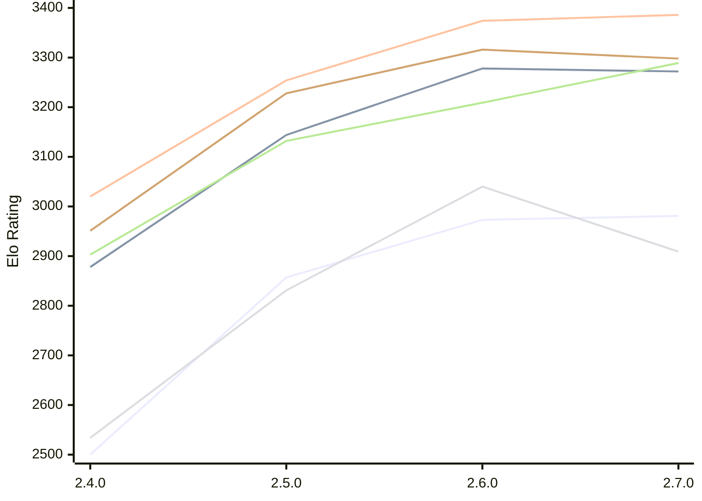

# Engine: Rarog

Author: Miloslav Macůrek

Home: https://github.com/maelic13/rarog

## Elo Ratings E1 (Ultra 7 265T (1.50 GHz) - E-Core)

| Version | Published | STC 8.0+0.08s  | LTC 60.0+0.60s | VLTC 2m24s+1.12s | Comment |
| --- | --- | --- | --- | --- | --- |
| 2.7.0 | 2026-11-13 | 2981(+8) | 3272(-6) | 3386(+12) |  |
| 2.6.0 | 2026-10-22 | 2973(+116) | 3278(+134) | 3374(+120) |  |
| 2.5.0 | 2026-10-05 | 2857(+357) | 3144(+266) | 3254(+234) |  |
| 2.4.0 | 2026-09-11 | 2500 | 2878 | 3020 |  |
 | | | cElo (∆ prev) | cElo (∆ prev) | cElo (∆ prev) | 

## Elo Ratings P1 (Ultra 7 265T (1.50 GHz) - P-Core)

| Version | Published | STC 8.0+0.08s  | LTC 60.0+0.60s | VLTC 2m24s+1.12s | Comment |
| --- | --- | --- | --- | --- | --- |
| 2.7.0 | 2026-11-13 | 2909(-131) | 3289(+80) | 3298(-18) |  |
| 2.6.0 | 2026-10-22 | 3040(+209) | 3209(+77) | 3316(+88) |  |
| 2.5.0 | 2026-10-05 | 2831(+297) | 3132(+229) | 3228(+277) |  |
| 2.4.0 | 2026-09-11 | 2534 | 2903 | 2951 |  |
 | | | cElo (∆ prev) | cElo (∆ prev) | cElo (∆ prev) | 

## Elo Ratings T1 (i5-7500T 2.70GHz)

| Version | Published | STC 8.0+0.08s  | LTC 60.0+0.60s | VLTC 2m24s+1.12s | Comment |
| --- | --- | --- | --- | --- | --- |
| 2.4.0 | 2026-09-11 | 2614 | 2930 | 3015 |  |
 | | | cElo (∆ prev) | cElo (∆ prev) | cElo (∆ prev) | 

<a href="https://github.com/computer-chess-index/cci/issues/new?template=submit-version.yml&title=[VERSION]+Rarog+<version>&body=###%20Engine%20name%0ARarog%0A%0A###%20Version%0A2.4.0" target="_blank">Submit new version</a>

 Test Conditions:

GUI/CLI: <a href=https://github.com/cutechess/cutechess target="_blank">Cute-Chess</a> 
Elo Calculation: <a href=https://www.remi-coulom.fr/Bayesian-Elo/ target="_blank">Bayesian-Elo</a> 
CPU for P1: Intel(R) Core(TM) Ultra 7 265T (1.50 GHz) - P-Core 
CPU for E1: Intel(R) Core(TM) Ultra 7 265T (1.50 GHz) - E-Core 
CPU for T1: Intel(R) Core(TM) i5-7500T 2.70GHz 
Opening book: 8_moves_v3 
\* STC: 8.0+0.08s, LTC: 60.0+0.60s, VLTC: 2m24s+1.12s

 Lists:
Ratings: <a href=https://github.com/computer-chess-index/cci/blob/main/lists/CCIRatings.csv target="_blank">Complete list</a>

Generated: 2026-11-20 05:41:46

## Ratings Verlauf E1 / P1

```mermaid
%%{init: {"theme":"base","themeVariables":{"seriesColors:['#a3a3a3','#222221','#faa371']}}}%%
xychart-beta
  x-axis ["2.4.0", "2.5.0", "2.6.0", "2.7.0"]
  y-axis "Elo Rating" 2500 --> 3400
  line "E1: STC (8.0+0.08s)" [2500, 2857, 2973, 2981]
  line "E1: LTC (60.0+0.60s)" [2878, 3144, 3278, 3272]
  line "E1: VLTC (2m24s+1.12s)" [3020, 3254, 3374, 3386]
  line "P1: STC (8.0+0.08s)" [2534, 2831, 3040, 2909]
  line "P1: LTC (60.0+0.60s)" [2903, 3132, 3209, 3289]
  line "P1: VLTC (2m24s+1.12s)" [2951, 3228, 3316, 3298]
```

## Detailed Evaluation Results

| Version | Time Control | Variant | Elo  | Range +/- | Matches | Score | Average Opponent Elo | Draws |
| --- | --- |--- | --- | --- | --- | --- | --- | --- |
| 2.7.0 | VLTC (2m24s+1.12s) | P1 | 3298 | 51 | 100 | 51% | 3293 | 63% |
|  |  | E1 | 3386 | 39 | 174 | 51% | 3382 | 63% |
|  | LTC (60.0+0.60s) | P1 | 3289 | 47 | 120 | 52% | 3274 | 63% |
|  |  | E1 | 3272 | 39 | 180 | 49% | 3283 | 54% |
|  | STC (8.0+0.08s) | P1 | 2909 | 44 | 162 | 53% | 2882 | 36% |
|  |  | E1 | 2981 | 32 | 300 | 54% | 2947 | 43% |
| --- | --- |--- | --- | --- | --- | --- | --- | --- |
| 2.6.0 | VLTC (2m24s+1.12s) | P1 | 3316 | 36 | 204 | 50% | 3316 | 62% |
|  |  | E1 | 3374 | 28 | 346 | 49% | 3384 | 62% |
|  | LTC (60.0+0.60s) | P1 | 3209 | 34 | 246 | 52% | 3191 | 54% |
|  |  | E1 | 3278 | 30 | 320 | 50% | 3274 | 54% |
|  | STC (8.0+0.08s) | P1 | 3040 | 41 | 184 | 51% | 3038 | 42% |
|  |  | E1 | 2973 | 31 | 320 | 50% | 2973 | 41% |
| --- | --- |--- | --- | --- | --- | --- | --- | --- |
| 2.5.0 | VLTC (2m24s+1.12s) | E1 | 3254 | 29 | 320 | 53% | 3229 | 55% |
|  |  | P1 | 3228 | 36 | 206 | 53% | 3206 | 61% |
|  | LTC (60.0+0.60s) | P1 | 3132 | 35 | 238 | 47% | 3155 | 52% |
|  |  | E1 | 3144 | 32 | 280 | 54% | 3116 | 55% |
|  | STC (8.0+0.08s) | P1 | 2831 | 43 | 170 | 50% | 2832 | 41% |
|  |  | E1 | 2857 | 32 | 320 | 55% | 2812 | 38% |
| --- | --- |--- | --- | --- | --- | --- | --- | --- |
| 2.4.0 | VLTC (2m24s+1.12s) | T1 | 3015 | 35 | 256 | 53% | 2984 | 40% |
|  |  | P1 | 2951 | 39 | 198 | 51% | 2944 | 42% |
|  |  | E1 | 3020 | 29 | 367 | 52% | 3009 | 41% |
|  | LTC (60.0+0.60s) | T1 | 2930 | 33 | 292 | 57% | 2861 | 38% |
|  |  | P1 | 2903 | 42 | 168 | 53% | 2870 | 43% |
|  |  | E1 | 2878 | 32 | 310 | 47% | 2909 | 38% |
|  | STC (8.0+0.08s) | T1 | 2614 | 36 | 266 | 52% | 2564 | 29% |
|  |  | P1 | 2534 | 46 | 156 | 46% | 2570 | 31% |
|  |  | E1 | 2500 | 36 | 252 | 41% | 2595 | 33% |