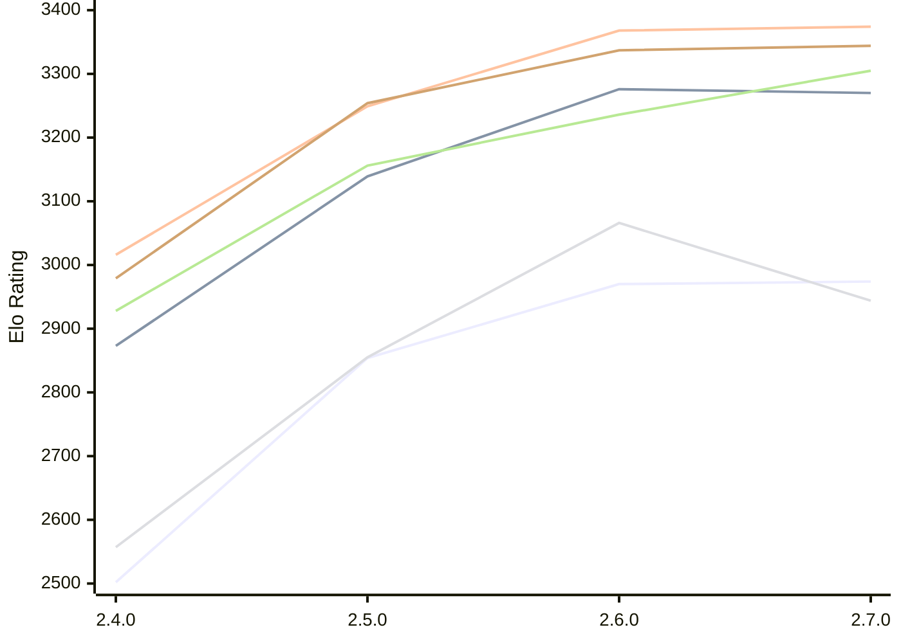

# Engine: Rarog

Author: Miloslav Macůrek

Home: https://github.com/maelic13/rarog

## Elo Ratings E1 (Ultra 7 265T (1.50 GHz) - E-Core)

| Version | Published | STC 8.0+0.08s  | LTC 60.0+0.60s | VLTC 2m24s+1.12s | Comment |
| --- | --- | --- | --- | --- | --- |
| 2.7.0 | 2026-11-13 | 2974(+4) | 3270(-6) | 3374(+6) |  |
| 2.6.0 | 2026-10-22 | 2970(+116) | 3276(+137) | 3368(+119) |  |
| 2.5.0 | 2026-10-05 | 2854(+352) | 3139(+266) | 3249(+233) |  |
| 2.4.0 | 2026-09-11 | 2502 | 2873 | 3016 |  |
 | | | cElo (∆ prev) | cElo (∆ prev) | cElo (∆ prev) | 

## Elo Ratings P1 (Ultra 7 265T (1.50 GHz) - P-Core)

| Version | Published | STC 8.0+0.08s  | LTC 60.0+0.60s | VLTC 2m24s+1.12s | Comment |
| --- | --- | --- | --- | --- | --- |
| 2.7.0 | 2026-11-13 | 2944(-122) | 3305(+69) | 3344(+7) |  |
| 2.6.0 | 2026-10-22 | 3066(+211) | 3236(+80) | 3337(+83) |  |
| 2.5.0 | 2026-10-05 | 2855(+298) | 3156(+228) | 3254(+275) |  |
| 2.4.0 | 2026-09-11 | 2557 | 2928 | 2979 |  |
 | | | cElo (∆ prev) | cElo (∆ prev) | cElo (∆ prev) | 

## Elo Ratings T1 (i5-7500T 2.70GHz)

| Version | Published | STC 8.0+0.08s  | LTC 60.0+0.60s | VLTC 2m24s+1.12s | Comment |
| --- | --- | --- | --- | --- | --- |
| 2.4.0 | 2026-09-11 | 2614 | 2930 | 3015 |  |
 | | | cElo (∆ prev) | cElo (∆ prev) | cElo (∆ prev) | 

<a href="https://github.com/computer-chess-index/cci/issues/new?template=submit-version.yml&title=[VERSION]+Rarog+<version>&body=###%20Engine%20name%0ARarog%0A%0A###%20Version%0A2.4.0" target="_blank">Submit new version</a>

 Test Conditions:

GUI/CLI: <a href=https://github.com/cutechess/cutechess target="_blank">Cute-Chess</a> 
Elo Calculation: <a href=https://www.remi-coulom.fr/Bayesian-Elo/ target="_blank">Bayesian-Elo</a> 
CPU for P1: Intel(R) Core(TM) Ultra 7 265T (1.50 GHz) - P-Core 
CPU for E1: Intel(R) Core(TM) Ultra 7 265T (1.50 GHz) - E-Core 
CPU for T1: Intel(R) Core(TM) i5-7500T 2.70GHz 
Opening book: 8_moves_v3 
\* STC: 8.0+0.08s, LTC: 60.0+0.60s, VLTC: 2m24s+1.12s

 Lists:
Ratings: <a href=https://github.com/computer-chess-index/cci/blob/main/lists/CCIRatings.csv target="_blank">Complete list</a>

Generated: 2026-11-27 05:42:15

## Ratings Verlauf E1 / P1

```mermaid
%%{init: {"theme":"base","themeVariables":{"seriesColors:['#a3a3a3','#222221','#faa371']}}}%%
xychart-beta
  x-axis ["2.4.0", "2.5.0", "2.6.0", "2.7.0"]
  y-axis "Elo Rating" 2500 --> 3400
  line "E1: STC (8.0+0.08s)" [2502, 2854, 2970, 2974]
  line "E1: LTC (60.0+0.60s)" [2873, 3139, 3276, 3270]
  line "E1: VLTC (2m24s+1.12s)" [3016, 3249, 3368, 3374]
  line "P1: STC (8.0+0.08s)" [2557, 2855, 3066, 2944]
  line "P1: LTC (60.0+0.60s)" [2928, 3156, 3236, 3305]
  line "P1: VLTC (2m24s+1.12s)" [2979, 3254, 3337, 3344]
```

## Detailed Evaluation Results

| Version | Time Control | Variant | Elo  | Range +/- | Matches | Score | Average Opponent Elo | Draws |
| --- | --- |--- | --- | --- | --- | --- | --- | --- |
| 2.7.0 | VLTC (2m24s+1.12s) | P1 | 3344 | 38 | 184 | 52% | 3328 | 59% |
|  |  | E1 | 3374 | 38 | 182 | 50% | 3376 | 63% |
|  | LTC (60.0+0.60s) | P1 | 3305 | 45 | 128 | 51% | 3301 | 61% |
|  |  | E1 | 3270 | 35 | 228 | 49% | 3278 | 57% |
|  | STC (8.0+0.08s) | P1 | 2944 | 38 | 210 | 53% | 2917 | 39% |
|  |  | E1 | 2974 | 29 | 346 | 53% | 2947 | 43% |
| --- | --- |--- | --- | --- | --- | --- | --- | --- |
| 2.6.0 | VLTC (2m24s+1.12s) | P1 | 3337 | 36 | 204 | 50% | 3337 | 62% |
|  |  | E1 | 3368 | 28 | 346 | 49% | 3378 | 62% |
|  | LTC (60.0+0.60s) | P1 | 3236 | 33 | 258 | 52% | 3218 | 53% |
|  |  | E1 | 3276 | 28 | 344 | 51% | 3268 | 55% |
|  | STC (8.0+0.08s) | P1 | 3066 | 40 | 192 | 50% | 3066 | 42% |
|  |  | E1 | 2970 | 30 | 332 | 50% | 2969 | 41% |
| --- | --- |--- | --- | --- | --- | --- | --- | --- |
| 2.5.0 | VLTC (2m24s+1.12s) | E1 | 3249 | 29 | 320 | 53% | 3225 | 55% |
|  |  | P1 | 3254 | 36 | 206 | 53% | 3232 | 61% |
|  | LTC (60.0+0.60s) | P1 | 3156 | 35 | 238 | 47% | 3179 | 52% |
|  |  | E1 | 3139 | 32 | 280 | 54% | 3112 | 55% |
|  | STC (8.0+0.08s) | P1 | 2855 | 43 | 170 | 50% | 2859 | 41% |
|  |  | E1 | 2854 | 32 | 320 | 55% | 2809 | 38% |
| --- | --- |--- | --- | --- | --- | --- | --- | --- |
| 2.4.0 | VLTC (2m24s+1.12s) | T1 | 3015 | 35 | 256 | 53% | 2984 | 40% |
|  |  | P1 | 2979 | 39 | 198 | 51% | 2973 | 42% |
|  |  | E1 | 3016 | 29 | 367 | 52% | 3004 | 41% |
|  | LTC (60.0+0.60s) | T1 | 2930 | 33 | 292 | 57% | 2861 | 38% |
|  |  | P1 | 2928 | 42 | 168 | 53% | 2896 | 43% |
|  |  | E1 | 2873 | 32 | 310 | 47% | 2904 | 38% |
|  | STC (8.0+0.08s) | T1 | 2614 | 36 | 266 | 52% | 2564 | 29% |
|  |  | P1 | 2557 | 46 | 156 | 46% | 2593 | 31% |
|  |  | E1 | 2502 | 36 | 252 | 41% | 2595 | 33% |