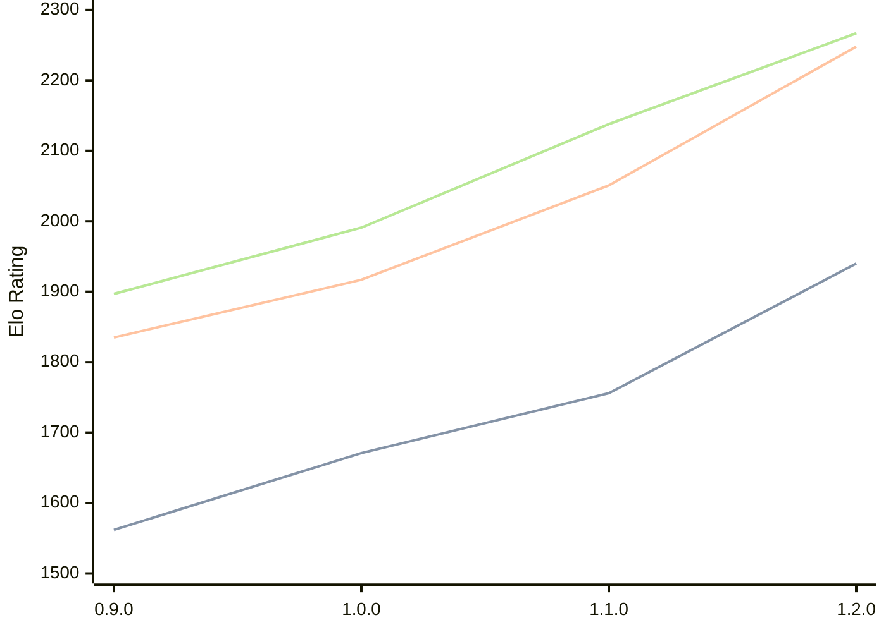

# Engine: Ratsu

Author: Eetu Rantala

Home: https://github.com/ranzuh/ratsu

## Elo Ratings

| Version | Published | STC 8.0+0.08s  | LTC 60.0+0.60s | VLTC 2m24s+1.12s | Comment |
| --- | --- | --- | --- | --- | --- |
| 1.2.0 | 2026-05-07 | 1940(+184) | 2248(+197) | 2267(+129) |  |
| 1.1.0 | 2026-04-21 | 1756(+85) | 2051(+134) | 2138(+147) |  |
| 1.0.0 | 2026-02-20 | 1671(+109) | 1917(+82) | 1991(+94) |  |
| 0.9.0 | 2026-01-21 | 1562 | 1835 | 1897 |  |
 | | | cElo (∆ prev) | cElo (∆ prev) | cElo (∆ prev) | 

<a href="https://github.com/computer-chess-index/cci/issues/new?template=submit-version.yml&title=[VERSION]+Ratsu+<version>&body=###%20Engine%20name%0ARatsu%0A%0A###%20Version%0A1.2.0" target="_blank">Submit new version</a>

 Test Conditions:

GUI/CLI: <a href=https://github.com/cutechess/cutechess target="_blank">Cute-Chess</a> 
Elo Calculation: <a href=https://www.remi-coulom.fr/Bayesian-Elo/ target="_blank">Bayesian-Elo</a> 
CPU: Intel(R) Core(TM) i5-7500T 2.70GHz 
Opening book: 8_moves_v3 
\* STC: 8.0+0.08s, LTC: 60.0+0.60s, VLTC: 2m24s+1.12s

 Lists:
Ratings: <a href=https://github.com/computer-chess-index/cci/blob/main/lists/CCIRatings.csv target="_blank">Complete list</a>

Generated: 2026-05-15 06:27:18

## Ratings Verlauf

⬛ STC (8.0+0.08s) &nbsp;&nbsp; 🟧 LTC (60.0+0.60s) &nbsp;&nbsp; 🟩 VLTC (2m24s+1.12s)

dark mode: 🟩STC (8.0+0.08s) 🟧LTC (60.0+0.60s) ⬜VLTC (2m24s+1.12s)

## Detailed Evaluation Results

| Version | Time Control | Elo  | Range +/- | Matches | Score | Average Opponent Elo | Draws |
| --- | --- | --- | --- | --- | --- | --- | --- |
| 1.2.0 | VLTC (2m24s+1.12s) | 2267 | 36 | 254 | 48% | 2284 | 28% |
| 1.2.0 | LTC (60.0+0.60s) | 2248 | 42 | 190 | 53% | 2225 | 29% |
| 1.2.0 | STC (8.0+0.08s) | 1940 | 39 | 228 | 52% | 1922 | 27% |
| --- | --- | --- | --- | --- | --- | --- | --- |
| 1.1.0 | VLTC (2m24s+1.12s) | 2138 | 32 | 348 | 53% | 2113 | 26% |
| 1.1.0 | LTC (60.0+0.60s) | 2051 | 33 | 326 | 51% | 2041 | 20% |
| 1.1.0 | STC (8.0+0.08s) | 1756 | 32 | 352 | 50% | 1743 | 22% |
| --- | --- | --- | --- | --- | --- | --- | --- |
| 1.0.0 | VLTC (2m24s+1.12s) | 1991 | 29 | 390 | 50% | 1993 | 27% |
| 1.0.0 | LTC (60.0+0.60s) | 1917 | 31 | 384 | 51% | 1910 | 18% |
| 1.0.0 | STC (8.0+0.08s) | 1671 | 30 | 394 | 48% | 1690 | 23% |
| --- | --- | --- | --- | --- | --- | --- | --- |
| 0.9.0 | VLTC (2m24s+1.12s) | 1897 | 41 | 208 | 50% | 1902 | 25% |
| 0.9.0 | LTC (60.0+0.60s) | 1835 | 36 | 280 | 53% | 1804 | 17% |
| 0.9.0 | STC (8.0+0.08s) | 1562 | 39 | 242 | 49% | 1570 | 18% |
| --- | --- | --- | --- | --- | --- | --- | --- |