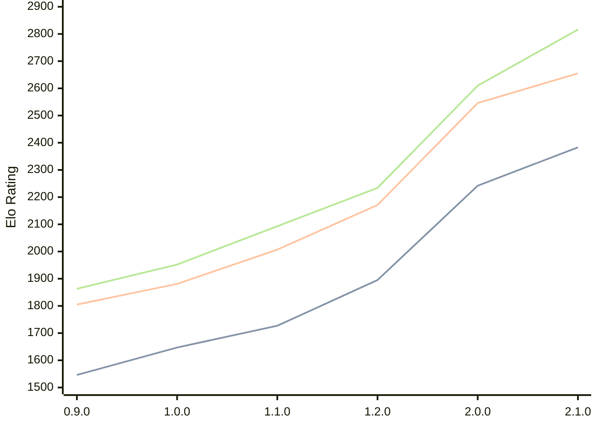

# Engine: Ratsu

Author: Eetu Rantala

Home: https://github.com/ranzuh/ratsu

## Elo Ratings

| Version | Published | STC 8.0+0.08s  | LTC 60.0+0.60s | VLTC 2m24s+1.12s | Comment |
| --- | --- | --- | --- | --- | --- |
| 2.1.0 | 2026-06-29 | 2383(+141) | 2655(+109) | 2816(+206) |  |
| 2.0.0 | 2026-05-23 | 2242(+347) | 2546(+375) | 2610(+376) |  |
| 1.2.0 | 2026-05-07 | 1895(+168) | 2171(+164) | 2234(+141) |  |
| 1.1.0 | 2026-04-21 | 1727(+80) | 2007(+126) | 2093(+141) |  |
| 1.0.0 | 2026-02-20 | 1647(+101) | 1881(+76) | 1952(+89) |  |
| 0.9.0 | 2026-01-21 | 1546 | 1805 | 1863 |  |
 | | | cElo (∆ prev) | cElo (∆ prev) | cElo (∆ prev) | 

<a href="https://github.com/computer-chess-index/cci/issues/new?template=submit-version.yml&title=[VERSION]+Ratsu+<version>&body=###%20Engine%20name%0ARatsu%0A%0A###%20Version%0A2.1.0" target="_blank">Submit new version</a>

 Test Conditions:

GUI/CLI: <a href=https://github.com/cutechess/cutechess target="_blank">Cute-Chess</a> 
Elo Calculation: <a href=https://www.remi-coulom.fr/Bayesian-Elo/ target="_blank">Bayesian-Elo</a> 
CPU: Intel(R) Core(TM) i5-7500T 2.70GHz 
Opening book: 8_moves_v3 
\* STC: 8.0+0.08s, LTC: 60.0+0.60s, VLTC: 2m24s+1.12s

 Lists:
Ratings: <a href=https://github.com/computer-chess-index/cci/blob/main/lists/CCIRatings.csv target="_blank">Complete list</a>

Generated: 2026-08-26 06:28:30

## Ratings Verlauf

⬛ STC (8.0+0.08s) &nbsp;&nbsp; 🟧 LTC (60.0+0.60s) &nbsp;&nbsp; 🟩 VLTC (2m24s+1.12s)

dark mode: 🟩STC (8.0+0.08s) 🟧LTC (60.0+0.60s) ⬜VLTC (2m24s+1.12s)

## Detailed Evaluation Results

| Version | Time Control | Elo  | Range +/- | Matches | Score | Average Opponent Elo | Draws |
| --- | --- | --- | --- | --- | --- | --- | --- |
| 2.1.0 | VLTC (2m24s+1.12s) | 2816 | 35 | 256 | 50% | 2816 | 40% |
| 2.1.0 | LTC (60.0+0.60s) | 2655 | 38 | 222 | 50% | 2655 | 31% |
| 2.1.0 | STC (8.0+0.08s) | 2383 | 33 | 310 | 50% | 2384 | 26% |
| --- | --- | --- | --- | --- | --- | --- | --- |
| 2.0.0 | VLTC (2m24s+1.12s) | 2610 | 48 | 136 | 49% | 2626 | 38% |
| 2.0.0 | LTC (60.0+0.60s) | 2546 | 45 | 168 | 54% | 2503 | 30% |
| 2.0.0 | STC (8.0+0.08s) | 2242 | 44 | 182 | 55% | 2188 | 24% |
| --- | --- | --- | --- | --- | --- | --- | --- |
| 1.2.0 | VLTC (2m24s+1.12s) | 2234 | 31 | 364 | 51% | 2229 | 26% |
| 1.2.0 | LTC (60.0+0.60s) | 2171 | 34 | 292 | 50% | 2157 | 28% |
| 1.2.0 | STC (8.0+0.08s) | 1895 | 32 | 356 | 51% | 1877 | 22% |
| --- | --- | --- | --- | --- | --- | --- | --- |
| 1.1.0 | VLTC (2m24s+1.12s) | 2093 | 32 | 348 | 53% | 2067 | 26% |
| 1.1.0 | LTC (60.0+0.60s) | 2007 | 33 | 326 | 51% | 1997 | 20% |
| 1.1.0 | STC (8.0+0.08s) | 1727 | 32 | 352 | 50% | 1715 | 22% |
| --- | --- | --- | --- | --- | --- | --- | --- |
| 1.0.0 | VLTC (2m24s+1.12s) | 1952 | 29 | 390 | 50% | 1952 | 27% |
| 1.0.0 | LTC (60.0+0.60s) | 1881 | 31 | 384 | 51% | 1874 | 18% |
| 1.0.0 | STC (8.0+0.08s) | 1647 | 30 | 394 | 48% | 1666 | 23% |
| --- | --- | --- | --- | --- | --- | --- | --- |
| 0.9.0 | VLTC (2m24s+1.12s) | 1863 | 41 | 208 | 50% | 1867 | 25% |
| 0.9.0 | LTC (60.0+0.60s) | 1805 | 36 | 280 | 53% | 1775 | 17% |
| 0.9.0 | STC (8.0+0.08s) | 1546 | 39 | 242 | 49% | 1554 | 18% |
| --- | --- | --- | --- | --- | --- | --- | --- |