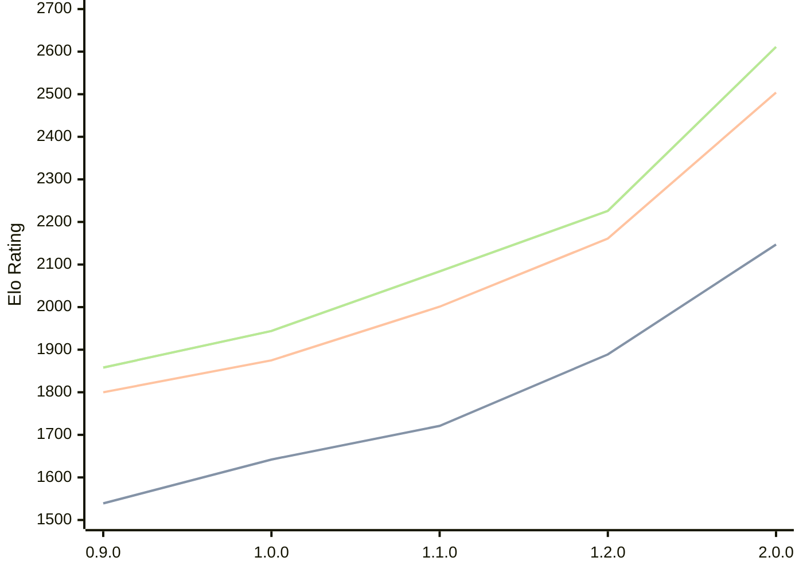

# Engine: Ratsu

Author: Eetu Rantala

Home: https://github.com/ranzuh/ratsu

## Elo Ratings

| Version | Published | STC 8.0+0.08s  | LTC 60.0+0.60s | VLTC 2m24s+1.12s | Comment |
| --- | --- | --- | --- | --- | --- |
| 2.0.0 | 2026-05-23 | 2147(+258) | 2504(+343) | 2611(+385) |  |
| 1.2.0 | 2026-05-07 | 1889(+168) | 2161(+160) | 2226(+142) |  |
| 1.1.0 | 2026-04-21 | 1721(+79) | 2001(+126) | 2084(+140) |  |
| 1.0.0 | 2026-02-20 | 1642(+103) | 1875(+75) | 1944(+86) |  |
| 0.9.0 | 2026-01-21 | 1539 | 1800 | 1858 |  |
 | | | cElo (∆ prev) | cElo (∆ prev) | cElo (∆ prev) | 

<a href="https://github.com/computer-chess-index/cci/issues/new?template=submit-version.yml&title=[VERSION]+Ratsu+<version>&body=###%20Engine%20name%0ARatsu%0A%0A###%20Version%0A2.0.0" target="_blank">Submit new version</a>

 Test Conditions:

GUI/CLI: <a href=https://github.com/cutechess/cutechess target="_blank">Cute-Chess</a> 
Elo Calculation: <a href=https://www.remi-coulom.fr/Bayesian-Elo/ target="_blank">Bayesian-Elo</a> 
CPU: Intel(R) Core(TM) i5-7500T 2.70GHz 
Opening book: 8_moves_v3 
\* STC: 8.0+0.08s, LTC: 60.0+0.60s, VLTC: 2m24s+1.12s

 Lists:
Ratings: <a href=https://github.com/computer-chess-index/cci/blob/main/lists/CCIRatings.csv target="_blank">Complete list</a>

Generated: 2026-06-23 06:28:49

## Ratings Verlauf

## Ratings Verlauf

⬛ STC (8.0+0.08s) &nbsp;&nbsp; 🟧 LTC (60.0+0.60s) &nbsp;&nbsp; 🟩 VLTC (2m24s+1.12s)

dark mode: 🟩STC (8.0+0.08s) 🟧LTC (60.0+0.60s) ⬜VLTC (2m24s+1.12s)

## Detailed Evaluation Results

| Version | Time Control | Elo  | Range +/- | Matches | Score | Average Opponent Elo | Draws |
| --- | --- | --- | --- | --- | --- | --- | --- |
| 2.0.0 | VLTC (2m24s+1.12s) | 2611 | 54 | 106 | 51% | 2591 | 39% |
| 2.0.0 | LTC (60.0+0.60s) | 2504 | 67 | 78 | 54% | 2456 | 24% |
| 2.0.0 | STC (8.0+0.08s) | 2147 | 75 | 62 | 53% | 2113 | 23% |
| --- | --- | --- | --- | --- | --- | --- | --- |
| 1.2.0 | VLTC (2m24s+1.12s) | 2226 | 31 | 364 | 51% | 2219 | 26% |
| 1.2.0 | LTC (60.0+0.60s) | 2161 | 34 | 292 | 50% | 2148 | 28% |
| 1.2.0 | STC (8.0+0.08s) | 1889 | 32 | 356 | 51% | 1870 | 22% |
| --- | --- | --- | --- | --- | --- | --- | --- |
| 1.1.0 | VLTC (2m24s+1.12s) | 2084 | 32 | 348 | 53% | 2059 | 26% |
| 1.1.0 | LTC (60.0+0.60s) | 2001 | 33 | 326 | 51% | 1990 | 20% |
| 1.1.0 | STC (8.0+0.08s) | 1721 | 32 | 352 | 50% | 1709 | 22% |
| --- | --- | --- | --- | --- | --- | --- | --- |
| 1.0.0 | VLTC (2m24s+1.12s) | 1944 | 29 | 390 | 50% | 1945 | 27% |
| 1.0.0 | LTC (60.0+0.60s) | 1875 | 31 | 384 | 51% | 1868 | 18% |
| 1.0.0 | STC (8.0+0.08s) | 1642 | 30 | 394 | 48% | 1659 | 23% |
| --- | --- | --- | --- | --- | --- | --- | --- |
| 0.9.0 | VLTC (2m24s+1.12s) | 1858 | 41 | 208 | 50% | 1862 | 25% |
| 0.9.0 | LTC (60.0+0.60s) | 1800 | 36 | 280 | 53% | 1769 | 17% |
| 0.9.0 | STC (8.0+0.08s) | 1539 | 39 | 242 | 49% | 1547 | 18% |
| --- | --- | --- | --- | --- | --- | --- | --- |