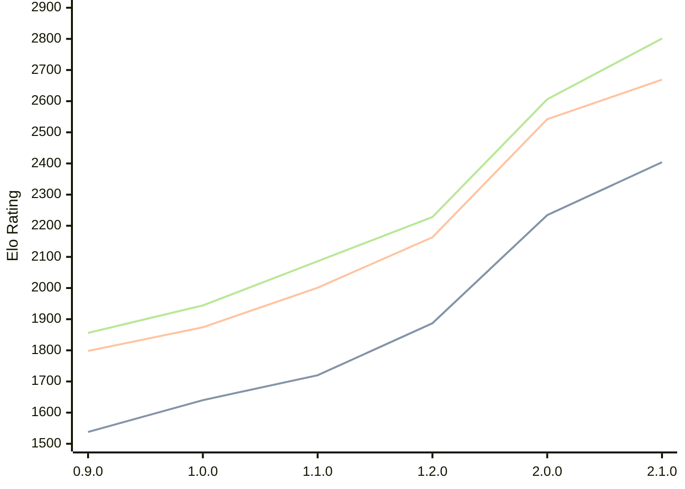

# Engine: Ratsu

Author: Eetu Rantala

Home: https://github.com/ranzuh/ratsu

## Elo Ratings

| Version | Published | STC 8.0+0.08s  | LTC 60.0+0.60s | VLTC 2m24s+1.12s | Comment |
| --- | --- | --- | --- | --- | --- |
| 2.1.0 | 2026-06-29 | 2404(+170) | 2669(+127) | 2801(+195) |  |
| 2.0.0 | 2026-05-23 | 2234(+347) | 2542(+379) | 2606(+378) |  |
| 1.2.0 | 2026-05-07 | 1887(+167) | 2163(+162) | 2228(+142) |  |
| 1.1.0 | 2026-04-21 | 1720(+80) | 2001(+127) | 2086(+142) |  |
| 1.0.0 | 2026-02-20 | 1640(+102) | 1874(+76) | 1944(+88) |  |
| 0.9.0 | 2026-01-21 | 1538 | 1798 | 1856 |  |
 | | | cElo (∆ prev) | cElo (∆ prev) | cElo (∆ prev) | 

<a href="https://github.com/computer-chess-index/cci/issues/new?template=submit-version.yml&title=[VERSION]+Ratsu+<version>&body=###%20Engine%20name%0ARatsu%0A%0A###%20Version%0A2.1.0" target="_blank">Submit new version</a>

 Test Conditions:

GUI/CLI: <a href=https://github.com/cutechess/cutechess target="_blank">Cute-Chess</a> 
Elo Calculation: <a href=https://www.remi-coulom.fr/Bayesian-Elo/ target="_blank">Bayesian-Elo</a> 
CPU: Intel(R) Core(TM) i5-7500T 2.70GHz 
Opening book: 8_moves_v3 
\* STC: 8.0+0.08s, LTC: 60.0+0.60s, VLTC: 2m24s+1.12s

 Lists:
Ratings: <a href=https://github.com/computer-chess-index/cci/blob/main/lists/CCIRatings.csv target="_blank">Complete list</a>

Generated: 2026-07-14 06:28:14

## Ratings Verlauf

## Ratings Verlauf

⬛ STC (8.0+0.08s) &nbsp;&nbsp; 🟧 LTC (60.0+0.60s) &nbsp;&nbsp; 🟩 VLTC (2m24s+1.12s)

dark mode: 🟩STC (8.0+0.08s) 🟧LTC (60.0+0.60s) ⬜VLTC (2m24s+1.12s)

## Detailed Evaluation Results

| Version | Time Control | Elo  | Range +/- | Matches | Score | Average Opponent Elo | Draws |
| --- | --- | --- | --- | --- | --- | --- | --- |
| 2.1.0 | VLTC (2m24s+1.12s) | 2801 | 43 | 168 | 49% | 2808 | 38% |
| 2.1.0 | LTC (60.0+0.60s) | 2669 | 45 | 160 | 51% | 2660 | 29% |
| 2.1.0 | STC (8.0+0.08s) | 2404 | 51 | 130 | 51% | 2398 | 27% |
| --- | --- | --- | --- | --- | --- | --- | --- |
| 2.0.0 | VLTC (2m24s+1.12s) | 2606 | 48 | 136 | 49% | 2622 | 38% |
| 2.0.0 | LTC (60.0+0.60s) | 2542 | 45 | 168 | 54% | 2499 | 30% |
| 2.0.0 | STC (8.0+0.08s) | 2234 | 44 | 182 | 55% | 2180 | 24% |
| --- | --- | --- | --- | --- | --- | --- | --- |
| 1.2.0 | VLTC (2m24s+1.12s) | 2228 | 31 | 364 | 51% | 2221 | 26% |
| 1.2.0 | LTC (60.0+0.60s) | 2163 | 34 | 292 | 50% | 2149 | 28% |
| 1.2.0 | STC (8.0+0.08s) | 1887 | 32 | 356 | 51% | 1870 | 22% |
| --- | --- | --- | --- | --- | --- | --- | --- |
| 1.1.0 | VLTC (2m24s+1.12s) | 2086 | 32 | 348 | 53% | 2059 | 26% |
| 1.1.0 | LTC (60.0+0.60s) | 2001 | 33 | 326 | 51% | 1990 | 20% |
| 1.1.0 | STC (8.0+0.08s) | 1720 | 32 | 352 | 50% | 1708 | 22% |
| --- | --- | --- | --- | --- | --- | --- | --- |
| 1.0.0 | VLTC (2m24s+1.12s) | 1944 | 29 | 390 | 50% | 1945 | 27% |
| 1.0.0 | LTC (60.0+0.60s) | 1874 | 31 | 384 | 51% | 1867 | 18% |
| 1.0.0 | STC (8.0+0.08s) | 1640 | 30 | 394 | 48% | 1658 | 23% |
| --- | --- | --- | --- | --- | --- | --- | --- |
| 0.9.0 | VLTC (2m24s+1.12s) | 1856 | 41 | 208 | 50% | 1860 | 25% |
| 0.9.0 | LTC (60.0+0.60s) | 1798 | 36 | 280 | 53% | 1767 | 17% |
| 0.9.0 | STC (8.0+0.08s) | 1538 | 39 | 242 | 49% | 1546 | 18% |
| --- | --- | --- | --- | --- | --- | --- | --- |