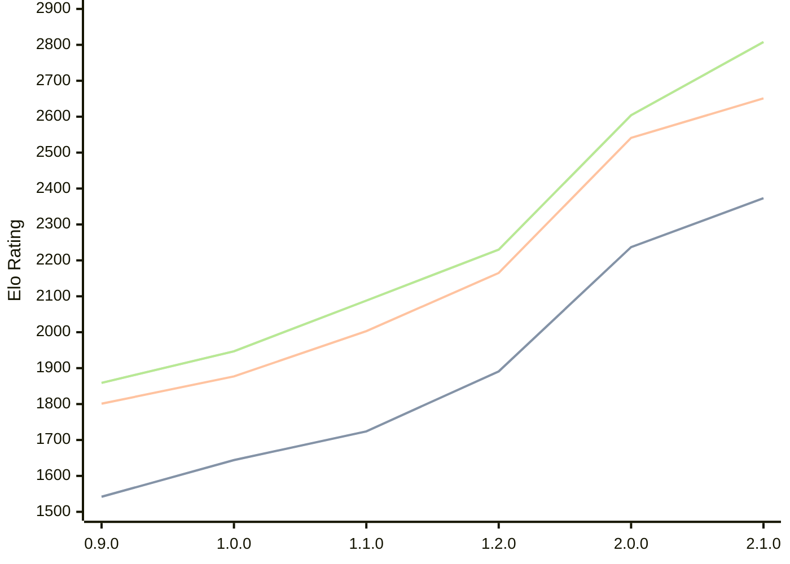

# Engine: Ratsu

Author: Eetu Rantala

Home: https://github.com/ranzuh/ratsu

## Elo Ratings

| Version | Published | STC 8.0+0.08s  | LTC 60.0+0.60s | VLTC 2m24s+1.12s | Comment |
| --- | --- | --- | --- | --- | --- |
| 2.1.0 | 2026-06-29 | 2373(+136) | 2651(+110) | 2808(+204) |  |
| 2.0.0 | 2026-05-23 | 2237(+346) | 2541(+376) | 2604(+374) |  |
| 1.2.0 | 2026-05-07 | 1891(+167) | 2165(+162) | 2230(+142) |  |
| 1.1.0 | 2026-04-21 | 1724(+80) | 2003(+126) | 2088(+141) |  |
| 1.0.0 | 2026-02-20 | 1644(+102) | 1877(+76) | 1947(+88) |  |
| 0.9.0 | 2026-01-21 | 1542 | 1801 | 1859 |  |
 | | | cElo (∆ prev) | cElo (∆ prev) | cElo (∆ prev) | 

<a href="https://github.com/computer-chess-index/cci/issues/new?template=submit-version.yml&title=[VERSION]+Ratsu+<version>&body=###%20Engine%20name%0ARatsu%0A%0A###%20Version%0A2.1.0" target="_blank">Submit new version</a>

 Test Conditions:

GUI/CLI: <a href=https://github.com/cutechess/cutechess target="_blank">Cute-Chess</a> 
Elo Calculation: <a href=https://www.remi-coulom.fr/Bayesian-Elo/ target="_blank">Bayesian-Elo</a> 
CPU: Intel(R) Core(TM) i5-7500T 2.70GHz 
Opening book: 8_moves_v3 
\* STC: 8.0+0.08s, LTC: 60.0+0.60s, VLTC: 2m24s+1.12s

 Lists:
Ratings: <a href=https://github.com/computer-chess-index/cci/blob/main/lists/CCIRatings.csv target="_blank">Complete list</a>

Generated: 2026-08-19 06:28:29

## Ratings Verlauf

⬛ STC (8.0+0.08s) &nbsp;&nbsp; 🟧 LTC (60.0+0.60s) &nbsp;&nbsp; 🟩 VLTC (2m24s+1.12s)

dark mode: 🟩STC (8.0+0.08s) 🟧LTC (60.0+0.60s) ⬜VLTC (2m24s+1.12s)

## Detailed Evaluation Results

| Version | Time Control | Elo  | Range +/- | Matches | Score | Average Opponent Elo | Draws |
| --- | --- | --- | --- | --- | --- | --- | --- |
| 2.1.0 | VLTC (2m24s+1.12s) | 2808 | 35 | 248 | 49% | 2812 | 40% |
| 2.1.0 | LTC (60.0+0.60s) | 2651 | 39 | 214 | 50% | 2653 | 31% |
| 2.1.0 | STC (8.0+0.08s) | 2373 | 34 | 298 | 49% | 2377 | 26% |
| --- | --- | --- | --- | --- | --- | --- | --- |
| 2.0.0 | VLTC (2m24s+1.12s) | 2604 | 48 | 136 | 49% | 2622 | 38% |
| 2.0.0 | LTC (60.0+0.60s) | 2541 | 45 | 168 | 54% | 2498 | 30% |
| 2.0.0 | STC (8.0+0.08s) | 2237 | 44 | 182 | 55% | 2183 | 24% |
| --- | --- | --- | --- | --- | --- | --- | --- |
| 1.2.0 | VLTC (2m24s+1.12s) | 2230 | 31 | 364 | 51% | 2223 | 26% |
| 1.2.0 | LTC (60.0+0.60s) | 2165 | 34 | 292 | 50% | 2152 | 28% |
| 1.2.0 | STC (8.0+0.08s) | 1891 | 32 | 356 | 51% | 1872 | 22% |
| --- | --- | --- | --- | --- | --- | --- | --- |
| 1.1.0 | VLTC (2m24s+1.12s) | 2088 | 32 | 348 | 53% | 2061 | 26% |
| 1.1.0 | LTC (60.0+0.60s) | 2003 | 33 | 326 | 51% | 1993 | 20% |
| 1.1.0 | STC (8.0+0.08s) | 1724 | 32 | 352 | 50% | 1710 | 22% |
| --- | --- | --- | --- | --- | --- | --- | --- |
| 1.0.0 | VLTC (2m24s+1.12s) | 1947 | 29 | 390 | 50% | 1948 | 27% |
| 1.0.0 | LTC (60.0+0.60s) | 1877 | 31 | 384 | 51% | 1870 | 18% |
| 1.0.0 | STC (8.0+0.08s) | 1644 | 30 | 394 | 48% | 1662 | 23% |
| --- | --- | --- | --- | --- | --- | --- | --- |
| 0.9.0 | VLTC (2m24s+1.12s) | 1859 | 41 | 208 | 50% | 1863 | 25% |
| 0.9.0 | LTC (60.0+0.60s) | 1801 | 36 | 280 | 53% | 1771 | 17% |
| 0.9.0 | STC (8.0+0.08s) | 1542 | 39 | 242 | 49% | 1551 | 18% |
| --- | --- | --- | --- | --- | --- | --- | --- |