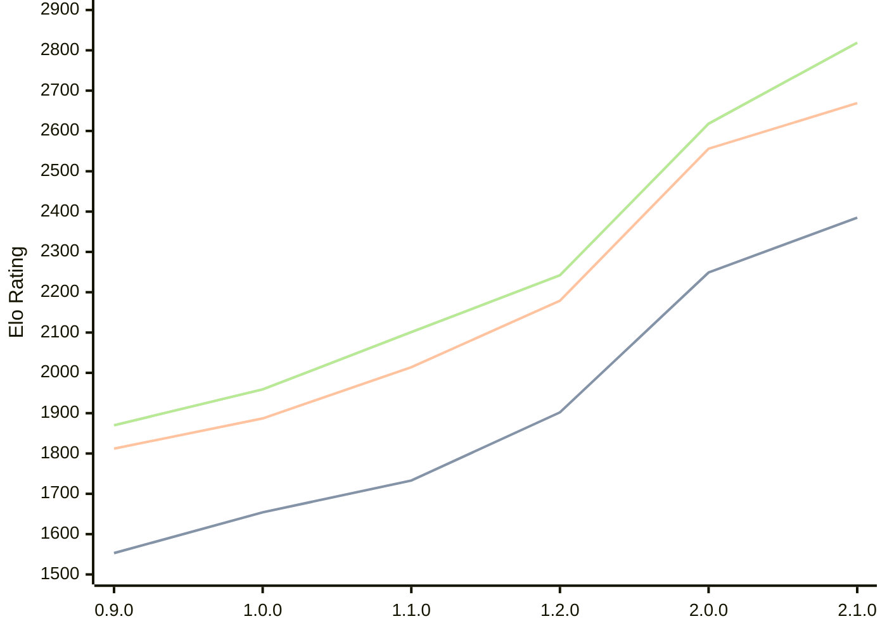

# Engine: Ratsu

Author: Eetu Rantala

Home: https://github.com/ranzuh/ratsu

## Elo Ratings E1

| Version | Published | STC 8.0+0.08s  | LTC 60.0+0.60s | VLTC 2m24s+1.12s | Comment |
| --- | --- | --- | --- | --- | --- |
| 2.1.0 | 2026-06-29 | 2263 | 2624 | 2673 |  |
 | | | cElo (∆ prev) | cElo (∆ prev) | cElo (∆ prev) | 

## Elo Ratings P1

| Version | Published | STC 8.0+0.08s  | LTC 60.0+0.60s | VLTC 2m24s+1.12s | Comment |
| --- | --- | --- | --- | --- | --- |
| 2.1.0 | 2026-06-29 | 2462 | 2811 | 2942 |  |
 | | | cElo (∆ prev) | cElo (∆ prev) | cElo (∆ prev) | 

## Elo Ratings T1

| Version | Published | STC 8.0+0.08s  | LTC 60.0+0.60s | VLTC 2m24s+1.12s | Comment |
| --- | --- | --- | --- | --- | --- |
| 2.1.0 | 2026-06-29 | 2385(+136) | 2669(+113) | 2819(+201) |  |
| 2.0.0 | 2026-05-23 | 2249(+347) | 2556(+377) | 2618(+376) |  |
| 1.2.0 | 2026-05-07 | 1902(+169) | 2179(+165) | 2242(+141) |  |
| 1.1.0 | 2026-04-21 | 1733(+79) | 2014(+127) | 2101(+142) |  |
| 1.0.0 | 2026-02-20 | 1654(+101) | 1887(+75) | 1959(+89) |  |
| 0.9.0 | 2026-01-21 | 1553 | 1812 | 1870 |  |
 | | | cElo (∆ prev) | cElo (∆ prev) | cElo (∆ prev) | 

<a href="https://github.com/computer-chess-index/cci/issues/new?template=submit-version.yml&title=[VERSION]+Ratsu+<version>&body=###%20Engine%20name%0ARatsu%0A%0A###%20Version%0A2.1.0" target="_blank">Submit new version</a>

 Test Conditions:

GUI/CLI: <a href=https://github.com/cutechess/cutechess target="_blank">Cute-Chess</a> 
Elo Calculation: <a href=https://www.remi-coulom.fr/Bayesian-Elo/ target="_blank">Bayesian-Elo</a> 
CPU for P1: Intel(R) Core(TM) Ultra 7 265T (1.50 GHz) - P-Core 
CPU for E1: Intel(R) Core(TM) Ultra 7 265T (1.50 GHz) - E-Core 
CPU for T1: Intel(R) Core(TM) i5-7500T 2.70GHz 
Opening book: 8_moves_v3 
\* STC: 8.0+0.08s, LTC: 60.0+0.60s, VLTC: 2m24s+1.12s

 Lists:
Ratings: <a href=https://github.com/computer-chess-index/cci/blob/main/lists/CCIRatings.csv target="_blank">Complete list</a>

Generated: 2026-10-09 14:15:28

## Ratings Verlauf

```mermaid
%%{init: {"theme":"base","themeVariables":{"seriesColors:['#a3a3a3','#222221','#faa371']}}}%%
xychart-beta
  x-axis ["0.9.0", "1.0.0", "1.1.0", "1.2.0", "2.0.0", "2.1.0"]
  y-axis "Elo Rating" 1500 --> 2900
  line "" [1553, 1654, 1733, 1902, 2249, 2385]
  line "STC (8.0+0.08s)" [1553, 1654, 1733, 1902, 2249, 2385]
  line "LTC (60.0+0.60s)" [1812, 1887, 2014, 2179, 2556, 2669]
  line "" [1870, 1959, 2101, 2242, 2618, 2819]
  line "VLTC (2m24s+1.12s)" [1870, 1959, 2101, 2242, 2618, 2819]
```

## Detailed Evaluation Results

| Version | Time Control | Elo  | Range +/- | Matches | Score | Average Opponent Elo | Draws |
| --- | --- | --- | --- | --- | --- | --- | --- |
| 2.1.0 | VLTC (2m24s+1.12s) | 2942 | 52 | 112 | 49% | 2963 | 46% |
| 2.1.0 | VLTC (2m24s+1.12s) | 2673 | 36 | 252 | 53% | 2637 | 32% |
| 2.1.0 | VLTC (2m24s+1.12s) | 2819 | 32 | 298 | 49% | 2827 | 39% |
| 2.1.0 | LTC (60.0+0.60s) | 2624 | 39 | 206 | 44% | 2677 | 38% |
| 2.1.0 | LTC (60.0+0.60s) | 2669 | 35 | 262 | 50% | 2668 | 33% |
| 2.1.0 | LTC (60.0+0.60s) | 2811 | 47 | 148 | 49% | 2822 | 33% |
| 2.1.0 | STC (8.0+0.08s) | 2263 | 39 | 228 | 46% | 2325 | 29% |
| --- | --- | --- | --- | --- | --- | --- | --- |
| 2.1.0 | STC (8.0+0.08s) | 2385 | 31 | 346 | 49% | 2390 | 26% |
| --- | --- | --- | --- | --- | --- | --- | --- |
| 2.1.0 | STC (8.0+0.08s) | 2462 | 44 | 180 | 45% | 2522 | 28% |
| --- | --- | --- | --- | --- | --- | --- | --- |
| 2.0.0 | VLTC (2m24s+1.12s) | 2618 | 48 | 136 | 49% | 2635 | 38% |
| 2.0.0 | LTC (60.0+0.60s) | 2556 | 45 | 168 | 54% | 2514 | 30% |
| 2.0.0 | STC (8.0+0.08s) | 2249 | 44 | 182 | 55% | 2196 | 24% |
| --- | --- | --- | --- | --- | --- | --- | --- |
| 1.2.0 | VLTC (2m24s+1.12s) | 2242 | 31 | 364 | 51% | 2237 | 26% |
| 1.2.0 | LTC (60.0+0.60s) | 2179 | 34 | 292 | 50% | 2165 | 28% |
| 1.2.0 | STC (8.0+0.08s) | 1902 | 32 | 356 | 51% | 1883 | 22% |
| --- | --- | --- | --- | --- | --- | --- | --- |
| 1.1.0 | VLTC (2m24s+1.12s) | 2101 | 32 | 348 | 53% | 2074 | 26% |
| 1.1.0 | LTC (60.0+0.60s) | 2014 | 33 | 326 | 51% | 2005 | 20% |
| 1.1.0 | STC (8.0+0.08s) | 1733 | 32 | 352 | 50% | 1720 | 22% |
| --- | --- | --- | --- | --- | --- | --- | --- |
| 1.0.0 | VLTC (2m24s+1.12s) | 1959 | 29 | 390 | 50% | 1959 | 27% |
| 1.0.0 | LTC (60.0+0.60s) | 1887 | 31 | 384 | 51% | 1881 | 18% |
| 1.0.0 | STC (8.0+0.08s) | 1654 | 30 | 394 | 48% | 1673 | 23% |
| --- | --- | --- | --- | --- | --- | --- | --- |
| 0.9.0 | VLTC (2m24s+1.12s) | 1870 | 41 | 208 | 50% | 1874 | 25% |
| 0.9.0 | LTC (60.0+0.60s) | 1812 | 36 | 280 | 53% | 1781 | 17% |
| 0.9.0 | STC (8.0+0.08s) | 1553 | 39 | 242 | 49% | 1561 | 18% |
| --- | --- | --- | --- | --- | --- | --- | --- |