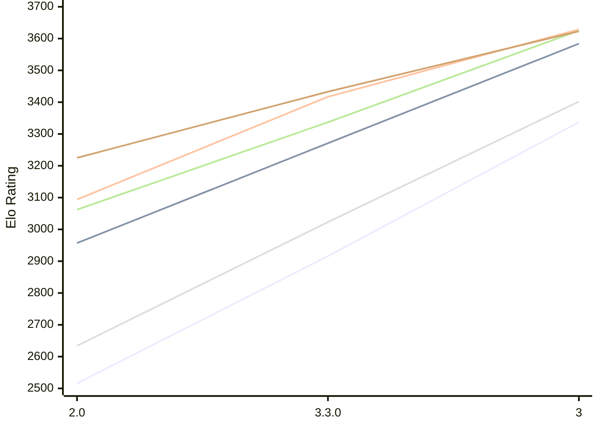

# Engine: Ravager

Author: Abhinav Tiwari

Home: https://github.com/erensh27/Ravager

## Elo Ratings E1 (Ultra 7 265T (1.50 GHz) - E-Core)

| Version | Published | STC 8.0+0.08s  | LTC 60.0+0.60s | VLTC 2m24s+1.12s | Comment |
| --- | --- | --- | --- | --- | --- |
| 3 | 2026-10-22 | 3337(+421) | 3584(+313) | 3629(+212) |  |
| 3.3.0 | 2026-10-09 | 2916(+400) | 3271(+314) | 3417(+323) |  |
| 2.0 | 2026-08-23 | 2516 | 2957 | 3094 |  |
 | | | cElo (∆ prev) | cElo (∆ prev) | cElo (∆ prev) | 

## Elo Ratings P1 (Ultra 7 265T (1.50 GHz) - P-Core)

| Version | Published | STC 8.0+0.08s  | LTC 60.0+0.60s | VLTC 2m24s+1.12s | Comment |
| --- | --- | --- | --- | --- | --- |
| 3 | 2026-10-22 | 3402(+379) | 3625(+288) | 3623(+190) |  |
| 3.3.0 | 2026-10-09 | 3023(+389) | 3337(+275) | 3433(+208) |  |
| 2.0 | 2026-08-23 | 2634 | 3062 | 3225 |  |
 | | | cElo (∆ prev) | cElo (∆ prev) | cElo (∆ prev) | 

## Elo Ratings T1 (i5-7500T 2.70GHz)

| Version | Published | STC 8.0+0.08s  | LTC 60.0+0.60s | VLTC 2m24s+1.12s | Comment |
| --- | --- | --- | --- | --- | --- |
| 2.0 | 2026-08-23 | 2757 | 3109 | 3220 |  |
 | | | cElo (∆ prev) | cElo (∆ prev) | cElo (∆ prev) | 

<a href="https://github.com/computer-chess-index/cci/issues/new?template=submit-version.yml&title=[VERSION]+Ravager+<version>&body=###%20Engine%20name%0ARavager%0A%0A###%20Version%0A2.0" target="_blank">Submit new version</a>

 Test Conditions:

GUI/CLI: <a href=https://github.com/cutechess/cutechess target="_blank">Cute-Chess</a> 
Elo Calculation: <a href=https://www.remi-coulom.fr/Bayesian-Elo/ target="_blank">Bayesian-Elo</a> 
CPU for P1: Intel(R) Core(TM) Ultra 7 265T (1.50 GHz) - P-Core 
CPU for E1: Intel(R) Core(TM) Ultra 7 265T (1.50 GHz) - E-Core 
CPU for T1: Intel(R) Core(TM) i5-7500T 2.70GHz 
Opening book: 8_moves_v3 
\* STC: 8.0+0.08s, LTC: 60.0+0.60s, VLTC: 2m24s+1.12s

 Lists:
Ratings: <a href=https://github.com/computer-chess-index/cci/blob/main/lists/CCIRatings.csv target="_blank">Complete list</a>

Generated: 2026-11-13 05:41:57

## Ratings Verlauf E1 / P1

```mermaid
%%{init: {"theme":"base","themeVariables":{"seriesColors:['#a3a3a3','#222221','#faa371']}}}%%
xychart-beta
  x-axis ["2.0", "3.3.0", "3"]
  y-axis "Elo Rating" 2500 --> 3700
  line "E1: STC (8.0+0.08s)" [2516, 2916, 3337]
  line "E1: LTC (60.0+0.60s)" [2957, 3271, 3584]
  line "E1: VLTC (2m24s+1.12s)" [3094, 3417, 3629]
  line "P1: STC (8.0+0.08s)" [2634, 3023, 3402]
  line "P1: LTC (60.0+0.60s)" [3062, 3337, 3625]
  line "P1: VLTC (2m24s+1.12s)" [3225, 3433, 3623]
```

## Detailed Evaluation Results

| Version | Time Control | Variant | Elo  | Range +/- | Matches | Score | Average Opponent Elo | Draws |
| --- | --- |--- | --- | --- | --- | --- | --- | --- |
| 3 | VLTC (2m24s+1.12s) | P1 | 3623 | 39 | 160 | 55% | 3590 | 81% |
|  |  | E1 | 3629 | 30 | 258 | 48% | 3640 | 86% |
|  | LTC (60.0+0.60s) | E1 | 3584 | 33 | 218 | 54% | 3557 | 81% |
|  |  | P1 | 3625 | 39 | 152 | 48% | 3636 | 81% |
|  | STC (8.0+0.08s) | E1 | 3337 | 29 | 328 | 55% | 3294 | 61% |
|  |  | P1 | 3402 | 41 | 148 | 53% | 3375 | 72% |
| --- | --- |--- | --- | --- | --- | --- | --- | --- |
| 3.3.0 | VLTC (2m24s+1.12s) | P1 | 3433 | 43 | 134 | 53% | 3410 | 69% |
|  |  | E1 | 3417 | 34 | 208 | 50% | 3414 | 76% |
|  | LTC (60.0+0.60s) | P1 | 3337 | 28 | 326 | 56% | 3290 | 68% |
|  |  | E1 | 3271 | 30 | 280 | 54% | 3240 | 67% |
|  | STC (8.0+0.08s) | P1 | 3023 | 36 | 224 | 51% | 2996 | 56% |
|  |  | E1 | 2916 | 35 | 242 | 52% | 2897 | 48% |
| --- | --- |--- | --- | --- | --- | --- | --- | --- |
| 2.0 | VLTC (2m24s+1.12s) | P1 | 3225 | 37 | 204 | 49% | 3236 | 54% |
|  |  | E1 | 3094 | 30 | 302 | 44% | 3144 | 56% |
|  |  | T1 | 3220 | 31 | 274 | 50% | 3218 | 64% |
|  | LTC (60.0+0.60s) | E1 | 2957 | 30 | 322 | 42% | 3020 | 56% |
|  |  | T1 | 3109 | 30 | 302 | 50% | 3109 | 57% |
|  |  | P1 | 3062 | 39 | 184 | 48% | 3075 | 52% |
|  | STC (8.0+0.08s) | E1 | 2516 | 35 | 298 | 39% | 2635 | 26% |
|  |  | T1 | 2757 | 35 | 256 | 49% | 2761 | 38% |
|  |  | P1 | 2634 | 37 | 216 | 48% | 2645 | 43% |