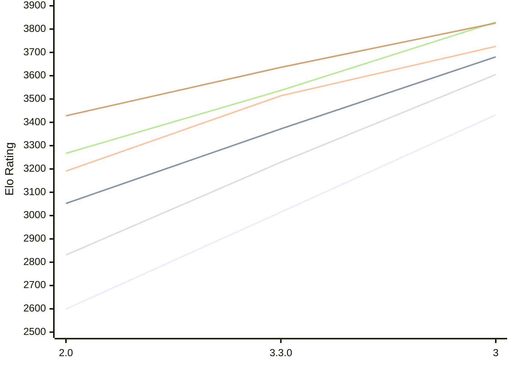

# Engine: Ravager

Author: Abhinav Tiwari

Home: https://github.com/erensh27/Ravager

## Elo Ratings E1 (Ultra 7 265T (1.50 GHz) - E-Core)

| Version | Published | STC 8.0+0.08s  | LTC 60.0+0.60s | VLTC 2m24s+1.12s | Comment |
| --- | --- | --- | --- | --- | --- |
| 3 | 2026-10-22 | 3432(+417) | 3681(+309) | 3726(+212) |  |
| 3.3.0 | 2026-10-09 | 3015(+416) | 3372(+320) | 3514(+323) |  |
| 2.0 | 2026-08-23 | 2599 | 3052 | 3191 |  |
 | | | cElo (∆ prev) | cElo (∆ prev) | cElo (∆ prev) | 

## Elo Ratings P1 (Ultra 7 265T (1.50 GHz) - P-Core)

| Version | Published | STC 8.0+0.08s  | LTC 60.0+0.60s | VLTC 2m24s+1.12s | Comment |
| --- | --- | --- | --- | --- | --- |
| 3 | 2026-10-22 | 3605(+376) | 3830(+293) | 3826(+190) |  |
| 3.3.0 | 2026-10-09 | 3229(+398) | 3537(+270) | 3636(+208) |  |
| 2.0 | 2026-08-23 | 2831 | 3267 | 3428 |  |
 | | | cElo (∆ prev) | cElo (∆ prev) | cElo (∆ prev) | 

## Elo Ratings T1 (i5-7500T 2.70GHz)

| Version | Published | STC 8.0+0.08s  | LTC 60.0+0.60s | VLTC 2m24s+1.12s | Comment |
| --- | --- | --- | --- | --- | --- |
| 2.0 | 2026-08-23 | 2757 | 3109 | 3220 |  |
 | | | cElo (∆ prev) | cElo (∆ prev) | cElo (∆ prev) | 

<a href="https://github.com/computer-chess-index/cci/issues/new?template=submit-version.yml&title=[VERSION]+Ravager+<version>&body=###%20Engine%20name%0ARavager%0A%0A###%20Version%0A2.0" target="_blank">Submit new version</a>

 Test Conditions:

GUI/CLI: <a href=https://github.com/cutechess/cutechess target="_blank">Cute-Chess</a> 
Elo Calculation: <a href=https://www.remi-coulom.fr/Bayesian-Elo/ target="_blank">Bayesian-Elo</a> 
CPU for P1: Intel(R) Core(TM) Ultra 7 265T (1.50 GHz) - P-Core 
CPU for E1: Intel(R) Core(TM) Ultra 7 265T (1.50 GHz) - E-Core 
CPU for T1: Intel(R) Core(TM) i5-7500T 2.70GHz 
Opening book: 8_moves_v3 
\* STC: 8.0+0.08s, LTC: 60.0+0.60s, VLTC: 2m24s+1.12s

 Lists:
Ratings: <a href=https://github.com/computer-chess-index/cci/blob/main/lists/CCIRatings.csv target="_blank">Complete list</a>

Generated: 2026-11-06 05:41:25

## Ratings Verlauf E1 / P1

```mermaid
%%{init: {"theme":"base","themeVariables":{"seriesColors:['#a3a3a3','#222221','#faa371']}}}%%
xychart-beta
  x-axis ["2.0", "3.3.0", "3"]
  y-axis "Elo Rating" 2500 --> 3900
  line "E1: STC (8.0+0.08s)" [2599, 3015, 3432]
  line "E1: LTC (60.0+0.60s)" [3052, 3372, 3681]
  line "E1: VLTC (2m24s+1.12s)" [3191, 3514, 3726]
  line "P1: STC (8.0+0.08s)" [2831, 3229, 3605]
  line "P1: LTC (60.0+0.60s)" [3267, 3537, 3830]
  line "P1: VLTC (2m24s+1.12s)" [3428, 3636, 3826]
```

## Detailed Evaluation Results

| Version | Time Control | Variant | Elo  | Range +/- | Matches | Score | Average Opponent Elo | Draws |
| --- | --- |--- | --- | --- | --- | --- | --- | --- |
| 3 | VLTC (2m24s+1.12s) | P1 | 3826 | 39 | 156 | 55% | 3792 | 81% |
|  |  | E1 | 3726 | 31 | 246 | 48% | 3740 | 87% |
|  | LTC (60.0+0.60s) | P1 | 3830 | 41 | 144 | 48% | 3839 | 81% |
|  |  | E1 | 3681 | 34 | 208 | 54% | 3653 | 80% |
|  | STC (8.0+0.08s) | P1 | 3605 | 43 | 136 | 53% | 3576 | 71% |
|  |  | E1 | 3432 | 30 | 308 | 55% | 3389 | 61% |
| --- | --- |--- | --- | --- | --- | --- | --- | --- |
| 3.3.0 | VLTC (2m24s+1.12s) | P1 | 3636 | 43 | 134 | 53% | 3613 | 69% |
|  |  | E1 | 3514 | 34 | 208 | 50% | 3511 | 76% |
|  | LTC (60.0+0.60s) | P1 | 3537 | 28 | 322 | 56% | 3490 | 68% |
|  |  | E1 | 3372 | 31 | 276 | 54% | 3337 | 68% |
|  | STC (8.0+0.08s) | P1 | 3229 | 36 | 216 | 50% | 3218 | 56% |
|  |  | E1 | 3015 | 36 | 226 | 54% | 2985 | 48% |
| --- | --- |--- | --- | --- | --- | --- | --- | --- |
| 2.0 | VLTC (2m24s+1.12s) | T1 | 3220 | 31 | 274 | 50% | 3218 | 64% |
|  |  | P1 | 3428 | 37 | 204 | 49% | 3438 | 54% |
|  |  | E1 | 3191 | 30 | 302 | 44% | 3241 | 56% |
|  | LTC (60.0+0.60s) | T1 | 3109 | 30 | 302 | 50% | 3109 | 57% |
|  |  | P1 | 3267 | 39 | 184 | 48% | 3281 | 52% |
|  |  | E1 | 3052 | 30 | 322 | 42% | 3116 | 56% |
|  | STC (8.0+0.08s) | P1 | 2831 | 37 | 216 | 48% | 2842 | 43% |
|  |  | E1 | 2599 | 35 | 298 | 39% | 2718 | 26% |
|  |  | T1 | 2757 | 35 | 256 | 49% | 2761 | 38% |