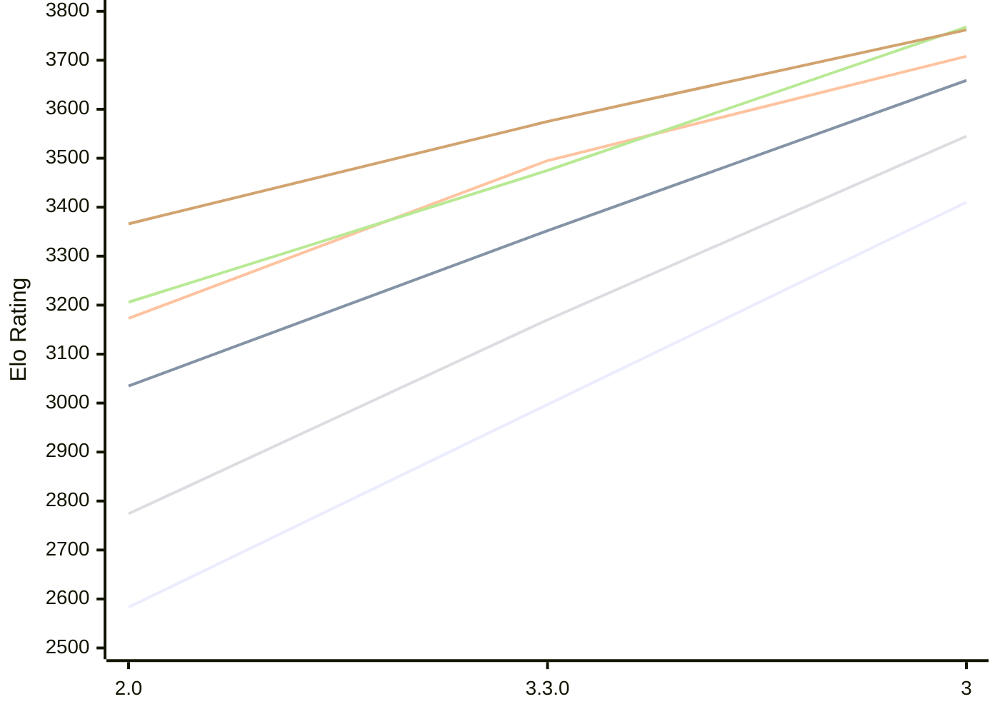

# Engine: Ravager

Author: Abhinav Tiwari

Home: https://github.com/erensh27/Ravager

## Elo Ratings E1 (Ultra 7 265T (1.50 GHz) - E-Core)

| Version | Published | STC 8.0+0.08s  | LTC 60.0+0.60s | VLTC 2m24s+1.12s | Comment |
| --- | --- | --- | --- | --- | --- |
| 3 | 2026-10-22 | 3410(+413) | 3659(+307) | 3708(+213) |  |
| 3.3.0 | 2026-10-09 | 2997(+414) | 3352(+317) | 3495(+322) |  |
| 2.0 | 2026-08-23 | 2583 | 3035 | 3173 |  |
 | | | cElo (∆ prev) | cElo (∆ prev) | cElo (∆ prev) | 

## Elo Ratings P1 (Ultra 7 265T (1.50 GHz) - P-Core)

| Version | Published | STC 8.0+0.08s  | LTC 60.0+0.60s | VLTC 2m24s+1.12s | Comment |
| --- | --- | --- | --- | --- | --- |
| 3 | 2026-10-22 | 3545(+375) | 3768(+293) | 3762(+187) |  |
| 3.3.0 | 2026-10-09 | 3170(+396) | 3475(+269) | 3575(+209) |  |
| 2.0 | 2026-08-23 | 2774 | 3206 | 3366 |  |
 | | | cElo (∆ prev) | cElo (∆ prev) | cElo (∆ prev) | 

## Elo Ratings T1 (i5-7500T 2.70GHz)

| Version | Published | STC 8.0+0.08s  | LTC 60.0+0.60s | VLTC 2m24s+1.12s | Comment |
| --- | --- | --- | --- | --- | --- |
| 2.0 | 2026-08-23 | 2757 | 3109 | 3220 |  |
 | | | cElo (∆ prev) | cElo (∆ prev) | cElo (∆ prev) | 

<a href="https://github.com/computer-chess-index/cci/issues/new?template=submit-version.yml&title=[VERSION]+Ravager+<version>&body=###%20Engine%20name%0ARavager%0A%0A###%20Version%0A2.0" target="_blank">Submit new version</a>

 Test Conditions:

GUI/CLI: <a href=https://github.com/cutechess/cutechess target="_blank">Cute-Chess</a> 
Elo Calculation: <a href=https://www.remi-coulom.fr/Bayesian-Elo/ target="_blank">Bayesian-Elo</a> 
CPU for P1: Intel(R) Core(TM) Ultra 7 265T (1.50 GHz) - P-Core 
CPU for E1: Intel(R) Core(TM) Ultra 7 265T (1.50 GHz) - E-Core 
CPU for T1: Intel(R) Core(TM) i5-7500T 2.70GHz 
Opening book: 8_moves_v3 
\* STC: 8.0+0.08s, LTC: 60.0+0.60s, VLTC: 2m24s+1.12s

 Lists:
Ratings: <a href=https://github.com/computer-chess-index/cci/blob/main/lists/CCIRatings.csv target="_blank">Complete list</a>

Generated: 2026-11-02 05:42:08

## Ratings Verlauf E1 / P1

```mermaid
%%{init: {"theme":"base","themeVariables":{"seriesColors:['#a3a3a3','#222221','#faa371']}}}%%
xychart-beta
  x-axis ["2.0", "3.3.0", "3"]
  y-axis "Elo Rating" 2500 --> 3800
  line "E1: STC (8.0+0.08s)" [2583, 2997, 3410]
  line "E1: LTC (60.0+0.60s)" [3035, 3352, 3659]
  line "E1: VLTC (2m24s+1.12s)" [3173, 3495, 3708]
  line "P1: STC (8.0+0.08s)" [2774, 3170, 3545]
  line "P1: LTC (60.0+0.60s)" [3206, 3475, 3768]
  line "P1: VLTC (2m24s+1.12s)" [3366, 3575, 3762]
```

## Detailed Evaluation Results

| Version | Time Control | Variant | Elo  | Range +/- | Matches | Score | Average Opponent Elo | Draws |
| --- | --- |--- | --- | --- | --- | --- | --- | --- |
| 3 | VLTC (2m24s+1.12s) | P1 | 3762 | 41 | 144 | 56% | 3726 | 79% |
|  |  | E1 | 3708 | 32 | 226 | 47% | 3723 | 86% |
|  | LTC (60.0+0.60s) | P1 | 3768 | 42 | 136 | 48% | 3777 | 79% |
|  |  | E1 | 3659 | 38 | 170 | 54% | 3625 | 81% |
|  | STC (8.0+0.08s) | P1 | 3545 | 43 | 136 | 53% | 3515 | 71% |
|  |  | E1 | 3410 | 31 | 272 | 56% | 3363 | 61% |
| --- | --- |--- | --- | --- | --- | --- | --- | --- |
| 3.3.0 | VLTC (2m24s+1.12s) | P1 | 3575 | 43 | 134 | 53% | 3552 | 69% |
|  |  | E1 | 3495 | 34 | 208 | 50% | 3492 | 76% |
|  | LTC (60.0+0.60s) | P1 | 3475 | 28 | 322 | 56% | 3429 | 68% |
|  |  | E1 | 3352 | 31 | 276 | 54% | 3318 | 68% |
|  | STC (8.0+0.08s) | P1 | 3170 | 36 | 216 | 50% | 3158 | 56% |
|  |  | E1 | 2997 | 36 | 226 | 54% | 2966 | 48% |
| --- | --- |--- | --- | --- | --- | --- | --- | --- |
| 2.0 | VLTC (2m24s+1.12s) | P1 | 3366 | 37 | 204 | 49% | 3376 | 54% |
|  |  | E1 | 3173 | 30 | 302 | 44% | 3222 | 56% |
|  |  | T1 | 3220 | 31 | 274 | 50% | 3218 | 64% |
|  | LTC (60.0+0.60s) | P1 | 3206 | 39 | 184 | 48% | 3220 | 52% |
|  |  | E1 | 3035 | 30 | 322 | 42% | 3098 | 56% |
|  |  | T1 | 3109 | 30 | 302 | 50% | 3109 | 57% |
|  | STC (8.0+0.08s) | P1 | 2774 | 37 | 216 | 48% | 2784 | 43% |
|  |  | E1 | 2583 | 35 | 298 | 39% | 2703 | 26% |
|  |  | T1 | 2757 | 35 | 256 | 49% | 2761 | 38% |