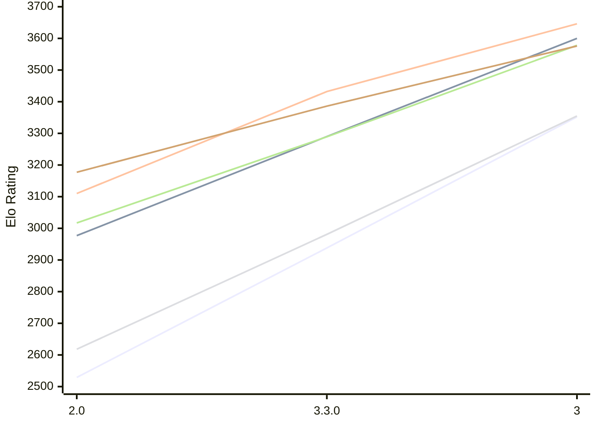

# Engine: Ravager

Author: Abhinav Tiwari

Home: https://github.com/erensh27/Ravager

## Elo Ratings E1 (Ultra 7 265T (1.50 GHz) - E-Core)

| Version | Published | STC 8.0+0.08s  | LTC 60.0+0.60s | VLTC 2m24s+1.12s | Comment |
| --- | --- | --- | --- | --- | --- |
| 3 | 2026-10-22 | 3352(+414) | 3600(+310) | 3646(+214) |  |
| 3.3.0 | 2026-10-09 | 2938(+409) | 3290(+313) | 3432(+322) |  |
| 2.0 | 2026-08-23 | 2529 | 2977 | 3110 |  |
 | | | cElo (∆ prev) | cElo (∆ prev) | cElo (∆ prev) | 

## Elo Ratings P1 (Ultra 7 265T (1.50 GHz) - P-Core)

| Version | Published | STC 8.0+0.08s  | LTC 60.0+0.60s | VLTC 2m24s+1.12s | Comment |
| --- | --- | --- | --- | --- | --- |
| 3 | 2026-10-22 | 3355(+374) | 3578(+289) | 3576(+190) |  |
| 3.3.0 | 2026-10-09 | 2981(+363) | 3289(+272) | 3386(+209) |  |
| 2.0 | 2026-08-23 | 2618 | 3017 | 3177 |  |
 | | | cElo (∆ prev) | cElo (∆ prev) | cElo (∆ prev) | 

## Elo Ratings T1 (i5-7500T 2.70GHz)

| Version | Published | STC 8.0+0.08s  | LTC 60.0+0.60s | VLTC 2m24s+1.12s | Comment |
| --- | --- | --- | --- | --- | --- |
| 2.0 | 2026-08-23 | 2757 | 3109 | 3220 |  |
 | | | cElo (∆ prev) | cElo (∆ prev) | cElo (∆ prev) | 

<a href="https://github.com/computer-chess-index/cci/issues/new?template=submit-version.yml&title=[VERSION]+Ravager+<version>&body=###%20Engine%20name%0ARavager%0A%0A###%20Version%0A2.0" target="_blank">Submit new version</a>

 Test Conditions:

GUI/CLI: <a href=https://github.com/cutechess/cutechess target="_blank">Cute-Chess</a> 
Elo Calculation: <a href=https://www.remi-coulom.fr/Bayesian-Elo/ target="_blank">Bayesian-Elo</a> 
CPU for P1: Intel(R) Core(TM) Ultra 7 265T (1.50 GHz) - P-Core 
CPU for E1: Intel(R) Core(TM) Ultra 7 265T (1.50 GHz) - E-Core 
CPU for T1: Intel(R) Core(TM) i5-7500T 2.70GHz 
Opening book: 8_moves_v3 
\* STC: 8.0+0.08s, LTC: 60.0+0.60s, VLTC: 2m24s+1.12s

 Lists:
Ratings: <a href=https://github.com/computer-chess-index/cci/blob/main/lists/CCIRatings.csv target="_blank">Complete list</a>

Generated: 2026-11-15 05:41:50

## Ratings Verlauf E1 / P1

```mermaid
%%{init: {"theme":"base","themeVariables":{"seriesColors:['#a3a3a3','#222221','#faa371']}}}%%
xychart-beta
  x-axis ["2.0", "3.3.0", "3"]
  y-axis "Elo Rating" 2500 --> 3700
  line "E1: STC (8.0+0.08s)" [2529, 2938, 3352]
  line "E1: LTC (60.0+0.60s)" [2977, 3290, 3600]
  line "E1: VLTC (2m24s+1.12s)" [3110, 3432, 3646]
  line "P1: STC (8.0+0.08s)" [2618, 2981, 3355]
  line "P1: LTC (60.0+0.60s)" [3017, 3289, 3578]
  line "P1: VLTC (2m24s+1.12s)" [3177, 3386, 3576]
```

## Detailed Evaluation Results

| Version | Time Control | Variant | Elo  | Range +/- | Matches | Score | Average Opponent Elo | Draws |
| --- | --- |--- | --- | --- | --- | --- | --- | --- |
| 3 | VLTC (2m24s+1.12s) | E1 | 3646 | 30 | 258 | 48% | 3657 | 86% |
|  |  | P1 | 3576 | 39 | 160 | 55% | 3542 | 81% |
|  | LTC (60.0+0.60s) | E1 | 3600 | 33 | 222 | 54% | 3572 | 81% |
|  |  | P1 | 3578 | 39 | 152 | 48% | 3588 | 81% |
|  | STC (8.0+0.08s) | E1 | 3352 | 28 | 348 | 55% | 3312 | 62% |
|  |  | P1 | 3355 | 41 | 148 | 53% | 3328 | 72% |
| --- | --- |--- | --- | --- | --- | --- | --- | --- |
| 3.3.0 | VLTC (2m24s+1.12s) | P1 | 3386 | 43 | 134 | 53% | 3363 | 69% |
|  |  | E1 | 3432 | 33 | 220 | 50% | 3429 | 75% |
|  | LTC (60.0+0.60s) | P1 | 3289 | 28 | 326 | 56% | 3241 | 68% |
|  |  | E1 | 3290 | 29 | 300 | 54% | 3259 | 68% |
|  | STC (8.0+0.08s) | P1 | 2981 | 35 | 232 | 50% | 2961 | 55% |
|  |  | E1 | 2938 | 35 | 242 | 52% | 2919 | 48% |
| --- | --- |--- | --- | --- | --- | --- | --- | --- |
| 2.0 | VLTC (2m24s+1.12s) | E1 | 3110 | 30 | 302 | 44% | 3160 | 56% |
|  |  | T1 | 3220 | 31 | 274 | 50% | 3218 | 64% |
|  |  | P1 | 3177 | 37 | 204 | 49% | 3187 | 54% |
|  | LTC (60.0+0.60s) | E1 | 2977 | 30 | 322 | 42% | 3039 | 56% |
|  |  | T1 | 3109 | 30 | 302 | 50% | 3109 | 57% |
|  |  | P1 | 3017 | 39 | 184 | 48% | 3031 | 52% |
|  | STC (8.0+0.08s) | E1 | 2529 | 35 | 298 | 39% | 2647 | 26% |
|  |  | T1 | 2757 | 35 | 256 | 49% | 2761 | 38% |
|  |  | P1 | 2618 | 37 | 216 | 48% | 2628 | 43% |