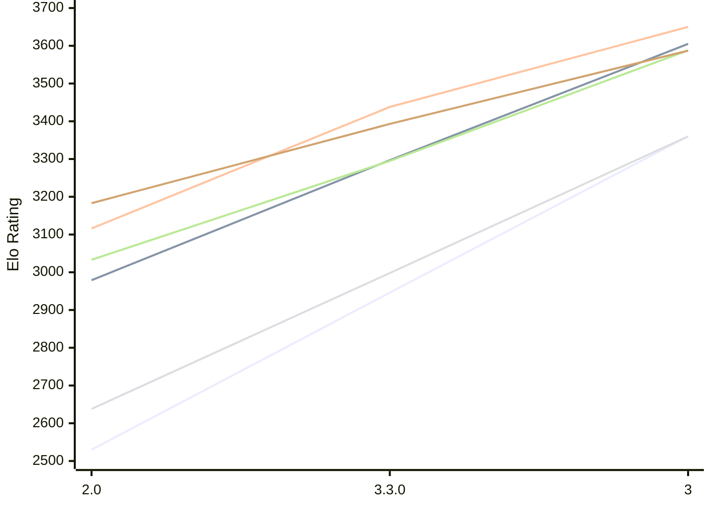

# Engine: Ravager

Author: Abhinav Tiwari

Home: https://github.com/erensh27/Ravager

## Elo Ratings E1 (Ultra 7 265T (1.50 GHz) - E-Core)

| Version | Published | STC 8.0+0.08s  | LTC 60.0+0.60s | VLTC 2m24s+1.12s | Comment |
| --- | --- | --- | --- | --- | --- |
| 3 | 2026-10-22 | 3360(+414) | 3605(+308) | 3650(+212) |  |
| 3.3.0 | 2026-10-09 | 2946(+416) | 3297(+318) | 3438(+322) |  |
| 2.0 | 2026-08-23 | 2530 | 2979 | 3116 |  |
 | | | cElo (∆ prev) | cElo (∆ prev) | cElo (∆ prev) | 

## Elo Ratings P1 (Ultra 7 265T (1.50 GHz) - P-Core)

| Version | Published | STC 8.0+0.08s  | LTC 60.0+0.60s | VLTC 2m24s+1.12s | Comment |
| --- | --- | --- | --- | --- | --- |
| 3 | 2026-10-22 | 3360(+362) | 3588(+293) | 3587(+194) |  |
| 3.3.0 | 2026-10-09 | 2998(+360) | 3295(+262) | 3393(+210) |  |
| 2.0 | 2026-08-23 | 2638 | 3033 | 3183 |  |
 | | | cElo (∆ prev) | cElo (∆ prev) | cElo (∆ prev) | 

## Elo Ratings T1 (i5-7500T 2.70GHz)

| Version | Published | STC 8.0+0.08s  | LTC 60.0+0.60s | VLTC 2m24s+1.12s | Comment |
| --- | --- | --- | --- | --- | --- |
| 2.0 | 2026-08-23 | 2757 | 3109 | 3220 |  |
 | | | cElo (∆ prev) | cElo (∆ prev) | cElo (∆ prev) | 

<a href="https://github.com/computer-chess-index/cci/issues/new?template=submit-version.yml&title=[VERSION]+Ravager+<version>&body=###%20Engine%20name%0ARavager%0A%0A###%20Version%0A2.0" target="_blank">Submit new version</a>

 Test Conditions:

GUI/CLI: <a href=https://github.com/cutechess/cutechess target="_blank">Cute-Chess</a> 
Elo Calculation: <a href=https://www.remi-coulom.fr/Bayesian-Elo/ target="_blank">Bayesian-Elo</a> 
CPU for P1: Intel(R) Core(TM) Ultra 7 265T (1.50 GHz) - P-Core 
CPU for E1: Intel(R) Core(TM) Ultra 7 265T (1.50 GHz) - E-Core 
CPU for T1: Intel(R) Core(TM) i5-7500T 2.70GHz 
Opening book: 8_moves_v3 
\* STC: 8.0+0.08s, LTC: 60.0+0.60s, VLTC: 2m24s+1.12s

 Lists:
Ratings: <a href=https://github.com/computer-chess-index/cci/blob/main/lists/CCIRatings.csv target="_blank">Complete list</a>

Generated: 2026-11-18 05:42:23

## Ratings Verlauf E1 / P1

```mermaid
%%{init: {"theme":"base","themeVariables":{"seriesColors:['#a3a3a3','#222221','#faa371']}}}%%
xychart-beta
  x-axis ["2.0", "3.3.0", "3"]
  y-axis "Elo Rating" 2500 --> 3700
  line "E1: STC (8.0+0.08s)" [2530, 2946, 3360]
  line "E1: LTC (60.0+0.60s)" [2979, 3297, 3605]
  line "E1: VLTC (2m24s+1.12s)" [3116, 3438, 3650]
  line "P1: STC (8.0+0.08s)" [2638, 2998, 3360]
  line "P1: LTC (60.0+0.60s)" [3033, 3295, 3588]
  line "P1: VLTC (2m24s+1.12s)" [3183, 3393, 3587]
```

## Detailed Evaluation Results

| Version | Time Control | Variant | Elo  | Range +/- | Matches | Score | Average Opponent Elo | Draws |
| --- | --- |--- | --- | --- | --- | --- | --- | --- |
| 3 | VLTC (2m24s+1.12s) | P1 | 3587 | 39 | 160 | 55% | 3553 | 81% |
|  |  | E1 | 3650 | 30 | 262 | 48% | 3661 | 86% |
|  | LTC (60.0+0.60s) | P1 | 3588 | 39 | 156 | 48% | 3599 | 81% |
|  |  | E1 | 3605 | 33 | 226 | 54% | 3576 | 81% |
|  | STC (8.0+0.08s) | P1 | 3360 | 41 | 152 | 53% | 3333 | 72% |
|  |  | E1 | 3360 | 27 | 362 | 55% | 3318 | 62% |
| --- | --- |--- | --- | --- | --- | --- | --- | --- |
| 3.3.0 | VLTC (2m24s+1.12s) | P1 | 3393 | 43 | 138 | 53% | 3370 | 70% |
|  |  | E1 | 3438 | 32 | 244 | 50% | 3436 | 76% |
|  | LTC (60.0+0.60s) | P1 | 3295 | 28 | 334 | 57% | 3248 | 68% |
|  |  | E1 | 3297 | 29 | 312 | 54% | 3267 | 68% |
|  | STC (8.0+0.08s) | E1 | 2946 | 34 | 258 | 53% | 2924 | 49% |
|  |  | P1 | 2998 | 35 | 240 | 50% | 2981 | 55% |
| --- | --- |--- | --- | --- | --- | --- | --- | --- |
| 2.0 | VLTC (2m24s+1.12s) | T1 | 3220 | 31 | 274 | 50% | 3218 | 64% |
|  |  | P1 | 3183 | 37 | 204 | 49% | 3194 | 54% |
|  |  | E1 | 3116 | 30 | 302 | 44% | 3166 | 56% |
|  | LTC (60.0+0.60s) | T1 | 3109 | 30 | 302 | 50% | 3109 | 57% |
|  |  | P1 | 3033 | 39 | 184 | 48% | 3047 | 52% |
|  |  | E1 | 2979 | 30 | 322 | 42% | 3043 | 56% |
|  | STC (8.0+0.08s) | T1 | 2757 | 35 | 256 | 49% | 2761 | 38% |
|  |  | P1 | 2638 | 37 | 216 | 48% | 2649 | 43% |
|  |  | E1 | 2530 | 35 | 298 | 39% | 2649 | 26% |