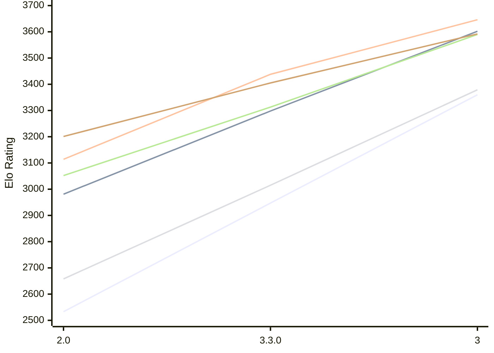

# Engine: Ravager

Author: Abhinav Tiwari

Home: https://github.com/erensh27/Ravager

## Elo Ratings E1 (Ultra 7 265T (1.50 GHz) - E-Core)

| Version | Published | STC 8.0+0.08s  | LTC 60.0+0.60s | VLTC 2m24s+1.12s | Comment |
| --- | --- | --- | --- | --- | --- |
| 3 | 2026-10-22 | 3360(+413) | 3602(+304) | 3646(+208) |  |
| 3.3.0 | 2026-10-09 | 2947(+414) | 3298(+317) | 3438(+324) |  |
| 2.0 | 2026-08-23 | 2533 | 2981 | 3114 |  |
 | | | cElo (∆ prev) | cElo (∆ prev) | cElo (∆ prev) | 

## Elo Ratings P1 (Ultra 7 265T (1.50 GHz) - P-Core)

| Version | Published | STC 8.0+0.08s  | LTC 60.0+0.60s | VLTC 2m24s+1.12s | Comment |
| --- | --- | --- | --- | --- | --- |
| 3 | 2026-10-22 | 3379(+364) | 3590(+277) | 3592(+187) |  |
| 3.3.0 | 2026-10-09 | 3015(+357) | 3313(+261) | 3405(+204) |  |
| 2.0 | 2026-08-23 | 2658 | 3052 | 3201 |  |
 | | | cElo (∆ prev) | cElo (∆ prev) | cElo (∆ prev) | 

## Elo Ratings T1 (i5-7500T 2.70GHz)

| Version | Published | STC 8.0+0.08s  | LTC 60.0+0.60s | VLTC 2m24s+1.12s | Comment |
| --- | --- | --- | --- | --- | --- |
| 2.0 | 2026-08-23 | 2757 | 3109 | 3220 |  |
 | | | cElo (∆ prev) | cElo (∆ prev) | cElo (∆ prev) | 

<a href="https://github.com/computer-chess-index/cci/issues/new?template=submit-version.yml&title=[VERSION]+Ravager+<version>&body=###%20Engine%20name%0ARavager%0A%0A###%20Version%0A2.0" target="_blank">Submit new version</a>

 Test Conditions:

GUI/CLI: <a href=https://github.com/cutechess/cutechess target="_blank">Cute-Chess</a> 
Elo Calculation: <a href=https://www.remi-coulom.fr/Bayesian-Elo/ target="_blank">Bayesian-Elo</a> 
CPU for P1: Intel(R) Core(TM) Ultra 7 265T (1.50 GHz) - P-Core 
CPU for E1: Intel(R) Core(TM) Ultra 7 265T (1.50 GHz) - E-Core 
CPU for T1: Intel(R) Core(TM) i5-7500T 2.70GHz 
Opening book: 8_moves_v3 
\* STC: 8.0+0.08s, LTC: 60.0+0.60s, VLTC: 2m24s+1.12s

 Lists:
Ratings: <a href=https://github.com/computer-chess-index/cci/blob/main/lists/CCIRatings.csv target="_blank">Complete list</a>

Generated: 2026-11-24 05:42:05

## Ratings Verlauf E1 / P1

```mermaid
%%{init: {"theme":"base","themeVariables":{"seriesColors:['#a3a3a3','#222221','#faa371']}}}%%
xychart-beta
  x-axis ["2.0", "3.3.0", "3"]
  y-axis "Elo Rating" 2500 --> 3700
  line "E1: STC (8.0+0.08s)" [2533, 2947, 3360]
  line "E1: LTC (60.0+0.60s)" [2981, 3298, 3602]
  line "E1: VLTC (2m24s+1.12s)" [3114, 3438, 3646]
  line "P1: STC (8.0+0.08s)" [2658, 3015, 3379]
  line "P1: LTC (60.0+0.60s)" [3052, 3313, 3590]
  line "P1: VLTC (2m24s+1.12s)" [3201, 3405, 3592]
```

## Detailed Evaluation Results

| Version | Time Control | Variant | Elo  | Range +/- | Matches | Score | Average Opponent Elo | Draws |
| --- | --- |--- | --- | --- | --- | --- | --- | --- |
| 3 | VLTC (2m24s+1.12s) | P1 | 3592 | 39 | 160 | 55% | 3559 | 81% |
|  |  | E1 | 3646 | 28 | 290 | 48% | 3657 | 86% |
|  | LTC (60.0+0.60s) | P1 | 3590 | 38 | 164 | 47% | 3605 | 81% |
|  |  | E1 | 3602 | 31 | 246 | 53% | 3579 | 80% |
|  | STC (8.0+0.08s) | P1 | 3379 | 38 | 172 | 53% | 3351 | 70% |
|  |  | E1 | 3360 | 26 | 386 | 55% | 3322 | 61% |
| --- | --- |--- | --- | --- | --- | --- | --- | --- |
| 3.3.0 | VLTC (2m24s+1.12s) | P1 | 3405 | 42 | 146 | 53% | 3383 | 71% |
|  |  | E1 | 3438 | 32 | 244 | 50% | 3437 | 76% |
|  | LTC (60.0+0.60s) | P1 | 3313 | 28 | 338 | 57% | 3264 | 67% |
|  |  | E1 | 3298 | 28 | 320 | 53% | 3268 | 69% |
|  | STC (8.0+0.08s) | P1 | 3015 | 34 | 248 | 49% | 3001 | 54% |
|  |  | E1 | 2947 | 34 | 258 | 53% | 2925 | 49% |
| --- | --- |--- | --- | --- | --- | --- | --- | --- |
| 2.0 | VLTC (2m24s+1.12s) | T1 | 3220 | 31 | 274 | 50% | 3218 | 64% |
|  |  | P1 | 3201 | 37 | 204 | 49% | 3212 | 54% |
|  |  | E1 | 3114 | 30 | 302 | 44% | 3164 | 56% |
|  | LTC (60.0+0.60s) | T1 | 3109 | 30 | 302 | 50% | 3109 | 57% |
|  |  | P1 | 3052 | 39 | 184 | 48% | 3066 | 52% |
|  |  | E1 | 2981 | 30 | 322 | 42% | 3043 | 56% |
|  | STC (8.0+0.08s) | T1 | 2757 | 35 | 256 | 49% | 2761 | 38% |
|  |  | P1 | 2658 | 37 | 216 | 48% | 2669 | 43% |
|  |  | E1 | 2533 | 35 | 298 | 39% | 2651 | 26% |