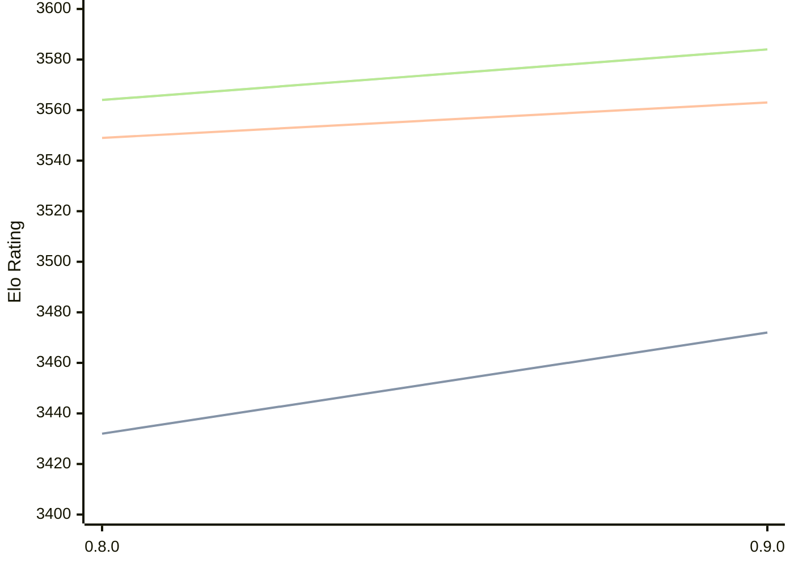

# Engine: Reckless

Author: Arseniy Surkov

Home: https://github.com/codedeliveryservice/Reckless

## Elo Ratings

| Version | Published | STC 8.0+0.08s  | LTC 60.0+0.60s | VLTC 2m24s+1.12s | Comment |
| --- | --- | --- | --- | --- | --- |
| 0.9.0 | 2026-03-01 | 3472(+40) | 3563(+14) | 3584(+20) |  |
| 0.8.0 | 2025-08-30 | 3432 | 3549 | 3564 |  |
 | | | cElo (∆ prev) | cElo (∆ prev) | cElo (∆ prev) | 

<a href="https://github.com/computer-chess-index/cci/issues/new?template=submit-version.yml&title=[VERSION]+Reckless+<version>&body=###%20Engine%20name%0AReckless%0A%0A###%20Version%0A0.9.0" target="_blank">Submit new version</a>

 Test Conditions:

GUI/CLI: <a href=https://github.com/cutechess/cutechess target="_blank">Cute-Chess</a> 
Elo Calculation: <a href=https://www.remi-coulom.fr/Bayesian-Elo/ target="_blank">Bayesian-Elo</a> 
CPU: Intel(R) Core(TM) i5-7500T 2.70GHz 
Opening book: 8_moves_v3 
\* STC: 8.0+0.08s, LTC: 60.0+0.60s, VLTC: 2m24s+1.12s

 Lists:
Ratings: <a href=https://github.com/computer-chess-index/cci/blob/main/lists/CCIRatings.csv target="_blank">Complete list</a>

Generated: 2026-08-16 06:28:18

## Ratings Verlauf

⬛ STC (8.0+0.08s) &nbsp;&nbsp; 🟧 LTC (60.0+0.60s) &nbsp;&nbsp; 🟩 VLTC (2m24s+1.12s)

dark mode: 🟩STC (8.0+0.08s) 🟧LTC (60.0+0.60s) ⬜VLTC (2m24s+1.12s)

## Detailed Evaluation Results

| Version | Time Control | Elo  | Range +/- | Matches | Score | Average Opponent Elo | Draws |
| --- | --- | --- | --- | --- | --- | --- | --- |
| 0.9.0 | VLTC (2m24s+1.12s) | 3584 | 32 | 216 | 53% | 3563 | 93% |
| 0.9.0 | LTC (60.0+0.60s) | 3563 | 27 | 316 | 51% | 3557 | 92% |
| 0.9.0 | STC (8.0+0.08s) | 3472 | 20 | 586 | 50% | 3470 | 82% |
| --- | --- | --- | --- | --- | --- | --- | --- |
| 0.8.0 | VLTC (2m24s+1.12s) | 3564 | 27 | 306 | 54% | 3537 | 88% |
| 0.8.0 | LTC (60.0+0.60s) | 3549 | 29 | 268 | 51% | 3536 | 87% |
| 0.8.0 | STC (8.0+0.08s) | 3432 | 26 | 378 | 51% | 3417 | 74% |
| --- | --- | --- | --- | --- | --- | --- | --- |