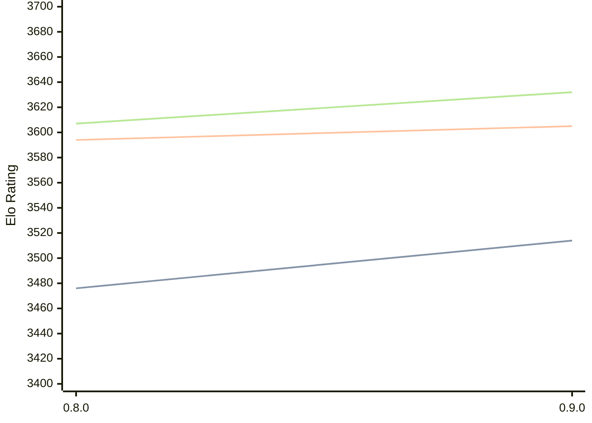

# Engine: Reckless

Author: Arseniy Surkov

Home: https://github.com/codedeliveryservice/Reckless

## Ratings nach Version

| Version | Published | STC 8.0+0.08s  | LTC 60.0+0.60s | VLTC 2m24s+1.12s | Comment |
| --- | --- | --- | --- | --- | --- |
| 0.9.0 | 2026-03-01 | 3514(+38) | 3605(+11) | 3632(+25) |  |
| 0.8.0 | 2025-08-30 | 3476(+new) | 3594(+new) | 3607(+new) |  |
| 0.7.0 | 2024-08-23 |  |  |  |  |
| 0.6.0 | 2024-03-21 |  |  |  |  |
| 0.5.0 | 2024-02-04 |  |  |  |  |
| 0.4.0 | 2023-12-13 |  |  |  |  |
| 0.3.0 | 2023-11-05 |  |  |  |  |
| 0.2.0 | 2023-10-06 |  |  |  |  |
| 0.1.0 | 2023-05-16 |  |  |  |  |
 | | | cElo (∆ prev) | cElo (∆ prev) | cElo (∆ prev) | 

<a href="https://github.com/computer-chess-index/cci/issues/new?template=submit-version.yml&title=[VERSION]+Reckless+<version>&body=###%20Engine%20name%0AReckless%0A%0A###%20Version%0A0.9.0" target="_blank">Submit new version</a>

 Test Conditions:

GUI/CLI: <a href=https://github.com/cutechess/cutechess target="_blank">Cute-Chess</a> 
Elo Calculation: <a href=https://www.remi-coulom.fr/Bayesian-Elo/ target="_blank">Bayesian-Elo</a> 
CPU: Intel(R) Core(TM) i5-7500T 2.70GHz 
Opening book: 8_moves_v3 
\* STC: 8.0+0.08s, LTC: 60.0+0.60s, VLTC: 2m24s+1.12s

 Lists:
Ratings: <a href=https://github.com/computer-chess-index/cci/blob/main/lists/CCIRatings.csv target="_blank">Complete list</a>

Generated: 2026-04-23 06:27:19

## Ratings Verlauf

⬛ STC (8.0+0.08s) &nbsp;&nbsp; 🟧 LTC (60.0+0.60s) &nbsp;&nbsp; 🟩 VLTC (2m24s+1.12s)

dark mode: 🟩STC (8.0+0.08s) 🟧LTC (60.0+0.60s) ⬜VLTC (2m24s+1.12s)

