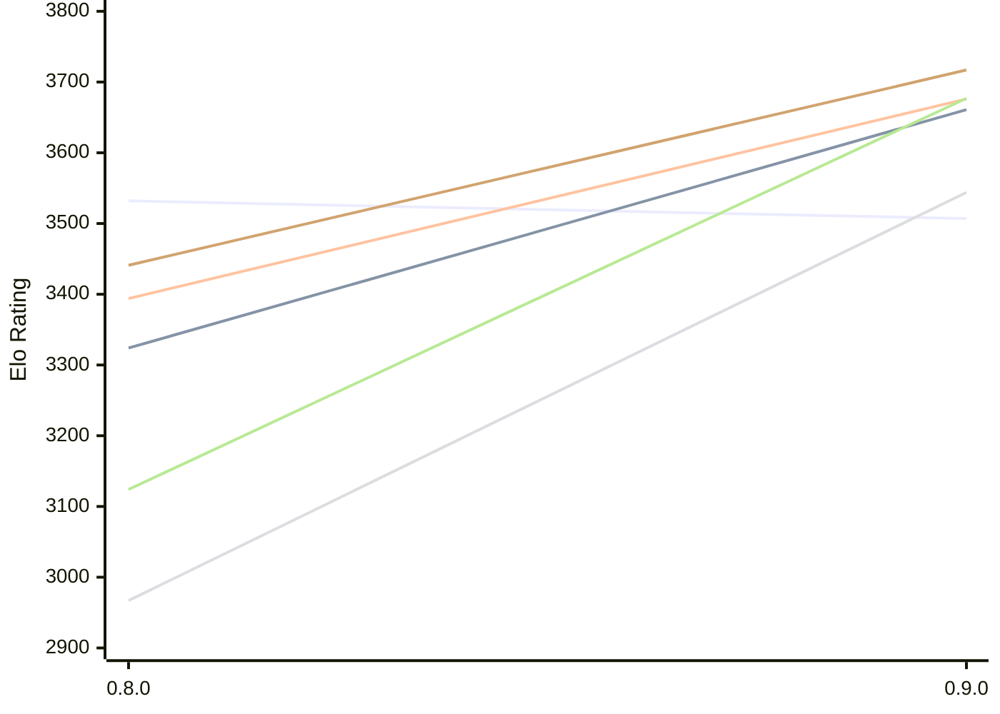
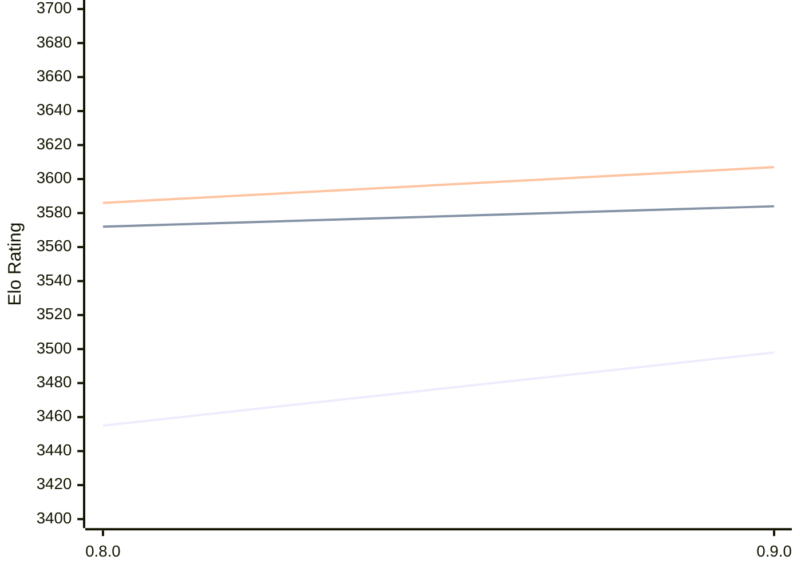

# Engine: Reckless

Author: Arseniy Surkov

Home: https://github.com/codedeliveryservice/Reckless

## Elo Ratings E1 (Ultra 7 265T (1.50 GHz) - E-Core)

| Version | Published | STC 8.0+0.08s  | LTC 60.0+0.60s | VLTC 2m24s+1.12s | Comment |
| --- | --- | --- | --- | --- | --- |
| 0.9.0 | 2026-03-01 | 3507(-25) | 3661(+337) | 3676(+282) |  |
| 0.8.0 | 2025-08-30 | 3532 | 3324 | 3394 |  |
 | | | cElo (∆ prev) | cElo (∆ prev) | cElo (∆ prev) | 

## Elo Ratings P1 (Ultra 7 265T (1.50 GHz) - P-Core)

| Version | Published | STC 8.0+0.08s  | LTC 60.0+0.60s | VLTC 2m24s+1.12s | Comment |
| --- | --- | --- | --- | --- | --- |
| 0.9.0 | 2026-03-01 | 3544(+577) | 3677(+553) | 3717(+276) |  |
| 0.8.0 | 2025-08-30 | 2967 | 3124 | 3441 |  |
 | | | cElo (∆ prev) | cElo (∆ prev) | cElo (∆ prev) | 

## Elo Ratings T1 (i5-7500T 2.70GHz)

| Version | Published | STC 8.0+0.08s  | LTC 60.0+0.60s | VLTC 2m24s+1.12s | Comment |
| --- | --- | --- | --- | --- | --- |
| 0.9.0 | 2026-03-01 | 3498(+43) | 3584(+12) | 3607(+21) |  |
| 0.8.0 | 2025-08-30 | 3455 | 3572 | 3586 |  |
 | | | cElo (∆ prev) | cElo (∆ prev) | cElo (∆ prev) | 

<a href="https://github.com/computer-chess-index/cci/issues/new?template=submit-version.yml&title=[VERSION]+Reckless+<version>&body=###%20Engine%20name%0AReckless%0A%0A###%20Version%0A0.9.0" target="_blank">Submit new version</a>

 Test Conditions:

GUI/CLI: <a href=https://github.com/cutechess/cutechess target="_blank">Cute-Chess</a> 
Elo Calculation: <a href=https://www.remi-coulom.fr/Bayesian-Elo/ target="_blank">Bayesian-Elo</a> 
CPU for P1: Intel(R) Core(TM) Ultra 7 265T (1.50 GHz) - P-Core 
CPU for E1: Intel(R) Core(TM) Ultra 7 265T (1.50 GHz) - E-Core 
CPU for T1: Intel(R) Core(TM) i5-7500T 2.70GHz 
Opening book: 8_moves_v3 
\* STC: 8.0+0.08s, LTC: 60.0+0.60s, VLTC: 2m24s+1.12s

 Lists:
Ratings: <a href=https://github.com/computer-chess-index/cci/blob/main/lists/CCIRatings.csv target="_blank">Complete list</a>

Generated: 2026-11-13 05:42:03

## Ratings Verlauf E1 / P1

```mermaid
%%{init: {"theme":"base","themeVariables":{"seriesColors:['#a3a3a3','#222221','#faa371']}}}%%
xychart-beta
  x-axis ["0.8.0", "0.9.0"]
  y-axis "Elo Rating" 2900 --> 3800
  line "E1: STC (8.0+0.08s)" [3532, 3507]
  line "E1: LTC (60.0+0.60s)" [3324, 3661]
  line "E1: VLTC (2m24s+1.12s)" [3394, 3676]
  line "P1: STC (8.0+0.08s)" [2967, 3544]
  line "P1: LTC (60.0+0.60s)" [3124, 3677]
  line "P1: VLTC (2m24s+1.12s)" [3441, 3717]
```

## Ratings Verlauf T1

```mermaid
%%{init: {"theme":"base","themeVariables":{"seriesColors:['#a3a3a3','#222221','#faa371']}}}%%
xychart-beta
  x-axis ["0.8.0", "0.9.0"]
  y-axis "Elo Rating" 3400 --> 3700
  line "T1: STC (8.0+0.08s)" [3455, 3498]
  line "T1: LTC (60.0+0.60s)" [3572, 3584]
  line "T1: VLTC (2m24s+1.12s)" [3586, 3607]
```

## Detailed Evaluation Results

| Version | Time Control | Variant | Elo  | Range +/- | Matches | Score | Average Opponent Elo | Draws |
| --- | --- |--- | --- | --- | --- | --- | --- | --- |
| 0.9.0 | VLTC (2m24s+1.12s) | T1 | 3607 | 30 | 244 | 53% | 3587 | 93% |
|  |  | P1 | 3717 | 45 | 126 | 60% | 3583 | 77% |
|  |  | E1 | 3676 | 28 | 304 | 55% | 3613 | 84% |
|  | LTC (60.0+0.60s) | T1 | 3584 | 25 | 356 | 51% | 3579 | 93% |
|  |  | P1 | 3677 | 42 | 138 | 56% | 3592 | 80% |
|  |  | E1 | 3661 | 28 | 342 | 58% | 3465 | 76% |
|  | STC (8.0+0.08s) | T1 | 3498 | 19 | 668 | 51% | 3494 | 82% |
|  |  | P1 | 3544 | 35 | 184 | 49% | 3546 | 90% |
|  |  | E1 | 3507 | 27 | 330 | 48% | 3519 | 75% |
| --- | --- |--- | --- | --- | --- | --- | --- | --- |
| 0.8.0 | VLTC (2m24s+1.12s) | P1 | 3441 | 237 | 8 | 94% | 3001 | 13% |
|  |  | T1 | 3586 | 27 | 306 | 54% | 3560 | 88% |
|  |  | E1 | 3394 | 177 | 12 | 83% | 2673 | 33% |
|  | LTC (60.0+0.60s) | T1 | 3572 | 29 | 268 | 51% | 3559 | 87% |
|  |  | E1 | 3324 | 164 | 16 | 84% | 2854 | 31% |
|  |  | P1 | 3124 | 158 | 12 | 75% | 2799 | 50% |
|  | STC (8.0+0.08s) | E1 | 3532 | 215 | 12 | 92% | 2834 | 17% |
|  |  | P1 | 2967 | 152 | 16 | 75% | 2630 | 38% |
|  |  | T1 | 3455 | 26 | 378 | 51% | 3440 | 74% |