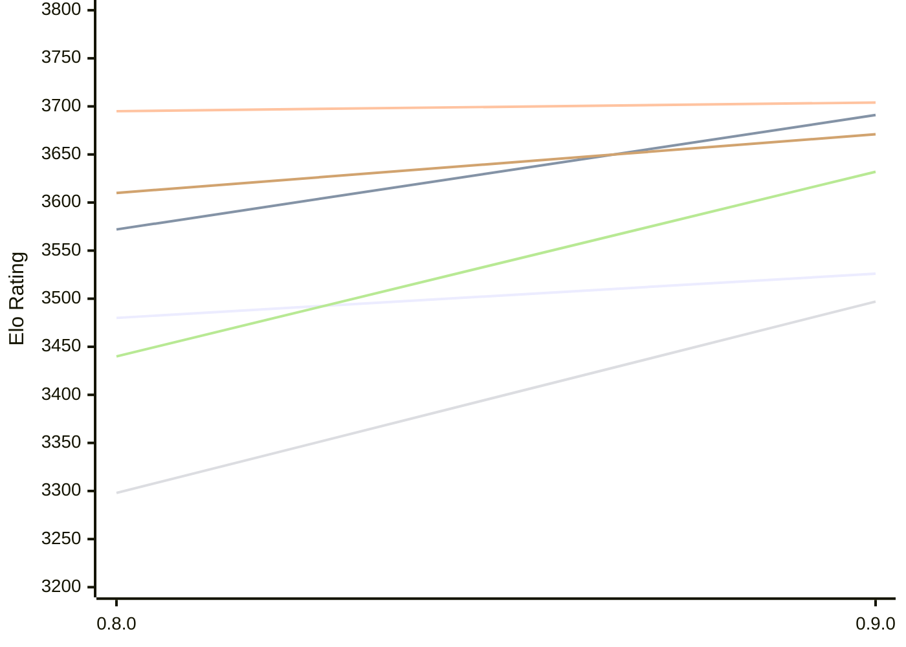
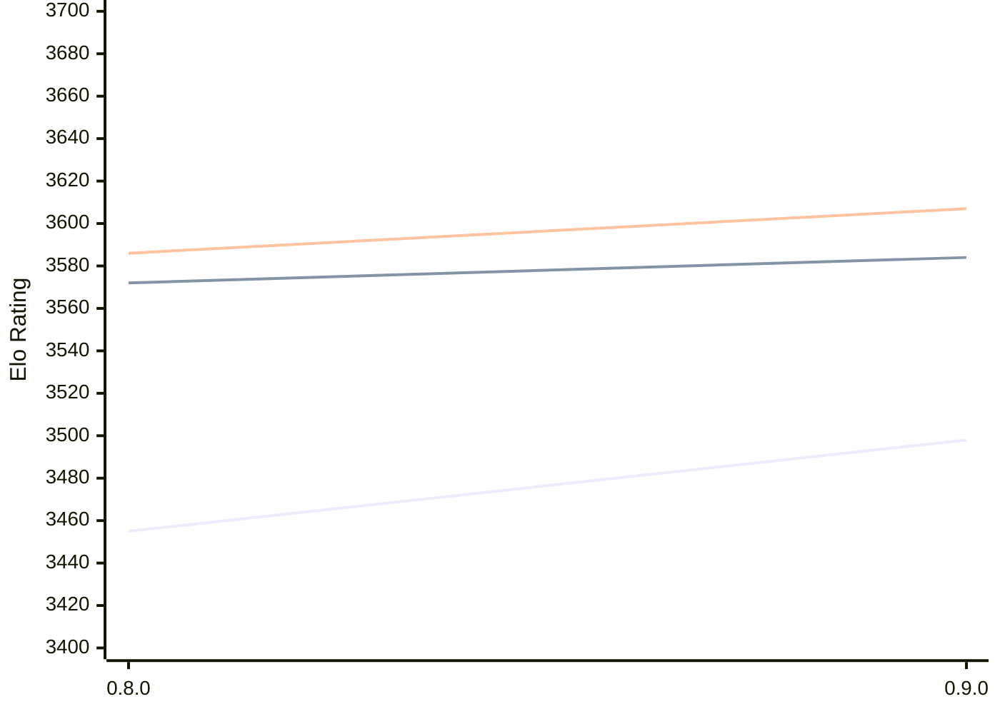

# Engine: Reckless

Author: Arseniy Surkov

Home: https://github.com/codedeliveryservice/Reckless

## Elo Ratings E1 (Ultra 7 265T (1.50 GHz) - E-Core)

| Version | Published | STC 8.0+0.08s  | LTC 60.0+0.60s | VLTC 2m24s+1.12s | Comment |
| --- | --- | --- | --- | --- | --- |
| 0.9.0 | 2026-03-01 | 3526(+46) | 3691(+119) | 3704(+9) |  |
| 0.8.0 | 2025-08-30 | 3480 | 3572 | 3695 |  |
 | | | cElo (∆ prev) | cElo (∆ prev) | cElo (∆ prev) | 

## Elo Ratings P1 (Ultra 7 265T (1.50 GHz) - P-Core)

| Version | Published | STC 8.0+0.08s  | LTC 60.0+0.60s | VLTC 2m24s+1.12s | Comment |
| --- | --- | --- | --- | --- | --- |
| 0.9.0 | 2026-03-01 | 3497(+199) | 3632(+192) | 3671(+61) |  |
| 0.8.0 | 2025-08-30 | 3298 | 3440 | 3610 |  |
 | | | cElo (∆ prev) | cElo (∆ prev) | cElo (∆ prev) | 

## Elo Ratings T1 (i5-7500T 2.70GHz)

| Version | Published | STC 8.0+0.08s  | LTC 60.0+0.60s | VLTC 2m24s+1.12s | Comment |
| --- | --- | --- | --- | --- | --- |
| 0.9.0 | 2026-03-01 | 3498(+43) | 3584(+12) | 3607(+21) |  |
| 0.8.0 | 2025-08-30 | 3455 | 3572 | 3586 |  |
 | | | cElo (∆ prev) | cElo (∆ prev) | cElo (∆ prev) | 

<a href="https://github.com/computer-chess-index/cci/issues/new?template=submit-version.yml&title=[VERSION]+Reckless+<version>&body=###%20Engine%20name%0AReckless%0A%0A###%20Version%0A0.9.0" target="_blank">Submit new version</a>

 Test Conditions:

GUI/CLI: <a href=https://github.com/cutechess/cutechess target="_blank">Cute-Chess</a> 
Elo Calculation: <a href=https://www.remi-coulom.fr/Bayesian-Elo/ target="_blank">Bayesian-Elo</a> 
CPU for P1: Intel(R) Core(TM) Ultra 7 265T (1.50 GHz) - P-Core 
CPU for E1: Intel(R) Core(TM) Ultra 7 265T (1.50 GHz) - E-Core 
CPU for T1: Intel(R) Core(TM) i5-7500T 2.70GHz 
Opening book: 8_moves_v3 
\* STC: 8.0+0.08s, LTC: 60.0+0.60s, VLTC: 2m24s+1.12s

 Lists:
Ratings: <a href=https://github.com/computer-chess-index/cci/blob/main/lists/CCIRatings.csv target="_blank">Complete list</a>

Generated: 2026-11-16 05:41:54

## Ratings Verlauf E1 / P1

```mermaid
%%{init: {"theme":"base","themeVariables":{"seriesColors:['#a3a3a3','#222221','#faa371']}}}%%
xychart-beta
  x-axis ["0.8.0", "0.9.0"]
  y-axis "Elo Rating" 3200 --> 3800
  line "E1: STC (8.0+0.08s)" [3480, 3526]
  line "E1: LTC (60.0+0.60s)" [3572, 3691]
  line "E1: VLTC (2m24s+1.12s)" [3695, 3704]
  line "P1: STC (8.0+0.08s)" [3298, 3497]
  line "P1: LTC (60.0+0.60s)" [3440, 3632]
  line "P1: VLTC (2m24s+1.12s)" [3610, 3671]
```

## Ratings Verlauf T1

```mermaid
%%{init: {"theme":"base","themeVariables":{"seriesColors:['#a3a3a3','#222221','#faa371']}}}%%
xychart-beta
  x-axis ["0.8.0", "0.9.0"]
  y-axis "Elo Rating" 3400 --> 3700
  line "T1: STC (8.0+0.08s)" [3455, 3498]
  line "T1: LTC (60.0+0.60s)" [3572, 3584]
  line "T1: VLTC (2m24s+1.12s)" [3586, 3607]
```

## Detailed Evaluation Results

| Version | Time Control | Variant | Elo  | Range +/- | Matches | Score | Average Opponent Elo | Draws |
| --- | --- |--- | --- | --- | --- | --- | --- | --- |
| 0.9.0 | VLTC (2m24s+1.12s) | T1 | 3607 | 30 | 244 | 53% | 3587 | 93% |
|  |  | P1 | 3671 | 45 | 126 | 60% | 3541 | 77% |
|  |  | E1 | 3704 | 28 | 304 | 55% | 3640 | 84% |
|  | LTC (60.0+0.60s) | P1 | 3632 | 42 | 138 | 56% | 3546 | 80% |
|  |  | E1 | 3691 | 28 | 346 | 58% | 3492 | 75% |
|  |  | T1 | 3584 | 25 | 356 | 51% | 3579 | 93% |
|  | STC (8.0+0.08s) | P1 | 3497 | 35 | 184 | 49% | 3499 | 90% |
|  |  | E1 | 3526 | 26 | 358 | 48% | 3542 | 75% |
|  |  | T1 | 3498 | 19 | 668 | 51% | 3494 | 82% |
| --- | --- |--- | --- | --- | --- | --- | --- | --- |
| 0.8.0 | VLTC (2m24s+1.12s) | P1 | 3610 | 145 | 16 | 78% | 3289 | 44% |
|  |  | E1 | 3695 | 82 | 44 | 69% | 3376 | 61% |
|  |  | T1 | 3586 | 27 | 306 | 54% | 3560 | 88% |
|  | LTC (60.0+0.60s) | P1 | 3440 | 96 | 32 | 70% | 3158 | 59% |
|  |  | E1 | 3572 | 79 | 52 | 72% | 3294 | 56% |
|  |  | T1 | 3572 | 29 | 268 | 51% | 3559 | 87% |
|  | STC (8.0+0.08s) | E1 | 3480 | 63 | 68 | 62% | 3325 | 68% |
|  |  | T1 | 3455 | 26 | 378 | 51% | 3440 | 74% |
|  |  | P1 | 3298 | 110 | 32 | 77% | 2913 | 41% |