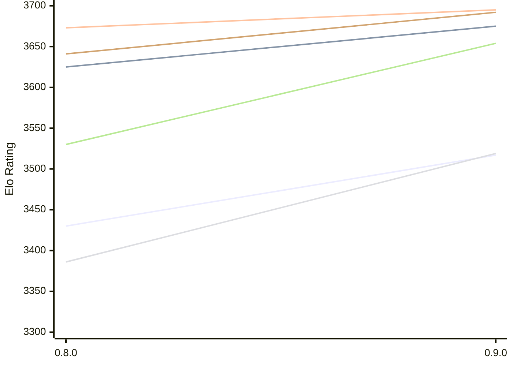
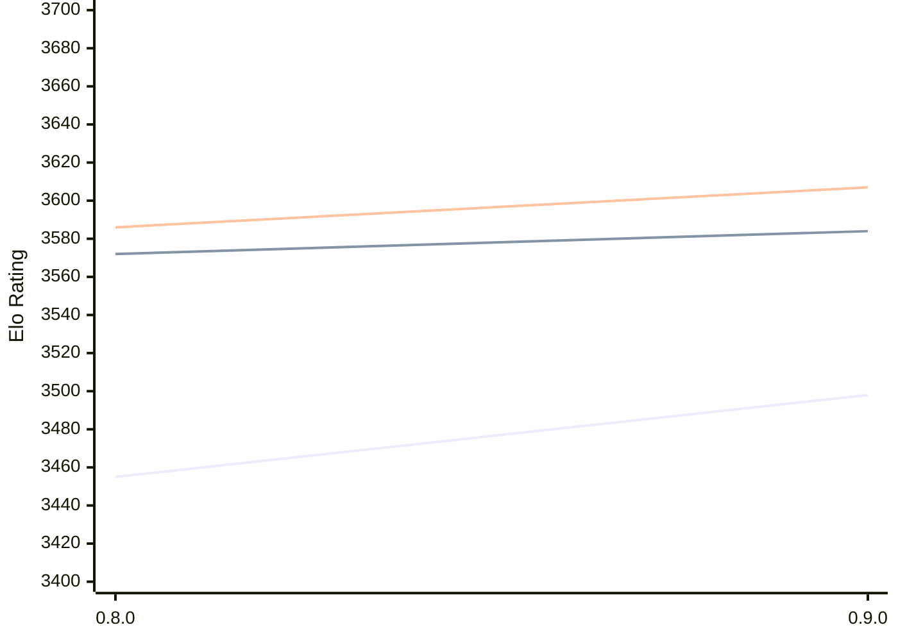

# Engine: Reckless

Author: Arseniy Surkov

Home: https://github.com/codedeliveryservice/Reckless

## Elo Ratings E1 (Ultra 7 265T (1.50 GHz) - E-Core)

| Version | Published | STC 8.0+0.08s  | LTC 60.0+0.60s | VLTC 2m24s+1.12s | Comment |
| --- | --- | --- | --- | --- | --- |
| 0.9.0 | 2026-03-01 | 3517(+87) | 3675(+50) | 3695(+22) |  |
| 0.8.0 | 2025-08-30 | 3430 | 3625 | 3673 |  |
 | | | cElo (∆ prev) | cElo (∆ prev) | cElo (∆ prev) | 

## Elo Ratings P1 (Ultra 7 265T (1.50 GHz) - P-Core)

| Version | Published | STC 8.0+0.08s  | LTC 60.0+0.60s | VLTC 2m24s+1.12s | Comment |
| --- | --- | --- | --- | --- | --- |
| 0.9.0 | 2026-03-01 | 3519(+133) | 3654(+124) | 3692(+51) |  |
| 0.8.0 | 2025-08-30 | 3386 | 3530 | 3641 |  |
 | | | cElo (∆ prev) | cElo (∆ prev) | cElo (∆ prev) | 

## Elo Ratings T1 (i5-7500T 2.70GHz)

| Version | Published | STC 8.0+0.08s  | LTC 60.0+0.60s | VLTC 2m24s+1.12s | Comment |
| --- | --- | --- | --- | --- | --- |
| 0.9.0 | 2026-03-01 | 3498(+43) | 3584(+12) | 3607(+21) |  |
| 0.8.0 | 2025-08-30 | 3455 | 3572 | 3586 |  |
 | | | cElo (∆ prev) | cElo (∆ prev) | cElo (∆ prev) | 

<a href="https://github.com/computer-chess-index/cci/issues/new?template=submit-version.yml&title=[VERSION]+Reckless+<version>&body=###%20Engine%20name%0AReckless%0A%0A###%20Version%0A0.9.0" target="_blank">Submit new version</a>

 Test Conditions:

GUI/CLI: <a href=https://github.com/cutechess/cutechess target="_blank">Cute-Chess</a> 
Elo Calculation: <a href=https://www.remi-coulom.fr/Bayesian-Elo/ target="_blank">Bayesian-Elo</a> 
CPU for P1: Intel(R) Core(TM) Ultra 7 265T (1.50 GHz) - P-Core 
CPU for E1: Intel(R) Core(TM) Ultra 7 265T (1.50 GHz) - E-Core 
CPU for T1: Intel(R) Core(TM) i5-7500T 2.70GHz 
Opening book: 8_moves_v3 
\* STC: 8.0+0.08s, LTC: 60.0+0.60s, VLTC: 2m24s+1.12s

 Lists:
Ratings: <a href=https://github.com/computer-chess-index/cci/blob/main/lists/CCIRatings.csv target="_blank">Complete list</a>

Generated: 2026-11-27 05:42:26

## Ratings Verlauf E1 / P1

```mermaid
%%{init: {"theme":"base","themeVariables":{"seriesColors:['#a3a3a3','#222221','#faa371']}}}%%
xychart-beta
  x-axis ["0.8.0", "0.9.0"]
  y-axis "Elo Rating" 3300 --> 3700
  line "E1: STC (8.0+0.08s)" [3430, 3517]
  line "E1: LTC (60.0+0.60s)" [3625, 3675]
  line "E1: VLTC (2m24s+1.12s)" [3673, 3695]
  line "P1: STC (8.0+0.08s)" [3386, 3519]
  line "P1: LTC (60.0+0.60s)" [3530, 3654]
  line "P1: VLTC (2m24s+1.12s)" [3641, 3692]
```

## Ratings Verlauf T1

```mermaid
%%{init: {"theme":"base","themeVariables":{"seriesColors:['#a3a3a3','#222221','#faa371']}}}%%
xychart-beta
  x-axis ["0.8.0", "0.9.0"]
  y-axis "Elo Rating" 3400 --> 3700
  line "T1: STC (8.0+0.08s)" [3455, 3498]
  line "T1: LTC (60.0+0.60s)" [3572, 3584]
  line "T1: VLTC (2m24s+1.12s)" [3586, 3607]
```

## Detailed Evaluation Results

| Version | Time Control | Variant | Elo  | Range +/- | Matches | Score | Average Opponent Elo | Draws |
| --- | --- |--- | --- | --- | --- | --- | --- | --- |
| 0.9.0 | VLTC (2m24s+1.12s) | T1 | 3607 | 30 | 244 | 53% | 3587 | 93% |
|  |  | P1 | 3692 | 39 | 158 | 58% | 3592 | 81% |
|  |  | E1 | 3695 | 21 | 554 | 53% | 3657 | 87% |
|  | LTC (60.0+0.60s) | P1 | 3654 | 40 | 150 | 56% | 3578 | 82% |
|  |  | E1 | 3675 | 26 | 386 | 57% | 3501 | 77% |
|  |  | T1 | 3584 | 25 | 356 | 51% | 3579 | 93% |
|  | STC (8.0+0.08s) | P1 | 3519 | 34 | 200 | 49% | 3525 | 90% |
|  |  | E1 | 3517 | 25 | 402 | 48% | 3533 | 75% |
|  |  | T1 | 3498 | 19 | 668 | 51% | 3494 | 82% |
| --- | --- |--- | --- | --- | --- | --- | --- | --- |
| 0.8.0 | VLTC (2m24s+1.12s) | E1 | 3673 | 53 | 92 | 58% | 3529 | 71% |
|  |  | T1 | 3586 | 27 | 306 | 54% | 3560 | 88% |
|  |  | P1 | 3641 | 109 | 24 | 69% | 3424 | 63% |
|  | LTC (60.0+0.60s) | E1 | 3625 | 56 | 92 | 67% | 3425 | 65% |
|  |  | T1 | 3572 | 29 | 268 | 51% | 3559 | 87% |
|  |  | P1 | 3530 | 76 | 48 | 67% | 3309 | 67% |
|  | STC (8.0+0.08s) | T1 | 3455 | 26 | 378 | 51% | 3440 | 74% |
|  |  | P1 | 3386 | 78 | 52 | 70% | 3104 | 56% |
|  |  | E1 | 3430 | 45 | 128 | 52% | 3379 | 71% |