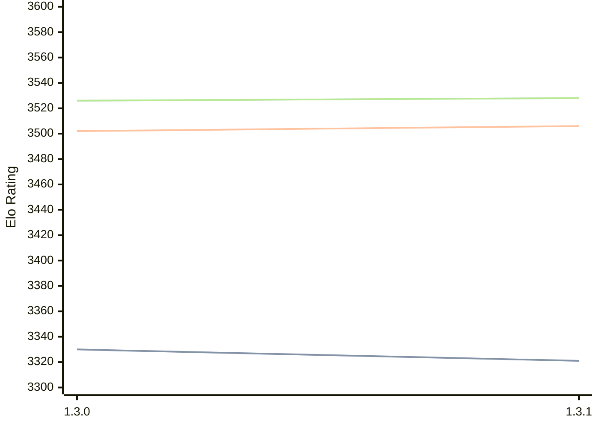

# Engine: Renegade

Author: Krisztián Peőcz

Home: https://github.com/pkrisz99/Renegade

## Elo Ratings

| Version | Published | STC 8.0+0.08s  | LTC 60.0+0.60s | VLTC 2m24s+1.12s | Comment |
| --- | --- | --- | --- | --- | --- |
| 1.3.1 | 2026-07-14 | 3321(-9) | 3506(+4) | 3528(+2) |  |
| 1.3.0 | 2026-06-17 | 3330(+new) | 3502(+new) | 3526(+new) |  |
| 1.2.0 | 2025-05-05 |  |  |  |  |
| 1.1.0 | 2024-06-26 |  |  |  |  |
| 1.0.0 | 2024-01-13 |  |  |  |  |
| 0.12.0 | 2023-10-12 |  |  |  |  |
| 0.11.0 | 2023-05-29 |  |  |  |  |
| 0.10.0 | 2023-04-06 |  |  |  |  |
| 0.9.0 | 2023-03-15 |  |  |  |  |
| 0.8.1 | 2023-02-13 |  |  |  |  |
| 0.8.0 | 2023-02-12 |  |  |  |  |
| 0.7.0 | 2023-01-15 |  |  |  |  |
 | | | cElo (∆ prev) | cElo (∆ prev) | cElo (∆ prev) | 

<a href="https://github.com/computer-chess-index/cci/issues/new?template=submit-version.yml&title=[VERSION]+Renegade+<version>&body=###%20Engine%20name%0ARenegade%0A%0A###%20Version%0A1.3.1" target="_blank">Submit new version</a>

 Test Conditions:

GUI/CLI: <a href=https://github.com/cutechess/cutechess target="_blank">Cute-Chess</a> 
Elo Calculation: <a href=https://www.remi-coulom.fr/Bayesian-Elo/ target="_blank">Bayesian-Elo</a> 
CPU: Intel(R) Core(TM) i5-7500T 2.70GHz 
Opening book: 8_moves_v3 
\* STC: 8.0+0.08s, LTC: 60.0+0.60s, VLTC: 2m24s+1.12s

 Lists:
Ratings: <a href=https://github.com/computer-chess-index/cci/blob/main/lists/CCIRatings.csv target="_blank">Complete list</a>

Generated: 2026-07-24 06:29:26

## Ratings Verlauf

⬛ STC (8.0+0.08s) &nbsp;&nbsp; 🟧 LTC (60.0+0.60s) &nbsp;&nbsp; 🟩 VLTC (2m24s+1.12s)

dark mode: 🟩STC (8.0+0.08s) 🟧LTC (60.0+0.60s) ⬜VLTC (2m24s+1.12s)

## Detailed Evaluation Results

| Version | Time Control | Elo  | Range +/- | Matches | Score | Average Opponent Elo | Draws |
| --- | --- | --- | --- | --- | --- | --- | --- |
| 1.3.1 | VLTC (2m24s+1.12s) | 3528 | 39 | 152 | 50% | 3530 | 88% |
| 1.3.1 | LTC (60.0+0.60s) | 3506 | 38 | 160 | 49% | 3513 | 84% |
| 1.3.1 | STC (8.0+0.08s) | 3321 | 35 | 200 | 52% | 3308 | 71% |
| --- | --- | --- | --- | --- | --- | --- | --- |
| 1.3.0 | VLTC (2m24s+1.12s) | 3526 | 33 | 226 | 54% | 3488 | 81% |
| 1.3.0 | LTC (60.0+0.60s) | 3502 | 31 | 260 | 53% | 3449 | 77% |
| 1.3.0 | STC (8.0+0.08s) | 3330 | 35 | 218 | 53% | 3274 | 66% |
| --- | --- | --- | --- | --- | --- | --- | --- |