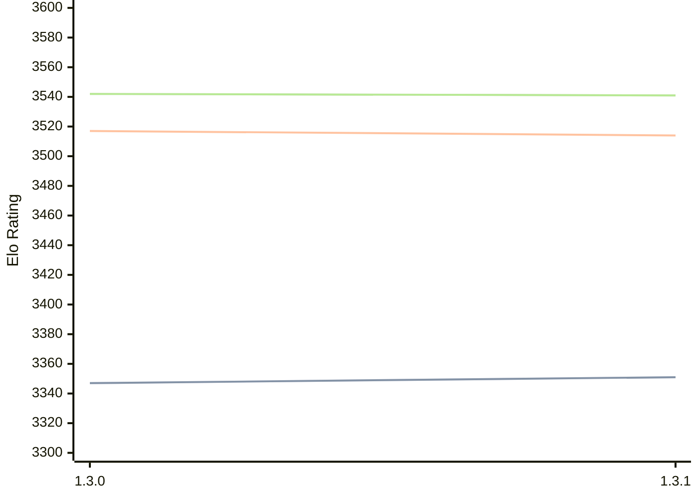

# Engine: Renegade

Author: Krisztián Peőcz

Home: https://github.com/pkrisz99/Renegade

## Elo Ratings

| Version | Published | STC 8.0+0.08s  | LTC 60.0+0.60s | VLTC 2m24s+1.12s | Comment |
| --- | --- | --- | --- | --- | --- |
| 1.3.1 | 2026-07-14 | 3351(+4) | 3514(-3) | 3541(-1) |  |
| 1.3.0 | 2026-06-17 | 3347(+new) | 3517(+new) | 3542(+new) |  |
| 1.2.0 | 2025-05-05 |  |  |  |  |
 | | | cElo (∆ prev) | cElo (∆ prev) | cElo (∆ prev) | 

<a href="https://github.com/computer-chess-index/cci/issues/new?template=submit-version.yml&title=[VERSION]+Renegade+<version>&body=###%20Engine%20name%0ARenegade%0A%0A###%20Version%0A1.3.1" target="_blank">Submit new version</a>

 Test Conditions:

GUI/CLI: <a href=https://github.com/cutechess/cutechess target="_blank">Cute-Chess</a> 
Elo Calculation: <a href=https://www.remi-coulom.fr/Bayesian-Elo/ target="_blank">Bayesian-Elo</a> 
CPU: Intel(R) Core(TM) i5-7500T 2.70GHz 
Opening book: 8_moves_v3 
\* STC: 8.0+0.08s, LTC: 60.0+0.60s, VLTC: 2m24s+1.12s

 Lists:
Ratings: <a href=https://github.com/computer-chess-index/cci/blob/main/lists/CCIRatings.csv target="_blank">Complete list</a>

Generated: 2026-09-12 04:41:06

## Ratings Verlauf

## Detailed Evaluation Results

| Version | Time Control | Elo  | Range +/- | Matches | Score | Average Opponent Elo | Draws |
| --- | --- | --- | --- | --- | --- | --- | --- |
| 1.3.1 | VLTC (2m24s+1.12s) | 3541 | 34 | 198 | 49% | 3545 | 88% |
| 1.3.1 | LTC (60.0+0.60s) | 3514 | 32 | 224 | 49% | 3524 | 86% |
| 1.3.1 | STC (8.0+0.08s) | 3351 | 26 | 368 | 51% | 3340 | 69% |
| --- | --- | --- | --- | --- | --- | --- | --- |
| 1.3.0 | VLTC (2m24s+1.12s) | 3542 | 33 | 226 | 54% | 3503 | 81% |
| 1.3.0 | LTC (60.0+0.60s) | 3517 | 31 | 260 | 53% | 3465 | 77% |
| 1.3.0 | STC (8.0+0.08s) | 3347 | 35 | 218 | 53% | 3290 | 66% |
| --- | --- | --- | --- | --- | --- | --- | --- |