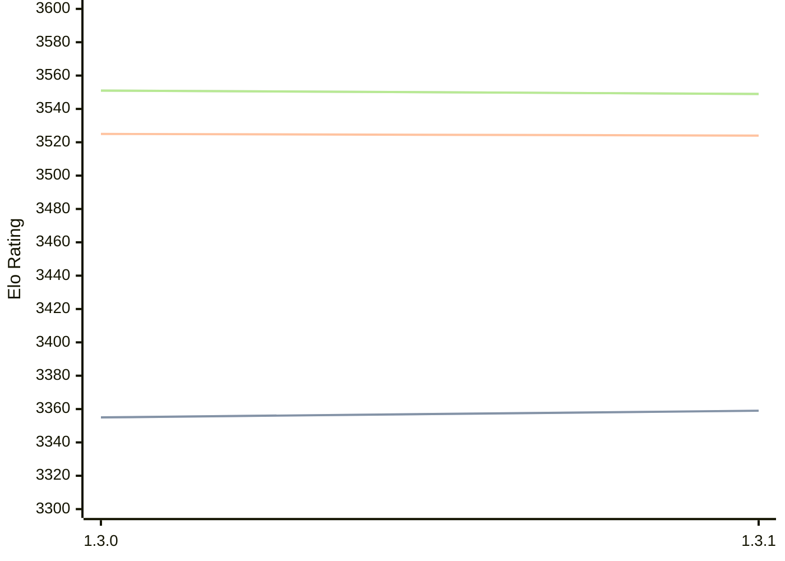

# Engine: Renegade

Author: Krisztián Peőcz

Home: https://github.com/pkrisz99/Renegade

## Elo Ratings E1

| Version | Published | STC 8.0+0.08s  | LTC 60.0+0.60s | VLTC 2m24s+1.12s | Comment |
| --- | --- | --- | --- | --- | --- |
| 1.3.1 | 2026-07-14 | 3236 | 3491 | 3546 |  |
 | | | cElo (∆ prev) | cElo (∆ prev) | cElo (∆ prev) | 

## Elo Ratings P1

| Version | Published | STC 8.0+0.08s  | LTC 60.0+0.60s | VLTC 2m24s+1.12s | Comment |
| --- | --- | --- | --- | --- | --- |
| 1.3.1 | 2026-07-14 | 3545 | 3715 | 3757 |  |
 | | | cElo (∆ prev) | cElo (∆ prev) | cElo (∆ prev) | 

## Elo Ratings T1

| Version | Published | STC 8.0+0.08s  | LTC 60.0+0.60s | VLTC 2m24s+1.12s | Comment |
| --- | --- | --- | --- | --- | --- |
| 1.3.1 | 2026-07-14 | 3359(+4) | 3524(-1) | 3549(-2) |  |
| 1.3.0 | 2026-06-17 | 3355 | 3525 | 3551 |  |
 | | | cElo (∆ prev) | cElo (∆ prev) | cElo (∆ prev) | 

<a href="https://github.com/computer-chess-index/cci/issues/new?template=submit-version.yml&title=[VERSION]+Renegade+<version>&body=###%20Engine%20name%0ARenegade%0A%0A###%20Version%0A1.3.1" target="_blank">Submit new version</a>

 Test Conditions:

GUI/CLI: <a href=https://github.com/cutechess/cutechess target="_blank">Cute-Chess</a> 
Elo Calculation: <a href=https://www.remi-coulom.fr/Bayesian-Elo/ target="_blank">Bayesian-Elo</a> 
CPU for P1: Intel(R) Core(TM) Ultra 7 265T (1.50 GHz) - P-Core 
CPU for E1: Intel(R) Core(TM) Ultra 7 265T (1.50 GHz) - E-Core 
CPU for T1: Intel(R) Core(TM) i5-7500T 2.70GHz 
Opening book: 8_moves_v3 
\* STC: 8.0+0.08s, LTC: 60.0+0.60s, VLTC: 2m24s+1.12s

 Lists:
Ratings: <a href=https://github.com/computer-chess-index/cci/blob/main/lists/CCIRatings.csv target="_blank">Complete list</a>

Generated: 2026-10-10 04:41:55

## Ratings Verlauf

```mermaid
%%{init: {"theme":"base","themeVariables":{"seriesColors:['#a3a3a3','#222221','#faa371']}}}%%
xychart-beta
  x-axis ["1.3.0", "1.3.1"]
  y-axis "Elo Rating" 3300 --> 3600
  line "" [3355, 3359]
  line "STC (8.0+0.08s)" [3355, 3359]
  line "LTC (60.0+0.60s)" [3525, 3524]
  line "" [3551, 3549]
  line "VLTC (2m24s+1.12s)" [3551, 3549]
```

## Detailed Evaluation Results

| Version | Time Control | Elo  | Range +/- | Matches | Score | Average Opponent Elo | Draws |
| --- | --- | --- | --- | --- | --- | --- | --- |
| 1.3.1 | VLTC (2m24s+1.12s) | 3757 | 46 | 122 | 57% | 3654 | 75% |
| 1.3.1 | VLTC (2m24s+1.12s) | 3546 | 41 | 160 | 55% | 3393 | 71% |
| 1.3.1 | VLTC (2m24s+1.12s) | 3549 | 33 | 206 | 50% | 3553 | 88% |
| 1.3.1 | LTC (60.0+0.60s) | 3715 | 43 | 140 | 59% | 3603 | 72% |
| 1.3.1 | LTC (60.0+0.60s) | 3491 | 36 | 200 | 60% | 3360 | 73% |
| 1.3.1 | LTC (60.0+0.60s) | 3524 | 31 | 244 | 49% | 3530 | 86% |
| 1.3.1 | STC (8.0+0.08s) | 3236 | 31 | 280 | 45% | 3275 | 63% |
| --- | --- | --- | --- | --- | --- | --- | --- |
| 1.3.1 | STC (8.0+0.08s) | 3359 | 26 | 380 | 52% | 3347 | 70% |
| --- | --- | --- | --- | --- | --- | --- | --- |
| 1.3.1 | STC (8.0+0.08s) | 3545 | 37 | 180 | 49% | 3552 | 69% |
| --- | --- | --- | --- | --- | --- | --- | --- |
| 1.3.0 | VLTC (2m24s+1.12s) | 3551 | 33 | 226 | 54% | 3511 | 81% |
| 1.3.0 | LTC (60.0+0.60s) | 3525 | 31 | 260 | 53% | 3474 | 77% |
| 1.3.0 | STC (8.0+0.08s) | 3355 | 35 | 218 | 53% | 3297 | 66% |
| --- | --- | --- | --- | --- | --- | --- | --- |